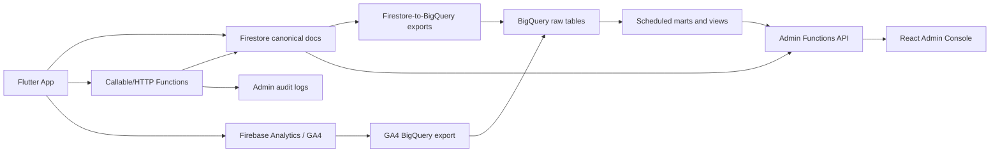

# Admin And Analytics Dashboard Spec

## Read Policy

Read this before building an internal admin console, analytics dashboard,
participant value model, cohort reporting, host finance dashboard, safety review
queue, or admin-only backend API. Pair it with:

- `docs/backend_operation_catalog.md` for canonical write ownership.
- `docs/data_contracts.md` for Firestore schema and relationship-document rules.
- `docs/release_operations.md` for Firebase, BigQuery, observability, and payment
  launch gates.
- `docs/event_success.md` for participant metrics and event-success guardrails.
- `lib/safety/README.md` for report/block/account-deletion boundaries.

## Executive Decision

Build a separate internal web admin console. Do not put this in the consumer
Flutter app.

Recommended stack:

- Vite + React + TypeScript for the admin UI.
- Firebase Hosting as a separate admin site or subdomain.
- Firebase Auth for operator login.
- Firebase custom claims for `admin` and narrower role claims.
- Cloud Functions v2 TypeScript under `functions/src/admin/**` for all admin
  reads, mutations, and BigQuery queries.
- BigQuery for cohort, retention, lifetime value, and historical joins.
- Firestore for live operational queues, short-lived dashboard snapshots, and
  canonical product state.

The admin web client must never receive a service-account key and must not query
private Firestore collections directly. It should call server-side admin
Functions that enforce role checks, validate filters, mask PII where possible,
and write audit logs for every privileged action.

## Why This Is Not Just A Dashboard

The product is two systems sharing one surface:

1. **Operational control plane.** Live queues and actions: safety reports,
   moderation flags, access applications, host/event operations, payment
   failures, refund review, payout readiness, and support notes.
2. **Analytics product.** Historical reporting: cohort retention, host
   month-on-month growth, event performance, spend over time, referral graph,
   user lifetime value, participant marketplace signals, ratings, and safety
   trends.

Those systems have different freshness, storage, and privacy needs. Live ops
should read canonical Firestore state through admin APIs. Analytics should read
BigQuery marts derived from Firestore exports, GA4 exports, and server-written
business facts.

## Current Repo Baseline

### Existing Strengths

- Backend operation ownership is already documented, with multi-document product
  actions behind callables/triggers instead of broad client writes.
- Firestore relationship documents already model key edges:
  `eventParticipations`, `clubMemberships`, `profileDecisions`, `matches`,
  `reviews`, `payments`, and notification items.
- Event-level counts exist on `events`: booked, waitlisted, checked-in, gender
  counts, cohort counts, and waitlisted cohort counts.
- Club-level aggregates exist on `clubs`: member count, rating, review count,
  and next event projection.
- Event Success already materializes private event scorecards and safety reports
  from feedback.
- Participant signal infrastructure exists:
  - raw facts: `participantSignalFacts/{factId}`;
  - per-user counters: `participantMetricCounters/{uid}`;
  - future user-facing summaries: `participantMomentum/{uid}`;
  - future admin summaries: `participantMarketplaceMetrics/{uid}`.
- Firestore-to-BigQuery export extensions are declared for Event Success,
  participant metric collections, and host analytics operational collections
  (`clubs`, `events`, `eventParticipations`, `payments`, `reviews`,
  `savedEvents`, `eventInviteLinks`, and `matches`).
- Production GA4-to-BigQuery export is documented as enabled, daily-only, and
  forward-looking from the date it was enabled. Host analytics mart refresh SQL
  now reads `organizer_<eventName>` GA4 exports when those tables exist and
  de-duplicates them against direct host analytics callable events.

### Existing Gaps

- `users/{uid}` does not have a canonical server-owned `createdAt` or
  `profileCompletedAt`, so signup and onboarding cohort metrics need a data
  model fix.
- The analytics facade defines many event names, but current production call
  sites are sparse. Rich funnel analysis needs explicit instrumentation across
  auth, onboarding, booking, payment, swipe, chat, referral, and host flows.
- Platform access applications are scaffolded, but the gate is intentionally not
  wired into routing and `accessApplications` does not appear to have a live
  Firestore rules/admin review path yet.
- Referral attribution is not modeled as a durable graph. Share/invite copy
  exists, but referral codes, invite opens, attributed signups, and activated
  referrals need implementation.
- Payment records exist, but host commission, settlement, payout lifecycle, and
  reconciliation are not yet modeled as a ledger.
- Participant metric collections currently have Functions helpers and rules
  entries, but no JSON Schema contracts. If the admin product depends on them,
  they should become first-class contract sources.
- Firestore-to-BigQuery exports still do not cover every collection needed for
  user cohorts, referrals, finance ledgers, and full admin retention analysis.
  Host/event analytics operational coverage is now declared in `firebase.json`.

## Data Architecture



### Operational Plane

Use Firestore and Cloud Functions for anything that requires immediate review or
mutation:

- safety reports;
- moderation flags;
- event safety reports;
- access applications;
- payment failures;
- refund/payout review;
- host onboarding and payout readiness;
- event cancellations and manual admin overrides;
- support notes and action audit logs.

Operational APIs should return paginated, filterable lists and detail payloads.
Every mutation must write an `adminAuditLogs/{logId}` row with:

- actor admin UID;
- role claim used;
- action name;
- target collection/path;
- before/after status or summary;
- reason/note;
- createdAt;
- environment;
- request id.

### Analytics Plane

Use BigQuery for historical reporting:

- month-on-month host growth;
- signup/profile-completion cohorts;
- event attendance cohorts;
- user retention;
- repeat booking;
- spend over time;
- referral conversion;
- participant value/LTV;
- event ratings and outcome metrics;
- host performance;
- safety trend analysis.

The admin browser should not talk to BigQuery directly. Admin Functions should
query BigQuery with server credentials, validate the requested metric/filter
surface, apply role-based access checks, and optionally cache common summaries
in Firestore under `adminAnalyticsSnapshots/{snapshotId}`.

### Freshness Tiers

| Tier | Use | Source | Expected Freshness |
|---|---|---|---|
| Live ops | Safety queues, access decisions, payment failures | Firestore via admin Functions | Seconds to minutes |
| Near-real-time metrics | Today signups, today reports, open queue counts | Firestore counts or cached snapshots | Minutes |
| Business analytics | Cohorts, retention, host MoM, LTV, referrals | BigQuery marts | Daily at first |
| Finance authority | Settlement, payouts, refunds | Payment provider webhooks + ledger | Provider-confirmed |

## Stack Constraints And Technical Limits

- Firestore aggregation queries are useful for counts/sums/averages, but they are
  not a substitute for SQL cohort analysis. Use Firestore for live counters and
  BigQuery for joins across users, events, payments, referrals, swipes, reviews,
  and time windows.
- GA4/Firebase Analytics can export event rows to BigQuery, but daily export is
  not retroactive before the link existed. Streaming export is a separate option;
  when enabled, intraday tables are temporary until the daily table completes.
- Firebase Analytics custom events are bounded by the GA event taxonomy. Treat
  client analytics as behavioral telemetry, not the authority for payments,
  safety, bookings, or host payouts.
- Current app observability collection is intentionally off in normal debug
  builds and on only for prod release or explicit collection-enabled builds.
  Analytics QA needs purpose-built smoke runs.
- Existing participant/Event Success Firestore-to-BigQuery extension env files
  use `EXCLUDE_OLD_DATA=yes`; old Firestore documents require explicit backfill
  if those dashboards need pre-link history. The new host analytics export
  configs use `EXCLUDE_OLD_DATA=no` so existing clubs, events, payments,
  reviews, saves, invite links, participations, and matches backfill on first
  install.
- BigQuery and Analytics Admin access can be an operational blocker. The repo
  previously recorded Analytics Admin scope problems when trying to verify GA4
  BigQuery links through APIs.

Official references checked:

- Firebase Analytics events:
  https://firebase.google.com/docs/analytics/events
- Firebase BigQuery export:
  https://firebase.google.com/docs/projects/bigquery-export
- GA4 BigQuery export schema:
  https://support.google.com/analytics/answer/7029846
- Firestore aggregation queries:
  https://firebase.google.com/docs/firestore/query-data/aggregation-queries
- Firebase custom claims:
  https://firebase.google.com/docs/auth/admin/custom-claims
- Callable Functions:
  https://firebase.google.com/docs/functions/callable
- Vite guide:
  https://vite.dev/guide/

## Metric Taxonomy

### Growth

Questions:

- How many users signed up today, this week, this month?
- How many completed onboarding?
- How many are active this day/week/month?
- How many users applied for launch access?
- How many were approved, denied, waitlisted, invited, or activated?

Required sources:

- Auth user creation time, or new server-owned profile timestamps.
- `users/{uid}` profile status and profile completion time.
- `accessApplications/{applicationId}` once the gate is live.
- GA4 session/user activity for active-user metrics.

Needed work:

- Add `createdAt`, `profileCreatedAt`, and `profileCompletedAt` semantics.
- Decide whether "signup" means Auth account created, phone verified, private
  profile created, or profile completed.
- Add daily/weekly/monthly BigQuery marts.

### Host Growth

Questions:

- How many unique hosts exist?
- How many new hosts were created this month?
- How many active hosts published an event this month?
- How many repeat hosts published events in consecutive months?
- How many hosts generated paid bookings?

Definitions:

- **Registered host:** user with a `clubHostClaims/{uid}` row.
- **Club owner:** user in `clubs.ownerUserId` or `clubs.hostUserIds`.
- **Active host:** host with at least one active/completed event in the period.
- **Revenue host:** host with at least one completed payment in the period.

Current sources:

- `clubs.createdAt`, `clubs.ownerUserId`, `clubs.hostUserIds`.
- `clubHostClaims.createdAt`.
- `events.clubId`, `events.startTime`, `events.status`.
- `payments.hostUserId`.

Needed work:

- Export `clubs`, `clubHostClaims`, `events`, and `payments` to BigQuery.
- Create `mart_host_monthly` with host status, event count, attendance, revenue,
  rating, refund rate, and safety incidents.

### Event Performance

Questions:

- How many events were created, published, cancelled, completed?
- What is capacity fill rate?
- What is check-in rate?
- What is no-show rate?
- How many waitlist requests were approved or declined?
- Which event formats perform best?
- What are average ratings and event-success scores?

Current sources:

- `events` for capacity, price, status, time, cohort counts, discovery fields.
- `eventParticipations` for signed-up, waitlisted, attended, cancelled, and
  manual approval status.
- `eventSuccessFeedback` for welcome/structure ratings and safety concerns.
- `eventSuccessScorecards` for event coaching aggregates.
- `reviews` for public attended-event ratings.
- `payments` for paid attendance and refunds.

Needed work:

- Export `events`, `eventParticipations`, `reviews`, and `payments`.
- Decide minimum anonymity thresholds before showing host/event cohort slices.
- Build `mart_event_performance_daily` and `mart_event_performance_lifetime`.

### Safety And Trust

Questions:

- How many reports were filed today/week/month?
- How many moderation flags are open?
- How many event safety incidents exist?
- Which reports need review?
- What action was taken and by whom?

Current sources:

- `reports/{reportId}` from user reporting.
- `moderationFlags/{flagId}` from chat/photo moderation.
- `eventSafetyReports/{feedbackId}` from event-success safety feedback.
- `blocks/{blockId}` for directed safety edges.

Needed work:

- Add explicit review status transitions and status timestamps where missing.
- Add admin notes and audit log entries.
- Build Safety queue APIs before launch.
- Export aggregate-safe safety facts to BigQuery for trends without exposing raw
  safety notes broadly.

### Revenue, Spend, And Host Finance

Questions:

- How much are users spending over time?
- What is GMV by day/month/event/host/city?
- What is platform fee/commission?
- What is refunded or failed?
- What is owed to each host?
- Which payout accounts are restricted or incomplete?

Current sources:

- `payments` has user, event, amount, currency, provider, status, host user id,
  Stripe account id, and application fee amount.
- `hostPaymentAccounts` has Stripe onboarding and payout readiness.
- Payment launch docs still list provider, secret, webhook, smoke-test, and fee
  policy gates.

Needed work:

- Add a settlement ledger, likely `hostSettlements/{settlementId}` and
  `hostSettlementItems/{itemId}` or a similar provider-neutral ledger.
- Decide commission policy per provider/currency/environment.
- Model payout states: payable, pending provider settlement, paid, failed,
  reversed, disputed.
- Export payments and settlement ledger to BigQuery.
- Do not calculate finance authority from GA4 events.

### Referrals

Questions:

- How many people is each user referring?
- Which referrals became applicants?
- Which referrals completed profiles?
- Which referrals attended an event?
- Which referrals paid?
- Which referral channels create valuable users?

Current state:

- Invite/share copy exists in product surfaces, but durable referral attribution
  is not implemented as a graph.

Needed model:

- `referralCodes/{code}`: owner UID, campaign/source, createdAt, status.
- `referralEvents/{eventId}`: code, referrer UID, referred UID when known,
  anonymous session id when not known, event type, target type, createdAt.
- `users/{uid}.referredByUid` or server-owned attribution edge after account
  creation.
- Optional `accessApplications.referralCode` / `referredByUid` if launch access
  remains gated.

Referral funnel:

1. Invite/share generated.
2. Link opened.
3. Waitlist/application submitted.
4. Auth account created.
5. Profile completed.
6. First event booked.
7. First event attended.
8. First payment completed.
9. Referred user refers another user.

### Participant Value And LTV

This should be admin-only and interpretable. Do not expose raw "desirability" or
marketplace percentile to users or hosts.

Possible components:

- Spend: completed payment amount, net contribution, repeat purchases.
- Attendance: events booked, events attended, no-show rate, cancellation rate.
- Social signal: outgoing likes, incoming likes, match count, match rate, chat
  start rate, message response signal.
- Referral signal: invited users, activated referrals, paid referrals.
- Quality signal: event feedback submitted, rating behavior, report-free
  participation.
- Host contribution: hosted events, attendees served, repeat attendance,
  ratings, paid GMV, refund/safety rates.
- Risk adjustments: safety reports, moderation flags, chargebacks/refunds,
  support interventions.

Suggested first admin score:

```text
admin_user_value_score =
  normalized_net_revenue_180d
  + normalized_activated_referrals_180d
  + normalized_repeat_attendance_180d
  + normalized_match_quality_90d
  + normalized_feedback_completion_180d
  + normalized_host_supply_value_180d
  - normalized_safety_and_payment_risk_365d
```

Rules:

- Keep every component visible in the admin UI; no black-box score.
- Cap social-signal influence so attractiveness/like volume does not dominate
  spend, referrals, attendance, and host supply.
- Separate user-facing `participantMomentum` from admin-only
  `participantMarketplaceMetrics`.
- Never use this score as an automatic safety, access, or eligibility decision
  without a separate policy review.

### Retention And Cohorts

Core cohort cuts:

- signup month;
- profile-completion month;
- first event booked month;
- first event attended month;
- first payment month;
- first host-created event month;
- referral acquisition month;
- city;
- activity kind;
- host cohort;
- event format.

Core retention definitions:

- **User retained M1:** active, booked, attended, swiped, chatted, or paid in the
  month after cohort month. The chosen definition must be explicit per chart.
- **Event attendee retained M1:** attended another event in the month after first
  attended event.
- **Buyer retained M1:** made another completed payment in the month after first
  payment.
- **Host retained M1:** created or hosted at least one active event in the month
  after first hosted event.

Suggested marts:

- `mart_user_monthly_activity`
- `mart_user_cohorts`
- `mart_user_retention`
- `mart_user_ltv`
- `mart_host_monthly`
- `mart_host_retention`
- `mart_host_event_daily`
- `mart_event_performance`
- `mart_referral_funnel`
- `mart_finance_daily`
- `mart_safety_daily`

## Dashboard Information Architecture

### Overview

- Today / week / month: signups, completed profiles, access applications, active
  users, active hosts, events created, events completed, GMV, open safety items,
  failed payments.
- Alerts: unresolved safety items, provider webhook failures, payout restrictions,
  unusual refund rate, BigQuery export lag.

### Growth And Cohorts

- Signup cohorts.
- Profile-completion conversion.
- DAU/WAU/MAU.
- Retention curves.
- City/activity growth.
- Acquisition/referral source performance.

### Users And Value

- Search users by UID, phone/email where authorized, name, city, status.
- User profile summary.
- Spend timeline.
- Event attendance timeline.
- Referral tree.
- Likes/matches/chat metrics.
- Safety/support history.
- Admin-only value component breakdown.

### Hosts

- Host list and status.
- Month-on-month host growth.
- Active/revenue host cohorts.
- Events hosted.
- Attendance, ratings, no-show rate, refund rate, safety rate.
- Payment account readiness.
- Payout/settlement summary.

### Events

- Event list with filters: city, host, date, status, paid/free, format,
  availability, safety status.
- Capacity/fill/check-in/no-show metrics.
- Waitlist/manual approval metrics.
- Event Success scorecard.
- Ratings and feedback.
- Revenue and refund state.

### Safety

- Reports queue.
- Moderation flags queue.
- Event safety reports queue.
- User context.
- Conversation/media/event context where role permits.
- Actions: assign, note, resolve, dismiss, escalate, block/suspend candidate,
  contact user/host.

### Access Applications

- Pending applications.
- Applicant profile/contact/context.
- Referral source.
- Decision controls: approve, deny, waitlist, invite, pause.
- Review note and audit history.

### Finance

- GMV, net revenue, platform fees, refunds.
- Pending and failed payments.
- Host payout readiness.
- Settlement ledger.
- Provider reconciliation.
- CSV export for accounting.

### Data Quality

- Export lag.
- Missing required timestamps.
- Failed BigQuery extension exports.
- Analytics smoke-event proof.
- Payment webhook health.
- Schema contract drift.

## Admin API Surface

Initial callable/HTTP Functions:

- `adminGetOverview`
- `adminListSafetyItems`
- `adminGetSafetyItem`
- `adminUpdateSafetyItem`
- `adminListAccessApplications`
- `adminDecideAccessApplication`
- `adminSearchUsers`
- `adminGetUserProfile`
- `adminGetGrowthCohorts`
- `adminGetRetention`
- `adminGetHostAnalytics`
- `adminGetEventAnalytics`
- `adminGetFinanceSummary`
- `adminListPaymentIssues`
- `adminListPayoutIssues`
- `adminExportCsv`

Every admin function should:

- require Auth;
- require App Check unless a deliberate admin-web exception is documented;
- require admin custom claims;
- validate payload with Zod or generated schema;
- enforce role-specific field masking;
- log the action to `adminAuditLogs`;
- rate-limit dangerous mutations;
- return stable typed DTOs for the web app.

Suggested roles:

- `adminOwner`: all dashboards and actions.
- `safetyReviewer`: safety queues and limited user context.
- `support`: user lookup, access applications, non-finance support actions.
- `finance`: payments, settlement, payout, export.
- `analyticsViewer`: read-only aggregate analytics, no raw PII or safety notes.

## Data Model Work Required

### P0 Before Live

- Add admin auth and `adminAuditLogs`.
- Add safety queue status/action fields where missing.
- Wire access applications end-to-end if gated launch is still desired.
- Add user signup/profile-completion timestamps.
- Add backend admin APIs for Overview, Safety, Access, and User Search.
- Add BigQuery export coverage for `users`, `clubHostClaims`, referral
  attribution, settlement/ledger collections, and any remaining cohort inputs.
- Add launch-ready payment provider setup and finance smoke evidence before paid
  events.

### P1 Analytics Foundation

- Add referral data model and attribution.
- Add schemas for `participantSignalFacts`, `participantMetricCounters`,
  `participantMomentum`, and `participantMarketplaceMetrics`.
- Add the remaining admin marts under `analytics/sql/**`. Host analytics now has
  checked-in DDL and mart refresh SQL in `analytics/sql/ddl/**` and
  `analytics/sql/marts/refresh_mart_host_event_daily.sql`.
- Add `adminAnalyticsSnapshots` cache docs for common dashboard cards.
- Add analytics instrumentation for declared funnel events and missing product
  moments.
- Add data-quality checks for missing timestamps, export lag, and metric drift.

### P2 Rich Analytics

- Build cohort and retention marts.
- Build host monthly analytics.
- Build event performance analytics.
- Build user value/LTV component tables.
- Build referral funnel and graph views.
- Build finance settlement and reconciliation analytics.

## First Build Slice

Build this in four thin layers:

1. **Admin foundation:** Vite/React app shell, Firebase Auth, custom claim check,
   locked routes, admin API client, audit log writer.
2. **Live ops MVP:** Overview cards, Safety queue, Access queue, User search.
3. **Analytics foundation:** BigQuery export additions, checked-in SQL marts,
   dashboard snapshot job, Growth/Cohorts tab.
4. **Revenue and value:** Finance tab, Host analytics, Event analytics, User
   value component breakdown.

Do not start with a massive analytics UI. Start by making the data trustworthy,
then expose the smallest charts that answer live operating questions.

## Open Product Decisions

- What exactly counts as a signup?
- Is launch access gating still part of the live launch?
- Which admin users and roles should exist on day one?
- What host anonymity threshold should apply to cohort and event analytics?
- What commission/fee policy applies by provider and currency?
- What counts as a successful referral?
- Should user value include social desirability-like signals at all, or should
  those remain diagnostic sub-metrics with capped weight?
- Which metrics are operator-only versus safe for future host-facing analytics?
- What is the retention definition for each chart: app active, event booked,
  event attended, paid, or social action?

## Implementation Guardrails

- Prefer canonical business records over client analytics when measuring money,
  safety, bookings, attendance, and host payouts.
- Keep raw PII and safety text out of broad analytics marts.
- Do not expose raw participant marketplace metrics to clients.
- Keep dashboard DTOs stable and typed; do not let the web app assemble raw
  Firestore shapes from many collections.
- Put reusable SQL in versioned files and test expected columns with a lightweight
  query/fixture check.
- Keep finance authoritative in provider-confirmed ledgers, not charts.
- Use admin action logs as compliance evidence, not only debugging logs.
