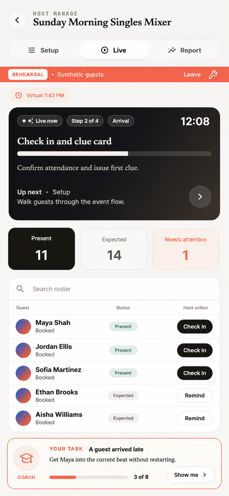
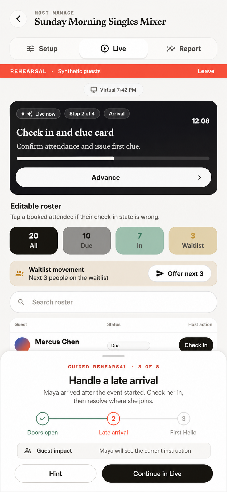
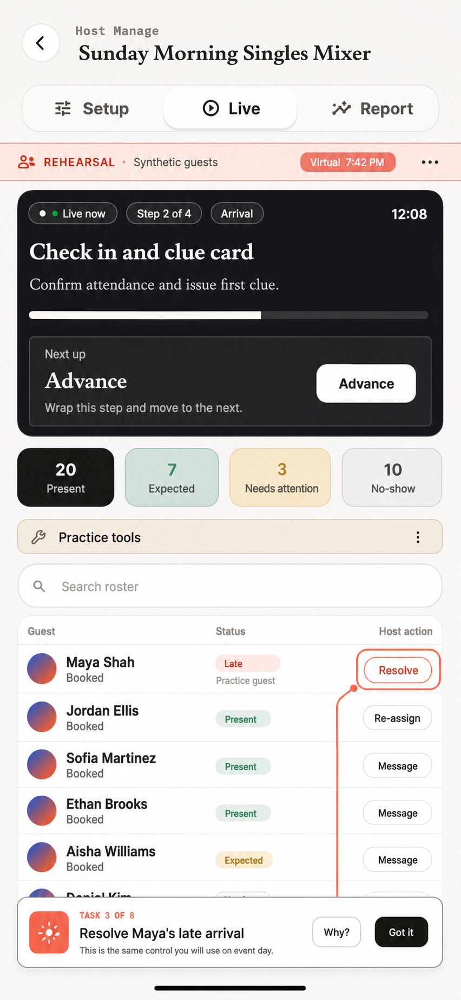
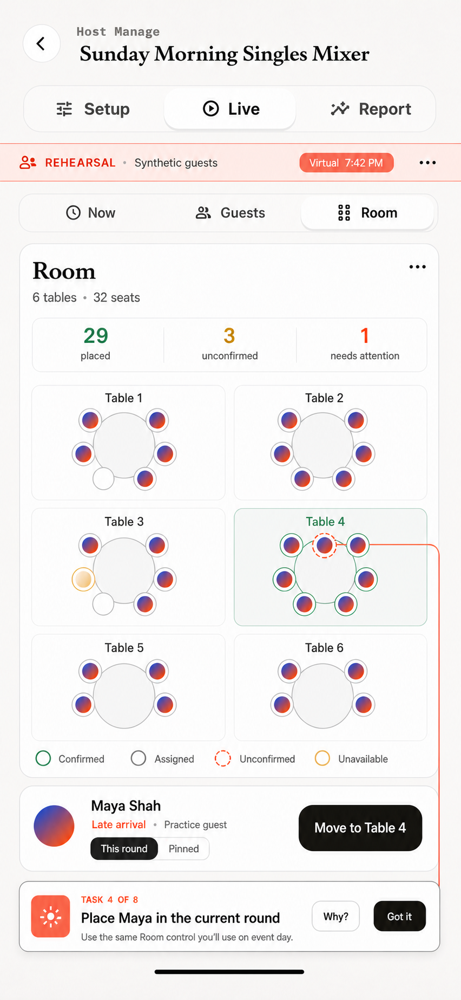

# Event Dress Rehearsal — Production Runtime Parity Spec

Status: proposed for owner review · 2026-08-20  
Scope: `lib/event_success/`, `lib/event_rehearsal/`, `website/src/features/eventRuntime/`, `website/src/features/eventRehearsal/`, `functions/src/eventSuccess/`, `functions/src/eventRehearsal/`, contracts, routing, Widgetbook, and focused tests  
Owner: Event Success / Host Operations  
Supersedes: the current standalone rehearsal presentation and its fixed rehearsal-only guest-moment projection; it does **not** supersede the isolation, deterministic-session, guest-link, or replay infrastructure behind that presentation

This document defines Dress Rehearsal as a learning mode for the real Catch
event runtime. A host should leave rehearsal knowing where production controls
are, what each action does, what guests see, and how the system behaves when an
event becomes messy. That promise cannot be met by a second, simplified
simulation UI.

The implementation decision is therefore:

> **Mount the canonical Host Live/Report and attendee web runtimes against a
> disposable rehearsal environment. Add coaching, scenario orchestration,
> virtual time, and fault controls around those runtimes; do not redraw their
> operating surfaces.**

The source-of-truth runtime remains the Host Event Success surface documented
in [`docs/event_success.md`](../event_success.md), implemented by
[`EventSuccessHostPanel`](../../lib/event_success/presentation/event_success_host_screen.dart)
and its `host_parts`, plus the attendee runtime implemented under
[`website/src/features/eventRuntime/`](../../website/src/features/eventRuntime/).
The host-facing product name remains **Live event guide**, following
[`host_club_edit_and_live_guide_spec.md`](host_club_edit_and_live_guide_spec.md).
“Event Success” remains an internal architecture/domain label.

---

## 0. The correction to the current feature

The current feature contains meaningful infrastructure, but presents a
parallel interpretation of the product:

- [`HostEventRehearsalScreen`](../../lib/event_rehearsal/presentation/host_event_rehearsal_screen.dart)
  stacks rehearsal-specific setup, run controls, synthetic-behavior controls,
  roster, and recap in one long screen.
- [`EventRehearsalPage`](../../website/src/features/eventRehearsal/EventRehearsalPage.tsx)
  renders a rehearsal-only sequence of guest moments and actions instead of
  entering the same identity, venue, assignment, reveal, and recovery states
  as the real attendee runtime.
- [`functions/src/eventRehearsal/engine.ts`](../../functions/src/eventRehearsal/engine.ts)
  advances a fixed rehearsal engine rather than exercising the complete
  production decision path.

That divergence has three consequences:

1. A host can learn controls and information hierarchy that do not exist on
   event day.
2. A rehearsal can pass while the production runtime is broken, because the
   two surfaces and state resolvers drift independently.
3. The most powerful simulator features appear as the product itself, making
   the feature read as an internal QA console rather than host training.

This is primarily a **product architecture issue expressed through UX**, not a
copy or discoverability issue. Clearer onboarding would not fix it while the
practice surface remains a second runtime.

### 0.1 What remains valuable

The following current capabilities are retained and promoted into shared
rehearsal infrastructure:

- deterministic seeded sessions;
- session-scoped synthetic actors;
- virtual time and manual time advancement;
- pause, resume, previous, complete, reset, and fork;
- behavior injection for late arrivals, no-shows, exits, returns, walk-ins,
  claim ambiguity, opt-out, keep-apart, disconnect, and reconnect;
- controlled latency, one-shot failure, listener disconnect, stale revision,
  duplicate delivery, legacy-fixture, reduced-motion, and low-bandwidth faults;
- rotating, expiring public guest links and browser-slot identity;
- action logs, runtime revisions, deterministic reproduction export;
- strict production-data isolation, rate limiting, and bounded expiry.

They move into a **Coach** layer for hosts and a restricted **Lab** layer for
internal QA. They no longer replace the production screen.

---

## 1. Product promise

### 1.1 One-sentence promise

**Practise running your exact Live event guide with realistic guests and
problems, without contacting anyone or changing the real event.**

### 1.2 Host outcomes

After the recommended rehearsal, a first-time host can:

1. open the real Manage → Live surface and identify the current beat, next
   beat, guest status, unresolved work, and primary action;
2. check in or resolve a synthetic attendee using the same production action;
3. understand when the attendee website changes and inspect that change in a
   second browser/device;
4. advance and recover the run of show using the production navigation and
   revision rules;
5. respond to at least one exception such as a late arrival, early exit,
   ambiguous claim, disconnection, or stale update;
6. complete the rehearsal and interpret the same aggregate Report surface used
   after a live event;
7. read the configured Room, distinguish assigned from Host-confirmed
   placement, and safely move one attendee using the same spatial control used
   on event day;
8. trust that no real guest, message, event document, payment, or notification
   was affected.

### 1.3 Product principles

| Principle | Required behavior |
|---|---|
| Learn the real product | Every event-day task happens in the same production component and action path. |
| Practice is unmistakable | Persistent `REHEARSAL` chrome, synthetic identity labels, and “No real guests will be contacted” appear without changing core layout. |
| Guidance stays peripheral | Coaching explains or spotlights a production control; it never substitutes a rehearsal-only version of that control. |
| Mistakes are safe | Destructive or externally visible side effects are impossible by construction, not merely hidden by UI. |
| Messiness is realistic | Scenarios are event-shaped timelines, not a bag of arbitrary toggles. |
| Power is progressive | Guided mode is the default; virtual clock, actor injection, and faults live in an advanced Lab. |
| Parity is testable | Live and rehearsal rendering from an equivalent canonical state differs only by an explicit overlay allowlist. |

---

## 2. Goals, non-goals, and boundaries

### 2.1 Goals

1. Reuse the existing Host Setup/Live/Report and attendee runtime components.
2. Exercise production domain objects, state resolution, timers, actions,
   errors, revision fences, and recovery behavior.
3. Provide a guided learning journey that can be completed without prior
   knowledge of Catch internals.
4. Preserve advanced deterministic simulation and reproduction tools for
   support, QA, and power users.
5. Give hosts an expiring companion website that behaves like the actual
   attendee website while avoiding OTP, messages, and real identities.
6. Allow production-runtime improvements discovered here when they improve
   live events as well as rehearsal.
7. Make drift between live and rehearsal difficult to introduce and easy to
   detect.
8. Give spatially structured events a coherent Room lifecycle across Setup,
   Live, companion, Report, and Dress Rehearsal rather than exposing the map
   only after hidden runtime preconditions happen to be satisfied.

### 2.2 Non-goals

- Building a separate training game or storyboard.
- Copying the Host Live screen into `lib/event_rehearsal/`.
- Teaching the full event-creation workflow. Rehearsal starts from a frozen
  event configuration and focuses on operating the event.
- Sending test SMS, WhatsApp, email, push, payment, refund, or booking actions.
- Writing synthetic actors into a production attendee, booking, ticket,
  matching, notification, CRM, or analytics collection.
- Rebranding Event Success modules or moving platform primitives into Event
  Success. Admission, attendance, roster, safety, and general recovery remain
  Host platform capabilities; First Hello and the social runtime remain Event
  Success capabilities. Rehearsal teaches the combined real workflow.
- Shipping unrestricted production fault injection.
- Allowing a temporary deployment to become the guest companion architecture.
- Building a to-scale venue/CAD editor with walls, doors, stages, obstacles, or
  freeform coordinates. Room remains an operational topology of tables, rows,
  courts, and zones.
- Claiming automatic table-seating optimization. Rehearsal may teach manual
  placement and the assignment engines the production runtime actually
  supports; it must not simulate an unsupported `tableSeating` solver.

### 2.3 Explicit boundary

The temporary companion is an **expiring session and URL on the existing Catch
website**, not a temporary website deployment. It uses the shipped attendee
runtime bundle, production design system, and standard route shell. Only the
data environment and synthetic identity bootstrap differ.

---

## 3. Users, permissions, and modes

### 3.1 Roles

| Role | Can create | Can run | Can use Lab | Can export reproduction | Can rotate guest link |
|---|---:|---:|---:|---:|---:|
| Organizer owner | Yes | Yes | Yes | Yes | Yes |
| Event host/editor | If event permission allows | Yes | Basic actor controls | No by default | Yes |
| Read-only staff | No | Observe only | No | No | No |
| Internal support/QA | In authorized environment | Yes | Full, including faults | Yes | Yes |
| Synthetic guest | No | Own browser slot only | No | No | No |

All permissions are checked server-side. Hiding Lab controls is not an
authorization boundary.

### 3.2 Experience modes

#### Guided rehearsal — default

The host selects a curriculum, then operates the actual runtime. A compact
Coach tells them what outcome to achieve, why it matters, and what guest-side
change to expect. Progress is recognized from canonical state transitions, not
from dismissing tips.

#### Free practice

The host operates the actual runtime without step-by-step instruction. A
scenario still schedules synthetic events, and Coach can be opened on demand.

#### Rehearsal Lab — advanced

A drawer/sheet exposes synthetic actors, virtual time, controlled faults,
revision state, action history, reset, fork, and reproduction export. This
preserves the current feature’s power without making first-time hosts parse an
engineering console.

Lab must carry an “Advanced practice tools” label and never be the default
landing state.

---

## 4. Entry points and end-to-end journey

### 4.1 Primary entry points

1. **Event workspace → Manage → Setup**  
   Card: “Practise this event”  
   Supporting copy: “Run the real Live event guide with synthetic guests. Your
   event and attendees will not be changed.”

2. **Event workspace → Manage → Live**, before the production live window  
   Secondary action: “Start a rehearsal”  
   It must not visually compete with the real event-day primary action.

3. **First-event readiness checklist**  
   Task: “Complete a 10-minute Live event guide rehearsal.”

4. **Support deep link**  
   Authorized support can create or fork a deterministic session from a
   reproduction receipt.

Do not surface rehearsal as a guest-facing event action or as an event module.

### 4.2 Journey

```text
Event workspace
  → Rehearsal briefing
  → Scenario + mode selection
  → Disposable session creation
  → Same Manage tabs, with persistent REHEARSAL chrome
      → Setup parity check (read-only summary by default)
      → Live runtime practice
          → Now / Guests / Room workspaces where configured
      → Optional companion web session
      → Optional advanced Lab
  → Same Report runtime, populated by synthetic outcomes
  → Learning recap
  → Retry / fork / finish
```

### 4.3 Recommended first-run curriculum

Target duration: 8–12 real minutes, representing roughly 45–60 virtual event
minutes.

| Beat | Scenario event | Host task in real UI | Attendee-side result | Evidence of completion |
|---|---|---|---|---|
| 1. Orient | Smooth guests begin arriving | Identify current beat and readiness state | Welcome/venue state becomes available | Host opens Live; session observes canonical state |
| 2. Admit | One guest arrives | Check in or resolve the guest | Guest moves from arrival to runtime state | Presence state transition succeeds |
| 3. Start | Threshold is met | Use the production primary start/advance action | Guest sees First Hello or current event instruction | Canonical active step/revision changes |
| 4. Observe | Synthetic guest asks for help | Find unresolved/recovery destination | Guest receives resolved state | No unresolved actor remains |
| 5. Recover | A late guest arrives after progression | Resolve late-arrival treatment | Late guest receives current safe assignment | Assignment/attendance rule succeeds |
| 6. Place | A late or unconfirmed guest needs a destination | Open Room, select the guest, inspect valid destinations, move, and confirm | Guest sees only their own current destination | Canonical spatial preview, reassignment, and confirmation succeed |
| 7. Coordinate | Companion is open | Compare “what guests see” with Host state | Same revision and own destination are visible | Host confirms or Coach observes companion view |
| 8. Progress | Timer reaches next beat | Advance via the same pinned production action | Attendee moment advances | Canonical plan action succeeds |
| 9. Finish | Final beat completes | Complete the run of show | Guest receives completion/afterglow state | Plan status and report projection update |
| 10. Reflect | Synthetic outcomes are aggregated | Read the real Report tab | N/A | Host opens report and reviews one insight |

The curriculum may skip steps that the event’s actual configuration does not
contain. The Place beat is required only when a non-`wholeGroup` source event
has a selected Room layout, or when the host explicitly creates a
session-local Room through the canonical Setup control. It must never fabricate
a control to keep the lesson intact.

---

## 5. Information architecture and screen specifications

### 5.1 Rehearsal briefing

Purpose: establish safety, select the learning goal, and create the disposable
session. This is the only major screen allowed to be rehearsal-specific.

Required regions, top to bottom:

1. **Title:** “Dress rehearsal”
2. **Event identity:** frozen event title, date, venue, format, and source
   configuration revision.
3. **Safety promise:** “Uses synthetic guests. No messages, bookings, payments,
   or event data will be changed.”
4. **Learning mode:** Recommended guided rehearsal / Free practice.
5. **Scenario:** recommended scenario first, then additional scenario packs.
6. **Synthetic roster size:** default derived from scenario and event capacity;
   editable within safe bounds.
7. **Companion option:** “Open an attendee view” enabled by default; explains
   that the link expires.
8. **Primary action:** “Create rehearsal”
9. **Secondary:** “Cancel”

Advanced fault selection does not appear here for normal hosts. Internal QA may
open “Advanced session settings.”

#### Creation behavior

- Snapshot the event’s current public/runtime configuration into the session.
- Record `sourceEventId` and `sourceEventRevision`, but never keep a live write
  bridge to the event.
- Generate seeded actors, expected attendance, safe profile fixtures, runtime
  plan, guest slots, and curriculum.
- Return the session route only after all canonical runtime preconditions are
  valid.
- If production configuration is incomplete, show the same blocker semantics
  the live runtime would show, plus a rehearsal explanation. Do not silently
  fill missing required production fields.

### 5.2 Host runtime shell

The body is the canonical Event Success Host panel. The shell adds exactly four
rehearsal affordances:

1. **Persistent practice band** above the canonical route body:
   - label: `REHEARSAL`;
   - message: `Synthetic guests · Nothing here changes your real event`;
   - trailing action: `Leave`;
   - minimum 44dp tap target for Leave;
   - not dismissible.

2. **Virtual time pill** near the practice band:
   - `Virtual 7:42 PM`;
   - tap opens time controls;
   - paused state is explicit: `Paused · 7:42 PM`;
   - no virtual-time control appears in production live mode.

3. **Coach dock** anchored above the bottom safe area, collapsed by default
   after the first lesson:
   - current objective;
   - reason/guest impact;
   - `Show me` spotlight action;
   - `Skip` only when the objective is optional or not configured;
   - progress such as `3 of 8`;
   - never duplicates the canonical primary action.

4. **Practice tools action** in the route overflow or rehearsal band:
   - opens Scenario / Actors / Time / Faults / History;
   - visually secondary;
   - Faults visible only with permission.

Everything below the band—including Setup/Live/Report tabs, current-beat
console, roster, unresolved guests, sync indicators, recovery paths, and
primary action—is the real production widget tree.

### 5.3 Setup tab in rehearsal

Default state is a read-only production-parity summary of the frozen event
configuration. The host can verify what will be practised without accidentally
learning an alternate setup model.

Actions:

- `View source event` leaves rehearsal after confirmation and opens the real
  event.
- `Change for this rehearsal` creates a session-local override, clearly marked
  `Practice only`; it never updates the event.
- `Reset to event setup` removes all session-local overrides.

Any editable setup control must be the canonical control used in production,
mounted against the rehearsal environment. No parallel form fields.

#### Room setup inside the canonical Setup tab

For events that use pods, pairs, teams, tables, rows, courts, or zones, Setup
contains a first-class **Room** readiness section. This corrects the current
split in which layout authoring is available only in the optional Create Event
flow while Manage cannot attach or change a layout later.

The collapsed readiness row shows:

- `Room`;
- `Configured` / `Not configured` / `Needs attention`;
- selected reusable layout name and summary, for example `Main room · 6 tables
  · 32 seats`;
- `Preview` and `Configure` actions before the event is frozen;
- the reason when Room does not apply, for example `Whole-group events do not
  use mapped placement`.

`Configure` opens the canonical production Room editor. The editor must:

1. start from a reusable organizer layout or a format-appropriate template;
2. show the map preview while fields change rather than asking the host to
   imagine the result of unit count and column steppers;
3. support the existing unit types: round table, rectangular table, row,
   court, and zone;
4. expose unit label, capacity, order, relative grid position, and mixed unit
   types supported by the existing layout contract;
5. show total capacity and highlight capacity below the event target;
6. provide a fast parametric path for uniform rooms such as `6 round tables,
   4 people each`;
7. name reuse consequences truthfully. Editing a shared organizer asset must
   list affected future events or require `Duplicate and customize`; it must
   never silently reshape another active event;
8. provide a preview using the same normalization and unit renderer as Live;
9. prevent topology changes after assignments are published or the event is
   running unless a separate, explicitly designed migration flow safely
   remaps every affected assignment.

In rehearsal, `Change for this rehearsal` mounts this same editor against a
session-local layout snapshot and adds `Practice only`. It may not update the
organizer layout library or source event.

### 5.4 Live tab in rehearsal

This is the heart of the product. It uses the existing “Quiet Command Console”
structure:

- one dominant dark current-beat stage;
- current beat, step position, status, timer, and outcome;
- next beat preview;
- pinned primary action;
- Previous where supported;
- truthful sync/revision state;
- flat Guests and recovery destinations;
- roster, presence, unresolved, waitlist, and accountability summaries;
- canonical recovery and exception panels.

The canonical Live area has a quiet secondary workspace switcher when the
event supports mapped placement:

- **Now** — current beat, room-health summary, highest-priority work, and
  primary progression action;
- **Guests** — roster, presence, search, filters, admission, and attendee
  recovery;
- **Room** — full spatial operating surface.

The top-level Setup / Live / Report model remains unchanged. Room is a Live
workspace because it is an operating view of the current event, not a fourth
lifecycle phase. On compact screens the switcher remains visible beneath the
rehearsal band; on larger screens it may become a rail or split workspace.

The Now workspace includes a compact Room status card whenever Room is
configured: `29 placed · 3 unconfirmed · 1 needs attention`. Selecting it opens
Room without losing the current beat, selected guest, or Coach objective.

#### Allowed rehearsal-only markings inside canonical content

- synthetic person rows include a small `Practice guest` semantic badge or an
  accessibility suffix;
- virtual timestamps use the virtual clock value;
- external-side-effect actions that cannot be safely emulated are either
  routed to a synthetic outbox or visibly disabled with `Unavailable in
  rehearsal` and a reason;
- Coach spotlight may temporarily outline a target using its stable semantic
  action identifier.

No rehearsal copy may replace a production action label. If the event-day
button says `Advance`, rehearsal says `Advance`.

### 5.5 Room workspace in live and rehearsal

Room is a first-class production workspace reused unchanged in Dress
Rehearsal. Its job is operational placement, not architectural drawing.

#### Required regions

1. **Room header:** layout name, unit/seat summary, overflow for permitted
   pre-event layout actions.
2. **Operational summary:** placed, unplaced, unconfirmed, at-capacity, and
   needs-attention counts. Zero-value categories may collapse; unresolved work
   never does.
3. **Topology map:** normalized coarse-grid units using the selected table,
   row, court, or zone shapes.
4. **Legend:** assigned, Host confirmed, unconfirmed, unavailable, and safety
   constrained. Meaning is not color-only.
5. **Selected guest panel:** identity, current assignment, confirmation state,
   valid destinations, invalid-destination reason, placement scope, and the
   canonical action.
6. **Unplaced/attention queue:** reachable without leaving Room and ordered by
   operational urgency.

#### Action cardinality

| Room affordance | Cardinality |
|---|---|
| Selected event layout | Singleton: zero or one `layoutId` per event/session |
| Reusable organizer layouts | Domain-bounded collection under existing contract/rate limits |
| Selected guest | Singleton local selection; changing selection replaces it |
| Destination choice | Exactly one layout unit per reassignment, bounded by the selected layout |
| Placement scope | Exactly one of `This round` or `Pinned` when reassignment supports both |
| Confirm / release pinned | Singleton state transition for the selected assignment and current revision |
| Attention queue | Bounded by the session roster and current spatial projection |

#### Interaction contract

- Tap is the universal interaction: select a guest, preview destinations, then
  select a valid unit.
- Large surfaces may add drag-and-drop, but drag never replaces tap or keyboard
  operation.
- Destination preview uses the canonical spatial-control decision path.
- Invalid destinations remain visible and explain `At capacity`, `Safety
  separation`, or `Declared constraint`; they do not merely disappear.
- A move requires an explicit scope where both are supported: `This round` or
  `Pinned`.
- Assigned and Host-confirmed remain distinct. The host can confirm a position
  or release a pinned placement through the existing canonical actions.
- A successful mutation returns focus to the moved guest, announces the new
  destination, updates the summary, and preserves map position.
- A stale revision uses the same `Another host changed this` recovery as the
  rest of Live and reloads destination validity before retry.
- The map renders configured empty units before assignments exist. It shows
  `Waiting for assignments` or `No guests placed yet`; it must not disappear
  merely because the assignment list is empty.
- If no layout is selected, the applicable Live surface shows `Room is not
  configured` with a pre-event `Configure in Setup` action. It does not fail by
  returning no widget.
- `wholeGroup` events omit the Room workspace and explain the omission in
  Setup. They do not fetch or synthesize a spatial projection.

#### Rehearsal behavior

- The session snapshots the selected organizer layout, normalization output,
  and assignment state at creation so later organizer edits cannot change an
  active rehearsal.
- Synthetic actors receive canonical `layoutUnitId` and
  `confirmedLayoutUnitId` states.
- Coach recognizes destination preview, reassignment, scope choice,
  confirmation, pinned release, and invalid-destination inspection from
  canonical state/action receipts—not from taps on rehearsal wrappers.
- The recommended spatial lesson injects one late or unconfirmed guest, one
  valid destination, and at least one unavailable destination whose reason is
  safe to explain.
- Reset restores the same layout, actors, placements, and destination outcomes
  for the same seed. Fork preserves the current topology and placement state.

### 5.6 Attendee companion web runtime

The guest link opens a route such as:

`/rehearse/:publicRehearsalId`

The route provides a synthetic browser slot, then mounts the same attendee
runtime stage resolver and renderers as the canonical event route.

Required behavior:

- persistent `REHEARSAL · This is a practice attendee` banner;
- synthetic display name and slot status;
- same responsive frame, content order, transitions, assignment cards,
  prompts, reveal, pause, help, opt-out, completion, error, reconnect, and
  reduced-motion behavior as production;
- when Room is configured, the guest sees only their own current destination,
  confirmation state, and movement instruction through the canonical attendee
  renderer; no other attendee positions or Room-wide occupancy are exposed;
- no real phone number, OTP, Catch account, ticket, or guest claim required;
- no real messaging or notification side effect;
- browser slot stored only for this rehearsal session and origin;
- `Switch practice guest` opens the available synthetic actors without
  exposing other user data;
- expired/rotated links show a safe terminal state;
- link rotation invalidates new bootstraps while allowing the host to decide
  whether already leased slots are revoked.

#### Identity simulation levels

1. **Quick companion** — recommended. Link grants one synthetic guest slot and
   enters at the canonical venue/runtime state.
2. **Guest onboarding lesson** — optional. Uses production-looking identity
   screens with an explicitly synthetic phone and code path, but sends no SMS.
   This is for learning only and must remain visually marked as rehearsal.
3. **Multi-device session** — host scans a QR code or shares the rehearsal link
   with staff; each browser receives a leased synthetic slot.

The current rehearsal-only guest moment model becomes orchestration metadata;
it must not remain the rendering model.

### 5.7 Report and learning recap

The Report tab first renders the **canonical production aggregate report** from
synthetic event outcomes. A separate Coach recap can sit above or below it.

Coach recap sections:

- `What you practised` — completed curriculum outcomes;
- `What happened` — scenario timeline in plain language;
- `How you recovered` — resolved, skipped, and unresolved exceptions;
- `Room operations` — moved, confirmed, pinned, unresolved, and constrained
  synthetic placements when Room was part of the rehearsal;
- `Guest impact` — what the companion showed at consequential moments;
- `Try once more` — up to three specific recommendations;
- `Session details` — seed, source revision, runtime revision, session expiry;
- actions: `Retry same scenario`, `Try a different scenario`, `Fork from this
  point` (advanced), `Export reproduction` (authorized), and `Finish`.

Avoid a single opaque numerical score. Use outcome labels:

- `Completed`;
- `Recovered`;
- `Needs another try`;
- `Not part of this event`.

### 5.8 Exit and resume

- Leaving a running rehearsal asks: `Leave rehearsal? Your practice session
  will stay available until {time}.`
- Resuming restores virtual time, active beat, actors, guest leases, Coach
  progress, faults, and canonical runtime revision.
- Expired sessions are read-only only if a retention policy explicitly permits
  a recap; otherwise show the terminal expired state and allow creation of a
  new session.
- Finishing rehearsal never marks the real event ready, live, or complete.

---

## 6. Coach system

### 6.1 Objective model

Each learning objective is declarative:

```text
objectiveId
title
body
whyItMatters
expectedGuestImpact
precondition(state) -> bool
completionPredicate(previousState, action, nextState) -> bool
targetSemanticId?
optionalWhen(eventConfiguration) -> bool
hintLevels[]
timeoutPolicy
recoveryObjectiveId?
```

Objectives observe canonical actions and state. They do not call production
actions themselves except in a separately labeled demo mode that is out of
scope for the first release.

### 6.2 Hint levels

1. **Prompt:** outcome only — “A guest has arrived. Get them into the event.”
2. **Location:** names the destination — “Open Guests.”
3. **Spotlight:** outlines the stable semantic target in the real UI.
4. **Explanation:** describes the exact event-day action and downstream effect.

Hints never advance the session. Completion requires the actual state change.

### 6.3 Coach placement rules

- Prefer a bottom dock on compact mobile screens.
- Use a right-side rail only when the canonical responsive breakpoint already
  provides safe width; never squeeze the live runtime below its supported
  width.
- Collapse automatically after a successful action, but remain reopenable.
- Do not cover the pinned primary action, current-beat timer, error banner, or
  system keyboard.
- On screen-reader focus, Coach content precedes its spotlighted target only
  when explicitly opened.
- Reduced motion uses a static outline and focus transfer, not a pulse.

---

## 7. Virtual clock and timers

### 7.1 Contract

All time-dependent runtime decisions in rehearsal consume an injected clock.
The canonical UI receives the same `now`, deadlines, elapsed durations, and
timer states it would receive in production.

Domain and controller code must not branch on `DateTime.now()` /
`new Date()` when operating a rehearsal session. Time is an environment
dependency.

### 7.2 Host controls

- play / pause;
- `1×`, `5×`, and `15×` speed;
- advance `+1 min`, `+5 min`, `+15 min`;
- jump to next scheduled scenario event;
- jump to a curriculum milestone after confirmation;
- restore real-time pace;
- reset to scenario start.

Scrubbing to an arbitrary earlier instant is not supported unless implemented
as deterministic state reconstruction. “Previous beat” and “rewind time” are
different concepts and must not be conflated.

### 7.3 Timer semantics

- Pausing virtual time pauses scheduled synthetic events and countdowns, but
  does not block the host from making allowed manual actions.
- Network latency faults use bounded real elapsed time so the UI can display
  genuine pending/error states; domain deadlines continue to use virtual time.
- Every mutation records both virtual timestamp and server audit timestamp.
- On resume after app/background suspension, virtual time derives from the
  persisted anchor, speed, and server audit time, not from a client-only timer.

---

## 8. Scenario system

### 8.1 Scenario definition

```text
scenarioId
version
title
learningGoal
supportedFormats[]
requiredCapabilities[]
defaultActorCount
seedPolicy
initialStateTemplate
timelineEvents[]
curriculumObjectives[]
faultSchedule[]
evaluationRules[]
cleanupPolicy
```

A timeline event includes a virtual trigger, actor selector, canonical command
or external stimulus, expected transition, optional Coach cue, idempotency key,
and fallback if the event configuration does not support it.

### 8.2 Initial catalog

| Scenario | Primary learning goal | Representative stimuli | Default audience |
|---|---|---|---|
| Smooth first run | Orientation and normal progression | On-time arrivals, start, advance, finish | First-time hosts |
| Late arrivals and no-shows | Presence and assignment recovery | Late arrival after beat change, no-show threshold | All hosts |
| Room placement and constraints | Spatial confidence and recovery | Unconfirmed position, valid move, full unit, safety separation, pinned release | Mapped events |
| Early exit and return | State repair | Departure, return, assignment refresh | All hosts |
| Roster and capacity | Admission operations | Waitlist movement, capacity boundary, walk-in | Ticketed events |
| Ambiguous guest claim | Identity recovery | Two possible records, resolve safely | Imported/external rosters |
| Privacy and keep-apart | Safety-aware coordination | Opt-out, keep-apart constraint | Social formats |
| Low connectivity | Confidence under degraded sync | Slow listener, disconnect, reconnect | Venue operations |
| Concurrent hosts | Revision conflict recovery | Two host actions, stale revision | Multi-host teams |
| Reveal interrupted | Mid-transition recovery | Reveal starts, listener drops, resumes | Reveal-enabled formats |
| External profiles | Sparse identity handling | Missing Catch profile, external guest | Imported audiences |
| Accountability sweep | End-of-event reconciliation | Unresolved presence/outcome records | Operations leads |

### 8.3 Format packs

Scenarios compose the event’s real run-of-show and capability configuration.
They do not redefine what each format means. First Hello, pods, rotations,
conversation cues, reveal, and afterglow can appear only when the source event
enables and supports them. Platform roster/admission/safety operations can
appear around any appropriate format.

### 8.4 Determinism

- The same scenario version, event snapshot, seed, and action log must recreate
  the same canonical state.
- Random actor assignment uses a seeded generator owned by the backend engine.
- Reproduction export includes no real attendee data.
- Updating a scenario definition creates a new version; it does not change an
  existing session on resume.

---

## 9. Practice tools / Lab

### 9.1 Sections

#### Scenario

- title, goal, current milestone, upcoming scheduled event;
- pause/resume scenario events independently only for authorized Lab users;
- inject next scheduled event.

#### Actors

- synthetic roster and statuses;
- actions mapped to real external stimuli: arrive, arrive late, no-show, leave,
  return, walk in, ambiguous claim, resolve claim, opt out/in, keep apart,
  disconnect/reconnect;
- actions unavailable in the current canonical state are disabled with a
  reason.

#### Time

- virtual time, speed, anchor, next scheduled event, advancement controls.

#### Faults

- latency;
- one-shot mutation failure;
- listener disconnect;
- stale revision;
- duplicate delivery;
- legacy fixture compatibility;
- reduced motion;
- low bandwidth.

Faults are scenario-scoped and self-describing. “Clear fault” is always
available. Fault injection can affect only rehearsal storage and session-bound
callables.

#### History

- chronological canonical actions and stimuli;
- virtual and audit timestamps;
- actor/host, semantic action identifier, revision before/after, result;
- copyable correlation ID;
- export reproduction when authorized.

### 9.2 Reset and fork

- `Reset` recreates the initial scenario state with the same seed and invalidates
  current mutation idempotency keys.
- `Try again with new guests` resets with a new seed.
- `Fork from here` creates a new session with the current canonical snapshot,
  history provenance, and independent guest link.
- The current session is never destructively overwritten by a fork.

---

## 10. Runtime architecture

### 10.1 Target shape

```text
Canonical Host widgets                     Canonical attendee components
EventSuccessHostPanel + host_parts         EventRuntimePage + LiveEventRuntime
                 │                                      │
                 └──────── canonical controllers ───────┘
                                      │
                         EventRuntimeEnvironment
                    ┌─────────────────┴─────────────────┐
                    │                                   │
              Live environment                   Rehearsal environment
          production repository/clock       session repository/virtual clock
          real identity + side effects      synthetic identity + side-effect sink
                    │                                   │
             production collections          rehearsal session namespace + TTL
```

### 10.2 Shared environment contract

Names are illustrative; implementation may align them with current Riverpod and
TypeScript conventions.

```text
EventRuntimeEnvironment
  mode: live | rehearsal
  runtimeId
  sourceEventId
  sourceRevision
  clock
  identityContext
  capabilityPolicy
  actionGateway
  stateGateway
  sideEffectGateway
  telemetryContext
```

UI reads `mode` only for the explicit rehearsal allowlist: practice band,
virtual time, Coach/Lab entry, synthetic identity semantics, and safe
side-effect explanations. Domain decisions depend on capabilities and injected
ports, not scattered `if (rehearsal)` checks.

### 10.3 Flutter Host

Current useful seam: `EventSuccessHostPanel` is already a state-driven
presentation surface, while `EventSuccessHostSection` binds production
providers. Preserve that split.

Required changes:

1. Define a controller-facing runtime gateway/interface covering the operations
   currently exposed by `EventSuccessRepository` and `EventSuccessController`.
2. Make the existing repository the live implementation without changing wire
   behavior.
3. Add a rehearsal implementation that operates on the session namespace but
   returns canonical Event Success plan, roster, presence, assignment, reveal,
   spatial layout, destination preview, placement action, and report types.
4. Scope environment/provider overrides at the rehearsal route boundary.
5. Mount `EventSuccessHostPanel` and the same Setup/Live/Report parts inside
   `EventRehearsalShell`.
6. Put Coach and Lab controllers in `lib/event_rehearsal/`; do not fork runtime
   widgets into that module.
7. Give all teachable production targets stable semantic IDs independent of
   localized copy and widget keys.

### 10.4 Website attendee runtime

Current useful seam: `EventRuntimePage` delegates state and mutations to
`useEventRuntimeController`, then renders production stages.

Required changes:

1. Extract or formalize a controller contract consumed by the page/runtime
   renderer.
2. Keep the live implementation unchanged in behavior.
3. Add a rehearsal controller implementation that bootstraps a synthetic slot,
   watches canonical rehearsal runtime state, and invokes session-bound actions.
4. Mount the same stage renderer from the rehearsal route.
5. Delete the rehearsal-only rendering dependency on `EventRehearsalGuestMoment`
   after migration; guest moments may survive only as scenario labels or a
   compatibility adapter.
6. Keep shared practice banner primitives, but do not maintain a duplicate
   runtime page.

### 10.5 Backend

The goal is shared behavior, not merely matching payload names.

1. Separate pure runtime transition/decision logic from storage and external
   side effects where it is not already separated.
2. Introduce store, clock, identity, and side-effect ports at the production
   runtime boundary.
3. Route live calls to production stores and providers.
4. Route rehearsal calls to a session-scoped store, virtual clock, synthetic
   identity broker, and side-effect sink.
5. Reuse the same validation, revision fence, assignment, presence, reveal,
   spatial preview/control, recovery, and report projection logic.
6. Keep rehearsal orchestration—scenario timeline, actor stimuli, faults,
   reset/fork/export—in `eventRehearsal` handlers.
7. Reject any rehearsal action carrying a production document target that is
   outside the frozen source-event read boundary.

### 10.6 Side-effect sink

Actions that normally send or modify external state produce typed synthetic
receipts:

```text
SyntheticSideEffectReceipt
  kind
  intendedAudience
  templateOrOperationId
  virtualCreatedAt
  suppressedReason: rehearsal
  previewPayload (redacted and bounded)
```

The UI may show “Would notify 12 guests” or a safe preview. It must never imply
delivery occurred.

---

## 11. Data, storage, isolation, and expiry

### 11.1 Session data model

Minimum canonical fields:

```text
session
  sessionId
  publicRehearsalId
  organizerId
  sourceEventId
  sourceEventRevision
  sourceSnapshotDigest
  scenarioId + scenarioVersion
  seed
  mode
  status
  virtualClock
  runtimeRevision
  setupOverrideRevision
  createdBy
  createdAt / expiresAt
  guestLinkRevision
  capabilityPolicy

children / equivalent bounded records
  actors
  runtime state
  room layout snapshot + source layout revision
  assignments
  presence
  actions
  scenario events
  guest leases/views
  synthetic side-effect receipts
  coach progress
  report projection
```

The physical schema may evolve from the current rehearsal documents, but all
records remain under an unambiguous session namespace and retention policy.

### 11.2 Isolation invariants

1. Rehearsal write credentials cannot write production event/guest paths.
2. Rehearsal handlers accept `sessionId`; they never accept an arbitrary
   collection path.
3. The source event is read once or through an explicitly read-only snapshot
   operation.
4. Synthetic actor IDs cannot collide with production user, booking, ticket, or
   attendee IDs and carry an explicit actor type.
5. Search, CRM, messaging, billing, recommendations, analytics, and audience
   exports exclude rehearsal namespaces.
6. Production aggregate dashboards exclude rehearsal telemetry by default.
7. Every action validates session ownership/permission, expiry, guest-link
   revision or slot lease, and runtime revision where applicable.
8. App Check, authentication, rate limits, payload bounds, and idempotency remain
   enforced.

### 11.3 Retention

- Default session expiry: 24 hours from creation.
- Owner may explicitly keep a redacted reproduction receipt longer; raw
  synthetic session state still expires.
- Cleanup removes actors, views, state, actions, side-effect receipts, and
  guest leases.
- Public IDs and rotated link tokens are non-sequential and non-guessable.

---

## 12. State and action model

### 12.1 Session lifecycle

```text
creating → ready → running ⇄ paused → complete
    │        │        │          │
    └────────┴────────┴──────────┴→ expired

Any non-expired state → reset (new runtime epoch)
Any supported state   → fork  (new session)
```

`draft` may remain for compatibility during migration, but new sessions should
not enter the Host runtime until canonical bootstrap validation reaches
`ready`.

### 12.2 Action taxonomy

| Action source | Examples | Goes through canonical production decision path? |
|---|---|---:|
| Host production UI | start, advance, previous, check-in, resolve, preview destination, reassign, confirm position, release pinned, reveal, complete | Yes |
| Attendee production UI | help, opt-out, prompt completion, acknowledgement | Yes |
| Scenario external stimulus | arrive late, disconnect, no-show, walk-in | Enters at the same external/input boundary as live equivalents |
| Coach | open hint, spotlight, skip optional objective | No runtime mutation |
| Lab | time advance, set bounded fault, reset, fork | Orchestration only; resulting runtime decisions remain canonical |

### 12.3 Concurrency

- Rehearsal uses the same revision/stale-write behavior as live.
- Concurrent-host scenarios create distinct authenticated host clients, not two
  buttons that mutate the same local controller.
- Duplicate-delivery faults verify idempotency rather than deliberately
  corrupting session state.
- UI shows the canonical stale/retry/reload behavior.

---

## 13. Production-runtime improvements proposed for both modes

These are candidates discovered through the learning use case. They should be
implemented in the canonical runtime only when they improve event-day use.

### 13.1 Stronger action consequence

Under the pinned primary action, add concise consequence text when ambiguity is
high: `Guests will move to First Hello` or `Publishes assignments to 18 present
guests`. This helps rehearsal learning and live-event confidence.

### 13.2 “What guests see” peek

Add a read-only attendee-state preview accessible from the current-beat console
or overflow. In production it previews the current anonymous/representative
guest state; in rehearsal it can switch among synthetic actors. It must reuse
the canonical attendee renderer, not a bespoke card.

### 13.3 Recovery prominence

When unresolved guests or revision failures exist, surface one explicit
recovery destination next to the relevant aggregate rather than requiring the
host to infer where to go. Preserve the quiet hierarchy when there is no issue.

### 13.4 Sync language

Use plain, durable states such as `Saved`, `Updating…`, `Needs attention`, and
`Another host changed this`. Rehearsal should teach the exact same language.

### 13.5 Context-preserving navigation

Returning from Guests/recovery should restore Live scroll position, expanded
current-beat state, and the pending task context. This is particularly valuable
during real high-pressure operation.

### 13.6 First-class Room workspace

Promote the existing spatial map from a conditionally inserted card to the
Room workspace specified in §5.5. Add Room readiness to Setup and Room health
to Now. Preserve the existing layout contracts, tap/drag actions, privacy
projection, revision fencing, and safety/capacity reasoning.

This is both a production improvement and a rehearsal prerequisite. A host
cannot learn mapped placement reliably if the production surface disappears
when configuration or assignments are incomplete.

### 13.7 Decision rule

If a proposed UI change exists only to make the simulation easier to explain,
it belongs in Coach. If it reduces uncertainty during a real event, it belongs
in the canonical runtime and therefore benefits rehearsal automatically.

---

## 14. Copy contract

### 14.1 Required labels

| Context | Copy |
|---|---|
| Product entry | Dress rehearsal |
| Safety promise | Practise with synthetic guests. Nothing here changes your real event. |
| Persistent band | REHEARSAL · Synthetic guests |
| Guest banner | REHEARSAL · You are viewing a practice attendee |
| Default mode | Guided rehearsal |
| Secondary mode | Free practice |
| Advanced drawer | Practice tools |
| Internal controls subsection | Advanced lab |
| Companion action | Open attendee view |
| Primary creation action | Create rehearsal |
| Completion action | Finish rehearsal |
| Spatial workspace | Room |
| Room setup action | Configure room |
| Empty configured Room | Waiting for assignments |
| Missing applicable Room | Room is not configured |
| Temporary placement scope | This round |
| Durable placement scope | Pinned |

### 14.2 Copy restrictions

- Do not call the Host surface “Event Success” in user-facing copy.
- Do not say “temporary website”; say “attendee practice link” and show expiry.
- Do not say a message “sent” when it was suppressed; say “Would send” or
  “Simulated.”
- Do not call synthetic people “fake users” or “bots.” Use “practice guest” or
  “synthetic guest” in advanced contexts.
- Do not translate production action labels differently in rehearsal.
- Do not use internal terms such as callable, fixture, revision fence, actor
  lease, namespace, or projection in normal host guidance.
- Do not call the operational topology a `floor plan` or imply exact physical
  scale. Use `Room`, `room layout`, `table`, `row`, `court`, or `zone`.
- Do not use `seated` as a synonym for `assigned` or `Host confirmed`; those
  states remain distinct.

---

## 15. Accessibility and responsive behavior

- Practice state is conveyed by text and semantics, never color alone.
- The persistent band meets contrast requirements in light and dark themes.
- Coach target relationships use accessible descriptions; spotlight is not the
  only instruction.
- Coach dock, sheets, and banners respect text scaling and do not obscure the
  production primary action at 200% text.
- All touch targets are at least 44×44 logical pixels.
- Screen readers announce `Practice guest` after the display name without
  polluting visible dense roster rows where space is limited.
- Virtual time announces `virtual time`; it cannot be mistaken for device time.
- Reduced-motion mode removes pulsing spotlight and large state transitions.
- Website companion works from 320px width upward and supports keyboard-only
  interaction.
- Landscape/tablet may use a Coach side rail only after the canonical content
  meets its supported maximum/minimum widths.
- Room units, occupants, destination validity, confirmation state, capacity,
  and constraint reasons have accessible names independent of shape and color.
- Keyboard users can select a guest, traverse units in stable order, hear each
  destination reason, choose scope, move, confirm, and release pinned placement
  without drag.
- At 200% text the map may keep its spatial canvas while selected-guest details
  and actions reflow below it; critical copy may not clip inside units.
- Live-region announcements are reserved for consequential runtime changes;
  scenario background events must not create an inaccessible notification
  storm.

---

## 16. Telemetry and success measures

Rehearsal telemetry is explicitly tagged and excluded from production event
metrics.

### 16.1 Product measures

- percentage of first-event hosts who start and complete guided rehearsal;
- median real time to complete;
- objective completion and hint depth;
- percentage who open the attendee companion;
- scenario retry and recovery completion;
- percentage of mapped-event hosts who configure Room, open it in rehearsal,
  complete a placement objective, and later use it successfully in Live;
- time to resolve unplaced, unconfirmed, capacity, and safety-constrained Room
  work in rehearsal versus the eligible live event;
- abandonment point and reported reason;
- later live-event incidence of common operational errors, compared between
  rehearsed and unrehearsed eligible hosts;
- support contacts related to locating/understanding Live event guide controls;
- parity failures detected before release.

### 16.2 Guardrails

- zero production writes from rehearsal sessions;
- zero real messages/payments/notifications;
- session cleanup success and expiry latency;
- no rehearsal traffic in production attendee/CRM/report aggregates;
- performance within the same interactive budgets as the production runtime,
  excluding deliberate fault states;
- no rise in live-runtime complexity solely due to Coach logic.

### 16.3 Completion definition

A rehearsal is complete when all required objectives for the event’s configured
capabilities are completed or explicitly resolved as unavailable. Merely
advancing to the last fixed simulator step does not count.

---

## 17. Visual snapshot brief

The initial concepts should preserve Catch’s existing Host visual language and
the actual Live tab hierarchy visible in current store/runtime references.
They explore only how coaching and simulation affordances coexist with the
canonical surface.

### Direction A — Guided current beat

- Minimal persistent coral practice band.
- Canonical dark current-beat console remains dominant.
- Compact Coach dock supplies one outcome and a `Show me` action.
- Virtual-time pill and practice-tools icon are quiet utilities.
- Best default for first-time hosts because the screen still reads as the real
  product.



### Direction B — Coach sheet

- Canonical runtime occupies the full screen.
- A medium-height bottom sheet shows the scenario timeline, current objective,
  guest impact, and hint progression.
- Sheet collapses to one line during active operation.
- Best for a more explanatory first lesson, but requires careful obstruction
  handling.



### Direction C — Contextual spotlight

- Canonical runtime is almost completely untouched.
- Coach appears as a small floating strip while a temporary outline anchors the
  instruction to a production control.
- Scenario progress and tools live behind a separate sheet.
- Highest fidelity to event day; depends on stable semantic target IDs and
  excellent accessibility behavior.



### Selected extension — Room workspace

- Retains Direction C’s contextual Coach and untouched production controls.
- Adds a quiet Now / Guests / Room switcher within Live; it does not add a
  fourth top-level lifecycle tab.
- Shows the real coarse topology map, operational counts, confirmation legend,
  selected guest, placement scope, and production move action.
- Demonstrates one valid destination and one unavailable state without
  pretending to be a to-scale venue editor.
- The same composition, minus rehearsal band, virtual time, synthetic labels,
  spotlight, and Coach, is the production Room workspace.



The concepts are alternatives, not three different runtime implementations.
After selection, the chosen system should be documented across at least these
snapshot states:

1. rehearsal briefing;
2. Live orientation;
3. Coach objective with target;
4. late-arrival recovery;
5. attendee companion current beat;
6. low-connectivity/revision recovery;
7. real Report tab plus learning recap;
8. advanced Lab open;
9. session complete/expired;
10. Room configured but waiting for assignments;
11. Room placement with valid and constrained destinations;
12. Room stale-revision recovery;
13. attendee companion showing only the selected guest’s own destination.

---

## 18. Migration from the current implementation

### Phase 0 — Contract and parity harness

- Inventory canonical Host and attendee states/actions.
- Introduce stable semantic IDs.
- Define the runtime environment and gateway interfaces.
- Add live-vs-rehearsal render fixtures with an overlay allowlist.
- Keep the current rehearsal available but label it `Legacy rehearsal` only in
  internal builds if needed.

Exit: no production behavior change; parity fixtures can mount canonical
runtime states under both environments.

### Phase 1 — Canonical Host runtime on rehearsal data

- Adapt existing rehearsal session storage to canonical Event Success state.
- Mount the actual Host Setup/Live/Report surface.
- Add practice band, virtual time, leave/resume, and synthetic roster semantics.
- Map current start/pause/advance/previous/complete operations to canonical
  actions.
- Promote Room readiness, Room health, and the full Room workspace into the
  canonical Host surface; render configured empty and missing-layout states
  rather than silently omitting the map.
- Snapshot the selected layout and route preview/reassign/confirm/release
  through the canonical spatial gateway in rehearsal.

Exit: a smooth scenario completes entirely through production Host controls.

### Phase 2 — Canonical attendee companion

- Replace rehearsal-only page rendering with the production attendee stage
  resolver and components.
- Retain public rehearsal link, rotation, expiry, browser slot, and practice
  banner.
- Support quick companion and switch-practice-guest.

Exit: equivalent canonical state produces equivalent guest UI under live and
rehearsal environments, excluding practice chrome and identity.

### Phase 3 — Guided Coach

- Ship the recommended curriculum, objectives, hints, spotlight semantics, and
  learning recap.
- Keep power controls behind Practice tools.

Exit: an untrained host can finish the happy-path plus one recovery scenario
without reading internal documentation.

### Phase 4 — Production decision-path convergence

- Move remaining fixed rehearsal engine decisions behind the production runtime
  engine/ports.
- Route scenario stimuli through real external/input boundaries.
- Add concurrency, identity ambiguity, reveal interruption, and accountability
  scenarios.

Exit: current fixed guest moments no longer own runtime rendering or transition
truth.

### Phase 5 — Advanced Lab and support reproduction

- Restore all authorized fault controls, action history, deterministic reset,
  fork, and export in the new shell.
- Add support import of redacted reproduction receipts.

Exit: current powerful QA capabilities are preserved without polluting the
first-time host experience.

### Phase 6 — Remove compatibility surface

- Remove or reduce the standalone rehearsal widgets and website page to route
  adapters.
- Remove fixed engine fields only after stored sessions expire or are migrated.
- Retain contract decoders where required for bounded backward compatibility.

Exit: no independent rehearsal runtime UI remains.

---

## 19. Verification strategy

### 19.1 Parity tests

For a matrix of canonical states, render live and rehearsal variants with the
same viewport, locale, theme, reduced-motion preference, and data. Mask only:

- practice band;
- Coach/Lab affordances;
- virtual-time label;
- synthetic identity badge;
- explicitly suppressed-side-effect explanation.

Everything else must match structurally and visually. A new production action
or state without a rehearsal mapping fails the contract.

### 19.2 Required state matrix

- loading, empty, ready, running, paused, complete, expired;
- setup incomplete and capability unavailable;
- current beat for every configured module family;
- present/late/no-show/departed/returned/walk-in/ambiguous guest;
- opt-out/keep-apart/help and unresolved state;
- assignment pending/published/overridden;
- Room not applicable / not configured / configured empty / populated;
- Room assigned / unconfirmed / Host confirmed / pinned / released;
- Room valid destination / at capacity / safety separation / declared
  constraint / stale revision;
- reveal ready/publishing/published/interrupted;
- syncing/saved/stale/failure/retry/disconnected/reconnected;
- single and concurrent host revisions;
- production and external-profile guests;
- reduced motion, large text, narrow mobile, tablet;
- guest companion identity, venue, runtime, pause, help, reveal, completion,
  unavailable, expired, and rotated link.

### 19.3 Isolation tests

- assert all rehearsal writes are restricted to the session namespace;
- use sentinels on production stores and side-effect providers that fail the
  test if invoked;
- verify real attendee identifiers cannot be supplied as actors;
- verify expiry and cleanup;
- verify public link rotation and slot lease behavior;
- fuzz revision, duplicate, and replay handling;
- verify synthetic telemetry exclusion.

### 19.4 Determinism tests

- same snapshot/scenario/version/seed/action log → same state digest;
- reset same seed → same initial actor/runtime digest;
- new seed → different actor identity/assignment where expected;
- fork preserves provenance and state but owns independent future history;
- virtual-clock resume is stable across client restart.

### 19.5 Usability validation

Test at minimum:

- first-time organizer with no Event Success vocabulary;
- experienced host who wants free practice;
- two-person host team;
- external-roster event;
- low-connectivity venue simulation;
- screen reader and 200% text;
- support reproduction workflow.

Measure whether users operate the production controls, not whether they can
describe the tutorial.

---

## 20. Acceptance criteria

### Product acceptance

- [ ] A host enters rehearsal from a real event and sees the same Manage
      Setup/Live/Report hierarchy used on event day.
- [ ] Persistent practice chrome makes synthetic state unmistakable on every
      host and attendee screen.
- [ ] The recommended curriculum is completed through production controls.
- [ ] At least one late-arrival/recovery objective is included.
- [ ] A mapped-event rehearsal exposes the same Room workspace as production
      and completes at least one preview, reassignment, and confirmation through
      canonical spatial actions.
- [ ] Applicable Room states are visible when unconfigured or waiting for
      assignments; the workspace never disappears silently.
- [ ] Host can open a temporary, expiring attendee practice link and observe
      the canonical attendee runtime.
- [ ] Report uses the real production report renderer with synthetic outcomes.
- [ ] Coach progress derives from canonical state transitions.
- [ ] Advanced simulation tools are available but secondary.

### Architecture acceptance

- [ ] No copy of Host Live or attendee runtime components exists under the
      rehearsal feature.
- [ ] Live and rehearsal use the same domain decision logic for all supported
      actions.
- [ ] Environment differences are injected at route/provider/controller/store,
      clock, identity, and side-effect boundaries.
- [ ] Mode checks inside shared UI are limited to a reviewed allowlist.
- [ ] Stable semantic target IDs support coaching without coupling to copy.
- [ ] Current guest link, slot, seed, fault, reset, fork, expiry, and export
      capabilities are retained or deliberately superseded.
- [ ] Layout normalization, destination preview, reassignment, confirmation,
      pinned release, constraints, and guest privacy projection are shared with
      Live rather than reimplemented in rehearsal.

### Safety acceptance

- [ ] Automated isolation tests prove no production writes or real side effects.
- [ ] All public/session tokens are bounded, authorized, rate-limited, and
      expiring.
- [ ] Synthetic data is excluded from production reports, CRM, communication,
      billing, recommendations, and product analytics.
- [ ] A production-side-effect sentinel stays uncalled throughout end-to-end
      rehearsal tests.

### UX and accessibility acceptance

- [ ] Coach never obscures the canonical primary action or critical error.
- [ ] Production action labels are unchanged in rehearsal.
- [ ] Virtual time is always identified as virtual.
- [ ] Practice/synthetic state is not color-only.
- [ ] Core flow works at 320px web width, mobile text scaling, keyboard only,
      screen reader, and reduced motion.
- [ ] Live-vs-rehearsal visual parity passes outside the overlay mask.
- [ ] Room supports tap, keyboard, screen reader, and large-surface drag as an
      additive affordance; invalid destinations expose a textual reason.
- [ ] Companion Room output exposes only the synthetic guest’s own destination
      and never the Room-wide occupancy map.

---

## 21. Owner decisions still required

1. **Default entry timing:** Should the readiness checklist recommend rehearsal
   immediately after setup, or within a time window before the event?
2. **Host permissions:** Can event editors create sessions, or only run sessions
   created by owners?
3. **Companion onboarding lesson:** Is simulated phone/OTP valuable for hosts,
   or should the practice link always enter after identity?
4. **Guest link rotation:** On rotation, should existing leased browser slots
   remain active by default?
5. **Retention:** Is 24 hours sufficient for normal sessions and what redacted
   receipt may support keep?
6. **Coach visual direction:** The recommendation is contextual spotlight for
   ordinary objectives, with the Coach sheet reserved for explanations that
   cannot fit safely in the dock. Confirm this hybrid as the delivery target.
7. **Room asset semantics:** Should changing an organizer’s reusable layout
   update only future events, or require an explicit migration for every
   already-linked event? The recommendation is immutable event snapshots after
   readiness freeze plus `Duplicate and customize` before freeze.
8. **Room editor depth:** Confirm the recommended operational topology editor
   (templates, mixed units, relative grid, capacity, labels, live preview) and
   explicitly defer walls, doors, obstacles, freeform scale, and automatic
   table seating.
9. **Production improvements:** Which items in §13 are approved for the shared
   live runtime rather than deferred?

None of these decisions changes the central architecture: the Dress Rehearsal
must teach the shipped runtime by running it.
