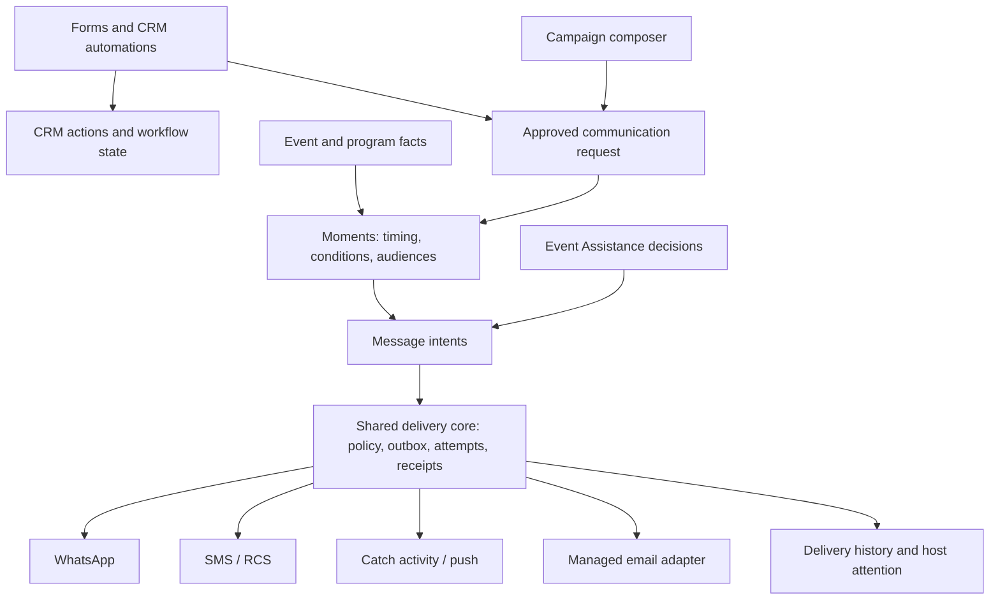

# R10 — shared delivery core + Moments orchestration: build spec

**Decision recorded.** Moments stays and becomes the scheduling and
orchestration layer over **one shared messaging delivery core** — an
expanded Option A, deeper than v0.2.0 described. Option B is rejected:
CRM actions do not move into Moments. The bridge slices from v0.2.0
remain useful during migration, but the required destination is a single
delivery core that Moments, campaigns, Event Assistance, and any future
messaging producer all execute through.

Sending a message on a fixed date does not need Moments — campaigns
already schedule. What justifies Moments is expressing sends relative to
changing operational facts: "90 days before the program," "only
households with outstanding RSVPs," "before *this guest's* function,
adjusted for travel time," "replan pending reminders when the program
moves," "alert assigned staff when a flight is disrupted." Those
capabilities belong to every messaging producer — ordinary events,
multi-day programs, and messages originating from other features — not
to a second delivery stack.

The redundancy to eliminate: Moments currently grows its own provider
dispatch, consent interpretation, retries, and delivery records beside
existing implementations.

## v0.3.0 — corrected findings (verified against source at `ca3028b09`)

These corrections supersede the v0.1.0/v0.2.0 capability comparison.
They are the reason the destination is a shared core rather than a
shared journal.

| Finding from source | Architectural implication |
|---|---|
| Moments already supports event *and* program scope for `scheduled`/`anchored` initiation; only `triggered` is program-restricted (`triggeredRequiresProgramScope` in `momentModel.ts`). | Broadening triggered scope is a targeted extension — not the migration driver. |
| Campaigns have per-recipient documents, provider message IDs, delivery callbacks, send-time checks, and a seven-day frequency cap (`organizerCampaigns.ts`). | The old comparison understated campaign delivery machinery. Consolidation must **preserve** these protections, not regress them. |
| `campaignHandoff` creates a campaign **and** invokes preview + approval programmatically (`organizerCampaigns.ts:461` calls `previewOrganizerCampaignHandler`). | "Draft awaiting human approval" was inaccurate. Dispatch stays separate, but migration must preserve the real approval semantics. |
| `notifyTeam` writes `activities` feed docs only — not a channel send. | Stays activity-only under the shared infrastructure; moving it to a channel send would be a product change, not plumbing. |
| Event Assistance already has a **transactional message outbox** and a shared SMS/WhatsApp/RCS worker (`firestoreMessageOutbox.ts`, `messageWorker.ts`): it reserves and claims an attempt transactionally *before* provider I/O, rechecks authority at claim time, and represents an interrupted submission as an `unknown` outcome requiring reconciliation. | This is the strongest existing implementation and the extraction seed — it was missing from earlier option analysis. Its contracts are bound to events/attendees/participation episodes, so the lifecycle must be extracted behind typed source adapters. Do **not** fabricate event-attendee records to fit program sends. |
| The Moments runner checks whether a send row exists, calls the provider, *then* writes the row (`momentRunner.ts`); a concurrent execution or interruption after provider acceptance can repeat the send. Its WhatsApp wiring discards the provider message ID (`momentWiring.ts`). | Adding campaign rows to that journal would unify reporting without establishing reliable delivery ownership. The journal is evidence; the outbox lifecycle is authority. |
| Anchored offsets are contract-limited to ±43,200 minutes (30 days) (`contracts/shared/moment_common.schema.json`); absolute scheduled dates go further but do not follow a changed event date; the `rsvpDeadline` anchor exists in the model while the fact loader always supplies `null` (`momentDocuments.ts`). | Weeks-or-months horizons need explicit contract work and real domain anchors. |
| Reproduced defect: a quiet-hours-deferred scheduled run is superseded once its *nominal* due passes the five-minute planning grace (`momentPlanning.ts` — `nominalDue < nowMillis - DEFAULT_GRACE_MILLIS` → `dueInPast`). | Scheduling recovery must be part of this integration's acceptance criteria. |
| The sweep takes the first 500 armed Moments and separately loads all planned runs. | Discovery needs an indexed, paginated strategy before horizons lengthen. |
| Communication routes already distinguish transport, sender identity, purpose, and capabilities (`communications/communicationRoutes.ts`). | Channel support shares execution while preserving per-route authority — Organizer WhatsApp, Catch WhatsApp, and personal handoff do not inherit each other's permissions. |

## Target architecture — one owner per responsibility

Logical responsibilities inside the existing backend — no microservices:

- **Forms/CRM automations** own business actions: create a contact, tag,
  queue update, webhook. Their messaging consequences enter the shared
  path as approved communication requests — the automation engine never
  dispatches a channel message itself.
- **Campaigns** own composition, audience review, and approval. Scheduled
  execution ultimately runs through Moments; campaign reporting becomes
  a view over shared delivery evidence rather than its own ledger.
- **Moments** owns *when* a communication is due and *who qualifies*.
  It produces **durable message intents** — it does not call providers.
- **Delivery core** owns *execution*: current authority, consent, sender
  and template readiness, quiet hours, budgets, atomic claims, attempts,
  receipts, and permitted fallback.
- **Event Assistance** retains domain decisions (e.g. whether a guest
  still needs joining guidance) and uses the same delivery core.
- `notifyTeam` remains activity-only; Catch conversations keep their
  conversation model and are not scheduled Moments.

## Message intent — the durable handoff shape

A message intent identifies: purpose, owning organizer, source
occurrence, recipient, approved content, allowed routes, and expiry.
Each source adapter renders the channel version and supplies its own
readiness and receipt semantics. Required behaviors:

- A reminder may create a Catch activity item and optionally send push
  according to preferences.
- WhatsApp→SMS fallback requires permission for the *fallback* route.
- An **unknown** WhatsApp outcome must not immediately produce an SMS
  duplicate — ambiguous provider outcomes reconcile first.
- Urgent operational alerts carry a different interruption policy than
  marketing.
- Managed email is a real adapter with its own delivery lifecycle — the
  currently registered personal-email route is a manual `mailto`
  handoff, not automated delivery.

## Long-horizon scheduling — explicit requirements

- **Long-lived definitions** supporting fixed dates and meaningful
  relative dates; "three calendar months before" and "90 days before"
  get explicitly defined behavior (not just minutes ≤ 43,200).
- **Real domain anchors** — program/function dates and RSVP deadlines;
  `rsvpDeadline` must be populated by the fact loader.
- **Separate identity axes**: occurrence identity ≠ scheduled time ≠
  next retry time ≠ expiry. Moving a reminder for quiet hours must not
  mint a new occurrence or erase the existing one.
- **Missed-reminder and late-join policy**: a late-added guest gets an
  appropriate *current* message, not every historical reminder.
- **Current recipient resolution**: RSVP changes, withdrawals, function
  moves, and opt-outs during the waiting months are evaluated at send
  eligibility, not at enrollment.
- **Indexed, paginated discovery** — replace the 500-armed sweep + full
  planned-run load.
- **Quiet-hours recovery**: a deferred run survives past its nominal
  grace (the reproduced supersede defect is an acceptance case).

## Implementation sequence

Each phase is PR-sized and independently landable. During migration a
bridge is acceptable; sharing only a journal and a quiet-hours helper is
**not** the destination.

1. **This document** — revised spec (done here).
2. **Extract and prove the delivery core with one program reminder.**
   Lift the Event Assistance outbox lifecycle (transactional reserve →
   claim → authority recheck → provider I/O → receipt/unknown
   reconciliation) behind typed source adapters; keep EA behavior
   unchanged while Moments emits durable intents executed by the core.
3. **Long-horizon scheduling.** Contract + planner work for anchors,
   occurrence identity, rescheduling, quiet-hours recovery,
   cancellation, late joins, dynamic audiences, bounded discovery.
4. **Migrate campaign delivery and scheduling incrementally.** Preserve
   approvals, consent, seven-day frequency control, and reports. Every
   migrated message has **exactly one active executor** at any time.
5. **Retire superseded execution paths.** Compatibility adapters may
   remain temporarily with explicit removal criteria; historic records
   stay readable without remaining executable.

## Retirement ledger (phase 5 state)

Removed execution paths and the evidence of each removal:

- **Moments direct WhatsApp path** (`sendTemplateToPhone`/`sendTemplate`
  in `momentWiring.ts`, and its `moment:{runId}:{key}` callback tag):
  deleted. Every phone-endpoint audience is program-scoped, so the only
  reachable sendTemplate sends dispatch through `deliverProgramReminder`
  into the core; the tag never had a webhook consumer. Fail-closed
  replacement: unroutable action×endpoint pairs journal `suppressed` /
  `hostReview` instead of aborting the run.
- **Campaign claim/deliver internals** (`claimRecipient`,
  `deliverRecipient`, `recordDeliveryFailure` in
  `organizerCampaignDispatcher.ts`): replaced by
  `CampaignDeliveryWorker` over the shared outbox. The dispatcher keeps
  lease/queue orchestration only.
- **`sendEventReminders` cron**: already absent before this work;
  `eventStartReminder`/`eventFeedbackPrompt` moments are its replacement.

Retained compatibility surfaces — readable, with explicit removal
criteria (none may produce a send):

- `organizerMomentSends` journal rows: evidence for run rollups,
  per-day caps, and the staffAttention attention projection. Remove the
  send-row write only when reporting reads shared delivery evidence.
- `processStatus` CRM projection in `whatsappWebhookProcessing.ts`:
  keeps campaign reports/contact channel state current by
  `providerMessageId`. Remove when campaign reporting reads
  `campaignDeliveryMessages` evidence directly.
- `organizerWhatsappThreads` reply operations and the setup test send:
  conversational/session sends and a synchronous verification ping —
  different primitives, not scheduled delivery. Out of core scope.
- `deliverProgramReminder`'s `retry` outcomes (withheld claims, expired
  permits, in-flight reconciliation) keep re-firing the run; the durable
  attempt owns the evidence trail until expiry.
- Campaign scheduling stays in `dispatchScheduledCampaigns` (fixed
  dates need no Moments per the decision above); the scheduler now also
  re-drives stalled `resolving`/`sending` leases and `blocked`
  campaigns.

## Acceptance demonstration

The integration is proven when the system can, end to end: schedule a
reminder 90 days ahead; move the program date (pending occurrences
replan, identity preserved); change the guest's RSVP and channel
permission (eligibility reflects current state); simulate a worker
interruption after provider acceptance (reconciles as `unknown`, no
automatic duplicate); and process delayed receipts (truthful delivery
reporting to the shared history).

## Explicit non-goals

- Moving CRM/action kinds into Moments (Option B — rejected).
- Converting `notifyTeam` into a channel send.
- Unifying Catch conversations into Moments.
- Any new service boundary — this is module ownership inside
  `functions/`.
