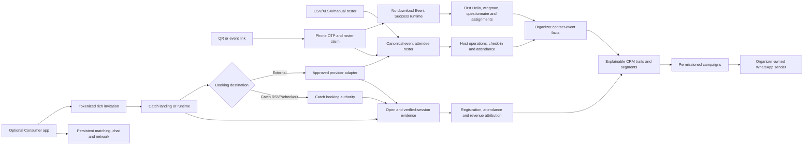
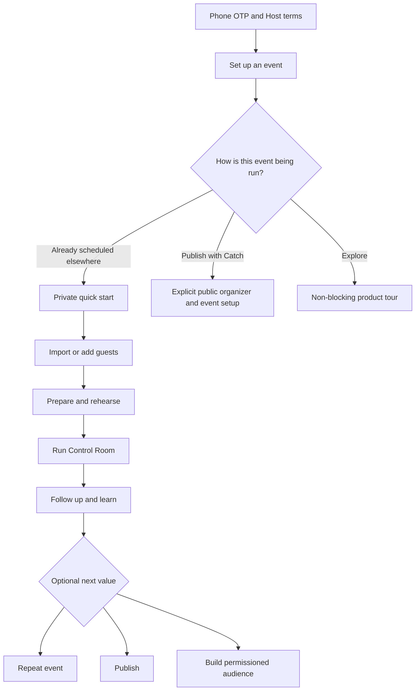
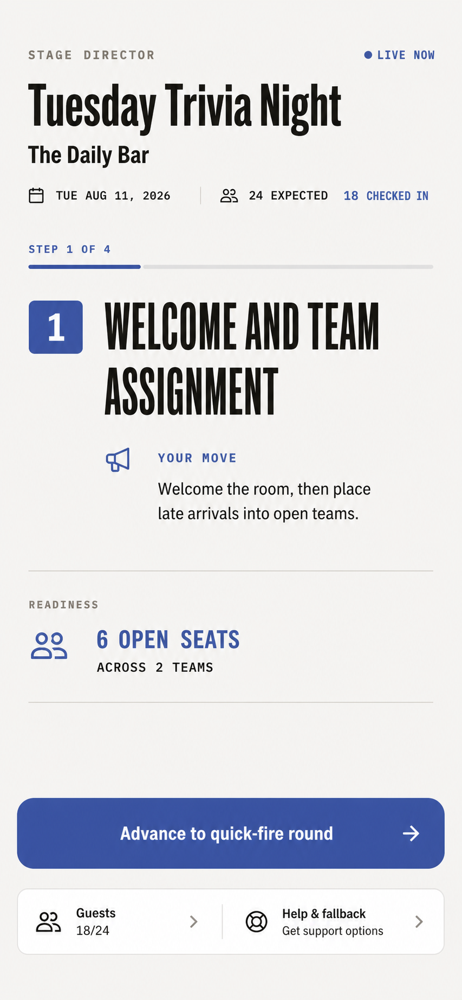
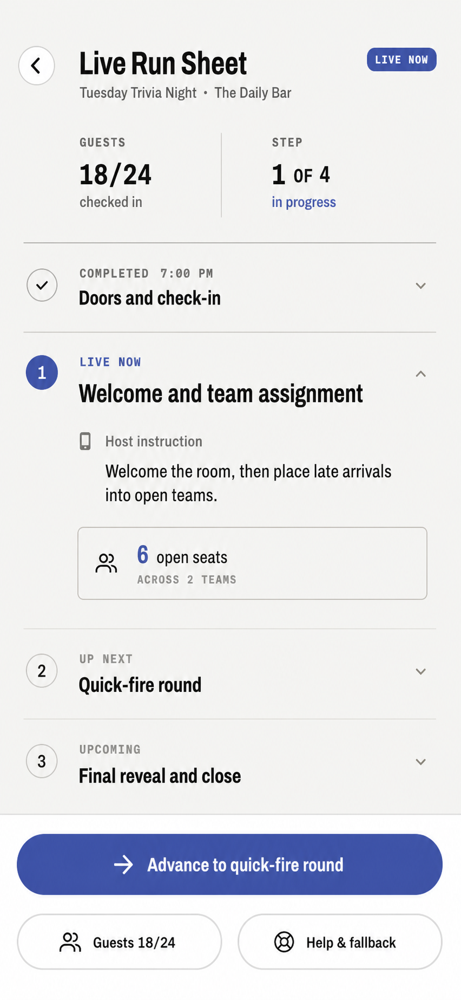
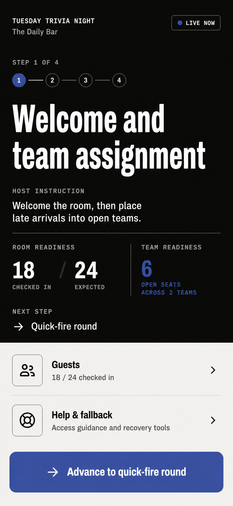
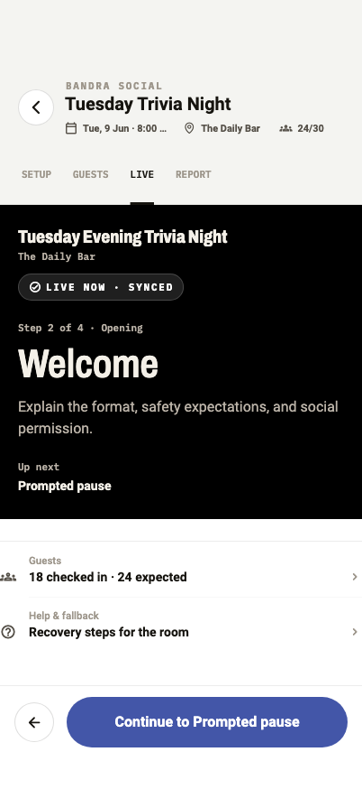
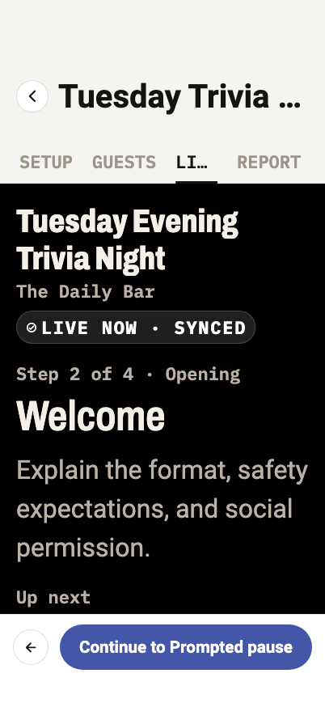

# Standalone Host Product And Implementation Specification

## Forms Product Owner

The generic Host Forms product is specified in
`docs/plans/host_forms_product_spec.md`. That specification owns form lifecycle,
builder and template behavior, the app-free respondent route, distribution,
responses, analytics, exports, automations, and reviewed downstream conversion.
This document continues to own the broader standalone Host capability and
consent model. Applications remain one Forms purpose with a review projection;
they are not the generic response model.

## Decision

Catch for Hosts is a first-class operations, reputation, audience, publishing,
and commerce product. Its minimum useful workflow must not depend on Catch
having sold the ticket or on an attendee having a Consumer dating profile.

The Host product and the Consumer network share organizers, events, operational
attendees, and explicit identity links. They do not share an onboarding
requirement. Hosts can adopt the system one capability at a time and may remain
on any rung indefinitely.

## Product Promise

The minimum Host promise is:

> Bring the event and guest list you already have. Catch gives your team one
> private run sheet, a clean roster, check-in, Event Success tools, feedback,
> review handling, and turnout analytics. Guests do not need the Catch dating
> app or a dating profile.

The progressive promise is:

> When you are ready, add audience follow-up, a public event page, OTP
> reservations, payments, a claimed organizer identity, and finally Catch's
> identity-rich network features. Each unlock is optional and explains its
> benefit, required setup, and data boundary before activation.

## Specification Purpose

This document is the reviewed product and implementation contract for turning
the existing standalone foundation into a comprehensible first-run Host
product. It owns the target customer, MVP boundary, journeys, progressive
disclosure rules, screen contracts, data and authorization deltas, rollout
order, measurement plan, failure policy, acceptance gates, cross-event CRM,
WhatsApp Business delivery, attendee categorization, rich invitations, and
share/booking attribution.

Every capability in this document uses one of these delivery labels:

| Label | Meaning |
| --- | --- |
| **Implemented** | Present in the implementation covered by this specification and on `main` after this change set is merged, subject to the exact limitations stated here |
| **Foundation** | A production contract or aggregate exists, but the end-to-end Host job is not complete |
| **Specified** | Approved product/technical design for a future implementation slice |
| **Provider-gated** | Catch can build its side, but launch also requires a third-party account, approval, API, webhook, template, or regulatory asset |
| **Policy-gated** | Technically feasible, but it must remain off until the named consent, safety, legal, or platform-policy decision is complete |

No **Specified** item may be described in Host-facing copy as available today.
An **Implemented** item can still be deployment- or provider-config-gated; the
tables below distinguish source completeness from a live credential, approved
sender, connected external account, deployed function, or completed backfill.

## Delivery Snapshot

The 2026-08-12 implementation provides the standalone Host platform in these
independent layers:

| Layer | Source status | External requirement or honest limit |
| --- | --- | --- |
| External event + roster | **Implemented** | CSV/XLSX/manual import and provider-specific normalization work without Catch checkout; provider export samples still determine adapter confidence |
| No-download Event Success | **Implemented** | Guests use phone OTP at `/join/:publicRuntimeId`; First Hello, wingman, questionnaires, groups, pairs, rotations, assignment delivery, self check-in and feedback do not require the Consumer app |
| Host CRM/Audience | **Implemented** | Person directory, timeline, fixed categories, server-backed sorting, search, detail, evidence-bearing merge review and receipt-specific unmerge, export, privacy requests and suppression work from any roster source; migration coverage is shown rather than hidden |
| WhatsApp Business campaigns and Inbox | **Implemented; provider-gated** | Catch supports Meta account authorization, WABA/number selection, sender verification, template sync/test, preview/approval/schedule/dispatch/report, status webhooks, STOP, 12-month inbound thread retention and service-window replies; production use requires Meta assets, credentials, webhook configuration, approved templates where required and exact recipient consent |
| Rich Host invitations | **Implemented** | Host/channel/direct-recipient/promoter/partner links, rich creative, bearer-token landing, likely-human opens and downstream conversions work without Catch booking; external booking conversion stays unknown without reconciliation/provider evidence |
| Attendee share attribution | **Implemented in web runtime and Consumer app** | Eligible attendees receive one stable personal link in no-download event mode, event detail or payment confirmation; Catch records use of its share/copy controls, opens, verified registrations and attendance, never private WhatsApp sends or forwards |
| Provider sync | **Implemented for Luma polling; cataloged for all providers** | Luma account connection, event selection, manual refresh and roster/check-in reconciliation are implemented; Eventbrite needs app/OAuth configuration, Partiful/Posh use exports, and other named providers remain sample/partner-gated |
| Offline event operations | **Partially implemented** | Absolute revisioned attendance mutations, a PII-free durable outbox, retry, conflict review and expiry are implemented; offline roster/run-sheet cache and revisioned run-step replay remain promotion gates |
| Event staff | **Implemented for scoped check-in/runtime review** | Expiring/revocable event grants and a restricted operator route work without a Consumer profile; multi-device live-run leadership/lease transfer remains pending |
| Catch bookings | **Implemented separately** | Catch RSVP/checkout adds authoritative capacity, waitlist, payment/refund and revenue facts; it is not a prerequisite for the layers above |
| Consumer network | **Separate optional layer** | Persistent mutual matching, chat, cross-event discovery and profile-derived reasoning still require the relevant Consumer profile and consent gates |

This snapshot is the source-of-truth answer to “what works at what integration
level.” Later sections retain the full architecture, safety constraints and
remaining promotion work.

### Host Customers workspace cutover

The Host shell now gives CRM people their own `/host/customers` branch between
Events and Inbox. The default surface is an organizer-scoped, server-paginated
directory sourced from `organizerContacts`; it supports name search, reviewed
fixed-trait filters, Last seen/Most attended/Name sorting, organizer switching,
manual name-only contacts, reviewed exact-evidence merge decisions, and a
route-level detail at `/host/customers/:contactId`. “At risk” is presentation
copy for the versioned `lapsed_regular` rule. It is never an opaque churn score.

The detail route exposes only contact endpoints, explainable attendance facts,
bounded event history, and completed non-refunded Catch payments for events in
that contact's organizer history. Revenue carries `exact`, `partial`, or
`unavailable` coverage. External-provider face value and unreconciled sales are
not inferred. A manager can start or reuse a direct conversation only when the
contact has one verified linked Catch UID; name-only or ambiguous identities
keep the action unavailable.

`HostCustomersDirectoryController` owns pagination and deduplication;
`HostCustomersController` owns create and conversation mutations;
`HostCrmRepository` remains the only Flutter callable boundary. The existing
Organizer Audience campaign/setup pane remains available during extraction so
the navigation cutover does not remove campaign functionality. Campaigns remain
in Messaging; notes/tags, reviewed merge/unmerge and per-person
Campaign/Announcement history are now under Customers without creating another
contact model. Value-segment projection remains a separate future decision.

The first Customers cutover deliberately does not label anyone “high spender.”
Customer detail revenue is implemented, but organizer-wide `known_spender` and
`top_spender` sorting still requires a payment-triggered, indexed contact-trait
projection. Until that projection and definition version ship, the directory
offers only attendance, reliability, lapse, and advocacy tags whose source
coverage is already enforceable.

## Target Customer And First Wedge

The first target is a recurring facilitated social-event Host who:

- runs mixers, newcomer socials, community dinners, social games, networking,
  speed-meeting, or similarly interaction-led events;
- typically has 20-150 attendees;
- already receives bookings through spreadsheets, forms, direct messages, a
  ticketing product, or another community platform;
- has at least one person actively facilitating the room;
- has a phone or tablet available during preparation and runtime; and
- needs roster confidence, check-in, a run of show, and repeatable learning
  more urgently than a new public marketplace.

Lectures, concerts, passive performances, large festivals, classes with no
facilitated social outcome, and events above the validated operational ceiling
are not launch claims. They may use basic roster tooling, but their needs must
not dilute the first Event Success experience.

The MVP promise is deliberately narrower than the full product promise:

> Bring a social event you already scheduled and the guest list you already
> have. In a few minutes, Catch gives your team one reliable roster, check-in,
> and a simple live run of show. Guests need neither the Consumer app nor a
> dating profile.

### Actors and jobs

| Actor | Primary job | Minimum authority |
| --- | --- | --- |
| Private workspace owner | Set up the first event without asserting public business ownership | Authenticated owner of the private workspace |
| Organizer owner/manager | Publish, manage identity, configure payments, inspect permitted business data | Verified organizer authority appropriate to the action |
| Event lead | Prepare and control the live run sheet | Organizer manager or event-scoped, expiring runtime grant without payout, CRM or public-page authority; multi-device leadership fencing remains separate |
| Check-in staff | Search the roster and set attendance state | Implemented event-scoped, expiring attendance grant with bounded roster access and no organizer-wide CRM/provider/import authority |
| Operational attendee | Exist on the roster and participate in Host-led activities | No account required for Host-only operations |
| Event-scoped verified attendee | Use private RSVP, feedback, assignment, or self-service actions | Phone-auth or purpose-scoped signed authorization linked server-side |
| Consumer member | Use profile-dependent network experiences | Completed relevant Consumer/profile/consent gates |

The MVP must not force the event lead or check-in staff to become an organizer
manager, and it must not expose payment, public-identity, or cross-event PII
authority to an event-scoped role.

## Product Evidence Gate

Before the implemented product is promoted beyond an internal or
founding-Host beta:

1. Interview at least eight target Hosts across at least three event formats.
2. Observe at least three real event runtimes, including one weak-connectivity
   venue.
3. Test the quick-start and Control Room prototype with at least ten target
   Hosts.
4. Collect representative CSV/XLSX files and document booking source, row
   count, contact quality, duplicate patterns, staff count, device count, venue
   connectivity, and existing event-day failure modes.
5. Resolve the workspace-authority, offline, staff-role, review-provenance, and
   guest-access decisions listed below before their dependent slices start.

Proposed usability gates are:

- at least 8/10 target Hosts create an operations-only event without help;
- at least 90% map and confirm a representative roster in under five minutes;
- at least 9/10 identify the current and next live action within five seconds;
- zero lost check-ins or run-sheet progress in restart/reconnect simulations.

These thresholds are release gates to validate, not forecasts.

## Narrow Operations-Only MVP Boundary

This subsection records the intentionally narrow launch-validation wedge. It
is not a list of features absent from the fuller implementation snapshot above.

The narrow standalone validation MVP can exclude:

- paid OTP checkout, refunds, receipts, payouts, and payment onboarding;
- WhatsApp or SMS campaign sending;
- a cross-event CRM contact workspace;
- public listing claim or automated business-authority verification;
- global Host bottom-navigation redesign;
- profile-derived compatibility, ranking, approval, or cohort balancing;
- swiping, catches, Cross Paths, dating chat, or cross-event discovery;
- persistent mutual Catch, Consumer chat, Cross Paths, and other cross-event
  network relationships for operational-only attendees;
- organizer-wide reputation analytics;
- provider API sync that lacks documented partner access; and
- unreviewed booking-platform adapters built from guessed export headers.

The schemas may preserve seams for these capabilities, but MVP UI, copy, and
success criteria must not depend on them.

## Product Principles

1. **First value before identity depth.** A phone-authenticated Host reaches a
   private event and roster before public-page, payments, or claim setup.
2. **Authentication is not business authority.** Host phone OTP proves the
   person controls a phone; it does not prove ownership of a business, public
   listing, sender identity, or payout destination.
3. **One operational truth.** Host UI reads one `EventAttendee` roster. Consumer
   participation remains a linked source contract, not a second Host board.
4. **One dominant live action.** The Control Room shows the current beat, the
   next beat, and recovery. Capability inventory stays off the live stage.
5. **Platform primitives stay platform primitives.** Roster, ordinary
   check-in, safety fallback, attendee feedback, and analytics are event
   platform capabilities. Event Success owns the optional facilitated ritual
   and run-of-show layer; First Hello remains its arrival ritual.
6. **Recommendation is not silent activation.** The basic run sheet may be
   recommended by default. Grouping, personalized, or attendee-private modules
   require explicit Host choice plus the required disclosure, authorization,
   consent, and opt-out.
7. **Offline is a product contract.** A runtime that loses check-ins or progress
   when a venue loses connectivity is not ready for standalone positioning.
8. **Progressive adoption is branching.** Operate, retain, publish, transact,
   establish identity, and use the network are capability branches with shared
   gates, not one mandatory setup wizard.
9. **Every import is reviewable and conditionally undoable.** Preview,
   correction, duplicate review, exact confirmation, receipt, and a bounded
   conflict-aware undo window precede cross-event identity assumptions.
10. **Private data is not growth consent.** Imports, OTP, attendance, service
    messaging, organizer messaging, and Catch marketing remain separate
    purposes.

## Capability Ladder

| Rung | Host outcome | Required adoption | Host-facing message |
| --- | --- | --- | --- |
| 0. Operate | Run an externally booked event | Host phone OTP, workspace, event, imported/manual roster | "Bring your guest list. Run the event here." |
| 1. Learn | Collect feedback, request reviews, respond publicly, improve the next event | Rung 0 plus attendee contact or event-scoped OTP where a private response is needed | "Close the loop after every event." |
| 2. Retain | Understand past and repeat attendance; message the audience that explicitly opted into each channel | Rung 1 plus a channel-specific permission ledger and delivery setup | "Turn attendees into a permissioned repeat audience." |
| 3. Publish | Acquire demand through a Catch public page and accept free/open reservations | Public organizer/event projection, publication eligibility, attendee phone OTP | "Publish once; registrations join the same roster." |
| 4. Transact | Sell tickets and manage refunds/payouts | Payment onboarding, supported policy, payout readiness | "Let Catch own checkout and payment operations." |
| 5. Establish identity | Own an existing public listing and reputation channel | Organizer claim and verification | "Claim your page and make your reputation portable." |
| 6. Use the network | Add persistent profiles, discovery, swiping, mutual Catch, cross-event recommendations and chat | Feature-specific Consumer profile and consent | "Unlock a relationship that continues after the event." |
| 7. Grow with Catch | Measure acquisition and use lawful first-party advertising activation | Separate Catch marketing consent, legal/policy approval, suppression and deletion controls | "Use only the audience that explicitly chose Catch marketing." |

Rung 2 is deliberately before Catch booking. A Host may build repeat business
from externally booked events, but an imported phone number is never treated as
WhatsApp, SMS, or Catch advertising permission.

The table is an adoption narrative, not an authorization dependency chain.
Implementation must use a capability graph:

```text
private Host workspace
  -> core event operations
       -> event learning and private feedback
       -> permissioned audience retention
       -> public acquisition
            -> commerce
            -> public reputation and claimed identity
                 -> profile-dependent network capabilities

Catch marketing activation is a separate governed branch. It is never implied
by any Host-product branch.
```

Business authority, sender identity, payment eligibility, review provenance,
and Consumer-profile readiness are shared gates that may appear in more than
one branch. The UI exposes only the next relevant outcome and its smallest
unmet gate.

## Integration Profiles And Capability Gates

The Host-facing adoption story may look progressive, but the implementation is
not a single depth score. Three independent facts determine what Catch knows:

1. **Booking authority:** whether Catch, an external provider API, or only an
   imported file knows that a reservation and payment occurred.
2. **Attendee identity:** whether Catch has only an operational roster row, an
   event-scoped phone-verified attendee, or an intentional Consumer member.
3. **Channel authority:** whether Catch may send an event-service message, the
   organizer has a valid channel opt-in and sender, or Catch has separate
   marketing permission.

Consumer-app adoption does not magically give Catch external booking data. A
provider sync does not give Catch dating-profile consent. A WhatsApp sender
connection does not create permission to message imported phone numbers.

### Reference integration profiles

| Profile | Host setup | What becomes dependable | What remains unknowable or unavailable |
| --- | --- | --- | --- |
| **E0: external roster only** | Create/import the event and CSV/XLSX/manual guest list | Operational roster, source provenance, Host manual check-in, run sheet, Host-directed grouping, attendance history, aggregate turnout, exact repeat attendance after identity resolution | Guest-facing QR/runtime actions; whether an external booking later changed unless re-imported; exact link-to-booking conversion; payment/refund truth |
| **E1: external roster + web runtime** | E0 plus attendee opens Catch QR/link, verifies phone, claims/joins the event, and answers only module-required questions | Everything in E0 plus guest-facing join QR/link, verified event identity, self check-in, First Hello, compatibility questionnaire, wingman requests, pairing/grouping/rotations, feedback, event-scoped permissions, and a self-service personal referrer link after verification | External-provider payment/refund truth; whether a WhatsApp message was sent or forwarded; persistent mutual matching/chat |
| **E2: external booking + Consumer app** | E0 or E1 plus attendee intentionally installs/uses Catch | Persistent Catch identity, native rich sharing, referrer links created from the app, share-intent telemetry, push/Activity, profile-dependent matching and chat after their own gates | External booking conversion or revenue unless the provider returns data or the attendee is reconciled later |
| **E3: supported external provider sync** | Host connects an approved provider account/API or imports repeatable provider exports | Automatic roster/status reconciliation and any stable attendee, order, ticket, referral, check-in, cancellation, refund, or amount fields the provider actually exposes | Fields the provider does not expose; APIs requiring unavailable partner access; off-platform forwards or screenshots |
| **C1: Catch registration** | Publish a Catch event page and let Catch own free/open RSVP, capacity and waitlist state | Deterministic registration, cancellation, capacity, waitlist, attendee identity, invite-link conversion, service messaging, and runtime access | Paid value, refunds and payout data; profile-dependent network behavior without Consumer adoption |
| **C2: Catch paid booking** | C1 plus supported checkout, refund and payout setup | Exact gross/net order value, discounts, refunds, ticket inventory, revenue attribution and defensible spend/LTV facts | A right to organizer marketing, Catch marketing, or dating-profile use without their separate permissions |

E1, E2, and E3 are optional branches, not consecutive prerequisites. For
example, a Luma Host could connect E3 without asking guests to use Catch, while
another Host could use E1 from a spreadsheet and never connect a provider.



The diagram does not imply that every external provider returns attribution or
revenue. The provider-to-attribution edge exists only for fields in the
connection's proven coverage projection.

### Capability matrix

Legend: **Yes** is dependable at that profile; **Conditional** requires the
condition in the cell; **No** means the claimed outcome cannot be measured or
performed honestly. E2 below assumes the booking itself still occurs outside
Catch. This table is both the integration feasibility contract and product
availability map. A conditional cell names an external setup, consent or
identity condition rather than implying Catch checkout is required. The
`Current-state audit` and `Marketing claim contract` below further distinguish
source-complete features from provider/deployment gates.

| Capability | E0 roster | E1 web runtime | E2 Consumer app | E3 provider sync | C1 Catch RSVP | C2 Catch paid |
| --- | --- | --- | --- | --- | --- | --- |
| Import/manual roster and source provenance | Yes | Yes | Yes | Yes, automated where exposed | Yes | Yes |
| Search roster, Host manual check-in and attendance | Yes | Yes | Yes | Yes | Yes | Yes |
| Guest-facing join QR/link and self check-in | No | Yes | Yes | Conditional on E1, not provider sync alone | Yes | Yes |
| Host run sheet and live cues | Yes | Yes | Yes | Yes | Yes | Yes |
| Host-authored pairs/groups/rotations | Yes, Host displays/directs placements | Yes, private assignments on guest web | Yes, private native assignments | Conditional on E0/E1 identity | Yes | Yes |
| Generated balanced pairs/groups/rotations | Conditional on disclosed inputs and attendee opt-out | Yes, with event-scoped answers | Yes, with permitted profile/event inputs | Provider data alone is insufficient | Yes, with event questions | Yes, with event questions |
| First Hello companion | No private guest surface | Yes | Yes | Provider sync alone is insufficient | Yes | Yes |
| Wingman requests | No private guest surface | Yes | Yes | Provider sync alone is insufficient | Yes | Yes |
| Event compatibility questionnaire | No private guest surface | Yes | Yes | Provider sync alone is insufficient | Yes | Yes |
| Post-event structured feedback | Conditional on service link/contact policy | Yes | Yes | Conditional on a reachable/verified identity | Yes | Yes |
| Aggregate turnout and repeat attendance | Yes, after dedupe | Yes | Yes | Yes | Yes | Yes |
| Person-level cross-event CRM | Yes, with confidence/coverage labels | Yes, with stronger verified links | Yes | Yes, with provider provenance | Yes | Yes |
| Current-event in-app broadcast | No | Conditional on linked Catch UIDs | Yes | No by sync alone | Conditional on linked UIDs | Conditional on linked UIDs |
| Organizer WhatsApp campaigns | Conditional on exact opt-in + active Meta sender/template | Same | Same | Same | Same | Same |
| Rich image/link invitation created by Host | Yes | Yes | Yes | Yes | Yes | Yes |
| Personal attendee/referrer link | Conditional on Host-issued link to a known contact | Yes, self-service after verified runtime claim | Yes, self-service | Conditional on provider referral support | Yes, self-service for eligible attendees | Yes, self-service for eligible attendees |
| Observe Catch share surface opened | Host share action only | Yes, runtime share/copy intent | Yes, Consumer share intent | No by sync alone | Yes on the adopted attendee surface | Yes on the adopted attendee surface |
| Prove a WhatsApp message was sent or forwarded | No | No | No; Catch only sees its own share action and later link use | No | No | No |
| Count human link opens | Conditional; bot-filtered estimate | Yes, estimate | Yes, estimate | Yes, estimate | Yes, estimate | Yes, estimate |
| Count additional verified people using a link | Conditional on later OTP/check-in reconciliation | Yes | Yes | Conditional on returned code/identity | Yes | Yes |
| Exact external booking attributed to link | No | No unless reconciled | No unless reconciled | Conditional on provider code/API/export | Yes | Yes |
| Exact cancellation/refund attribution | No | No | No | Conditional on provider fields | Yes | Yes |
| Exact customer spend/LTV | No; never infer from list price | No | No | Conditional on authoritative order amounts | No | Yes |
| Mutual matching and persistent chat | No | No | Conditional on full Consumer/profile gates | No by sync alone | No by RSVP alone | No by payment alone |

This matrix is the minimum copy and authorization truth. The UI may simplify it
to the current Host's profile, but analytics and backend policy must retain the
underlying facts.

### Provider adapter classes

External providers belong to capability classes rather than a promise of
"direct sync with every platform":

| Adapter class | Minimum contract | Product behavior |
| --- | --- | --- |
| **Class A: API + webhooks** | Documented organizer-authorized API, stable external ids, usable event/attendee scopes, webhook or safe polling terms | Connect account, initial backfill, incremental sync, reconciliation, health UI and revocation |
| **Class B: API/poll only** | Documented organizer-authorized read API but no usable webhook | Scheduled sync with visible freshness and manual refresh; never claim real time |
| **Class C: structured export** | Stable CSV/XLSX export fields and lawful Host access | Provider-specific import preset, file fingerprint, incremental re-import and conflict report |
| **Class D: partner/private API** | Access only through a commercial/approved partner relationship | Show as unavailable until written access and production credentials exist |
| **Class E: no dependable export** | No stable lawful machine-readable source | Generic import/manual workflow only; no brittle scraping or credential collection |

As of this specification, Luma documents a calendar-scoped JSON API for events
and guests plus webhooks, with a Luma Plus requirement. Eventbrite documents
attendee/order data and webhooks. Partiful documents guest-list CSV export.
Airbnb's software-connected model is partner-scoped. These examples are
planning evidence, not permanent guarantees; each adapter needs a launch-time
terms, scope, sample-payload, rate-limit, deletion, and sandbox review.

### Provider inventory and current adapter status

The current event-origin contract can name `generic`, `luma`, `eventbrite`,
`partiful`, `posh`, `bookmyshow`, `district`, `sortmyscene`, and `airbnb`.
Naming a provider is provenance, not proof of API support.

| Provider | Current Catch file adapter | Direct-sync planning class | Launch requirement |
| --- | --- | --- | --- |
| Generic CSV/XLSX | Generic header mapping | Class C | Representative Host files and mapping/duplicate proof |
| Luma | `luma-v1` header signature plus implemented API-key connection, event discovery, manual poll, cursor/paging and roster/check-in reconciliation | Implemented Class B polling subset; official API is calendar-scoped and requires Luma Plus; webhook automation is not implemented | Production organizer key, endpoint/terms review, representative payload monitoring and webhook work before a real-time claim |
| Eventbrite | `eventbrite-v1` header signature | Class A candidate; official attendees/orders and webhooks exist, and Catch exposes a configuration-required provider state | OAuth/application access, sample payloads, scopes, webhook verification and terms review |
| Partiful | `partiful-v1` header signature | Class C; official guest-list CSV export is documented | Real current export fixtures and incremental re-import semantics |
| Posh | `posh-v1` header signature | Unclassified beyond Class C until official access review | Real exports and official API/terms evidence before any sync claim |
| BookMyShow | `sample-required` | Class D/E until official organizer access is proven | Host export sample and written API/partner evidence |
| District | `sample-required` | Class D/E until official organizer access is proven | Host export sample and written API/partner evidence |
| SortMyScene | `sample-required` | Class D/E until official organizer access is proven | Host export sample and written API/partner evidence |
| Airbnb Experiences | `sample-required` | Class D; Airbnb API programs/scopes require partner/program access | Written program access, permitted-use/data-retention review and representative payloads |

The header signatures in code are normalization presets, not a substitute for
an expiring corpus of actual provider exports in tests. If a provider changes
its format, the importer falls back to explicit mapping or `sampleRequired`;
it does not silently guess.

### Provider connector data contracts

| Collection/path | Purpose | Required controls |
| --- | --- | --- |
| `organizerProviderConnections/{connectionId}` | One organizer-authorized external account/calendar connection | provider, organizer, external account ref, scopes, capability coverage, state, secret ref, actor/time, health, revocation; no raw secret |
| `externalEventMappings/{mappingId}` | Stable internal event to provider event mapping | connection/internal/external ids, immutable origin, roster/booking/check-in/payment authority by field, sync policy, revision |
| `providerSyncRuns/{runId}` | Resumable backfill/poll/reconciliation operation | connection/mapping, cursor/watermark, pages/counts, started/finished state, sanitized error, retry/idempotency and operation refs |
| `providerWebhookReceipts/{receiptId}` | Deduplicated authenticated provider callback | provider/connection/event id, payload hash, received/processed state, minimal routing metadata and short raw-payload retention |

Each connection publishes a field-coverage projection such as roster identity,
registration state, cancellation, order amount, refund, referral code,
provider check-in and webhook freshness. Downstream UI and attribution consult
that projection and fail closed per field. A provider being connected does not
make every fact authoritative.

Initial backfill enters the same preview/reconciliation boundary as imports.
After approval, webhooks/polls emit idempotent normalized facts, update the
operational roster, and enqueue affected CRM/attribution projections. A stored
cursor is never advanced until the corresponding facts and receipt commit.
Disconnect stops future calls/jobs, deletes or revokes secrets, preserves
minimal audit/reconciliation facts under policy, and marks freshness rather
than erasing the source of existing attendee rows.

Implementation must revalidate these official sources at adapter/sender launch:

- [Meta WhatsApp Business Platform](https://www.postman.com/meta/whatsapp-business-platform/overview),
  including Cloud API, Business Management, Embedded Signup, templates and
  webhook collections;
- [Luma public API](https://docs.luma.com/reference/getting-started-with-your-api);
- [Eventbrite attendee API](https://www.eventbrite.com/platform/docs/attendees)
  and [webhooks](https://www.eventbrite.com/platform/docs/webhooks);
- [Partiful guest-list export](https://help.partiful.com/hc/en-us/articles/26506705696155-How-can-I-export-my-guest-list);
  and
- [Airbnb API terms](https://www.airbnb.com/help/article/3418) plus the exact
  approved API Program and scopes Catch receives, if any.

### Adversarial utility and priority

| Verdict | Capability | Reason |
| --- | --- | --- |
| **Core** | One roster, check-in, no-download Event Success, feedback and repeat attendance | Solves an event-day and repeat-event job even when booking stays elsewhere |
| **Core retention** | Permissioned audience, transparent segments and WhatsApp invitations | Lets recurring Hosts bring back people they already served without replacing checkout |
| **Core differentiation** | First Hello, wingman, pairing/grouping/rotation plus attendance-qualified referrals in one external-event workflow | The aggregate is more useful than any isolated table-stakes feature |
| **Useful but conditional** | Provider sync | Removes re-import/reconciliation work only where lawful, stable data access exists |
| **Useful but conditional** | Spend/LTV and revenue attribution | High value only with authoritative order/refund data; actively misleading otherwise |
| **Supporting** | Rich invitation image and preview | Improves presentation, but the tokenized link and downstream action are the measurable product |
| **Gimmicky if overstated** | Share count, viral coefficient, unique people from cookies, or exact WhatsApp forwards | Catch cannot observe the claimed behavior; use share intent, opens, verified registrations and attendance instead |
| **Harmful** | Opaque customer-value score, sensitive dating-data segments, universal direct-sync promise | Hides uncertainty, creates trust/safety risk, or depends on access Catch does not control |

The first CRM release is therefore Audience facts/segments plus rich
permissioned invitations and attendance-qualified attribution. It is not an
automation suite, universal provider hub, or customer-scoring engine.

## Identity And Consent Model

### Operational attendee

An imported or manually entered `eventAttendees/{attendeeId}` row can support
roster operations, check-in, source-aware counts, exports, and public aggregate
analytics. It does not create Firebase Auth, a Consumer account, or a public
profile.

### Event-scoped verified attendee

The public website uses phone OTP to create or reuse a Firebase Auth UID, then
links that UID to the operational attendee. The experience does not ask for a
password, account creation form, dating preferences, photos, or profile
approval. The UID supplies a stable, verified private boundary for reservation,
waitlist, self-service, feedback, and later account continuation.

This is "no profile setup," not literal anonymous booking. The product should
say "continue with phone" rather than claim that no identity exists.

### Consumer member

The Consumer account is created only when the person intentionally continues
into Consumer onboarding. The OTP attendee may reuse their verified UID and a
private onboarding draft seeded with their supplied name and phone. Host-entered
data must not silently populate public or dating-profile fields.

### Permissions stay separate

| Permission | Purpose | Default |
| --- | --- | --- |
| Event service | Confirmation, changes, cancellation, check-in, safety and receipt messages for the requested reservation | Allowed only to the extent necessary for that event and channel policy |
| Organizer WhatsApp | Future organizer updates over WhatsApp | Off until explicit organizer-scoped opt-in |
| Organizer SMS | Future organizer updates over SMS | Off until explicit organizer-scoped opt-in |
| Organizer email | Future organizer updates over email | Off until a valid organizer-scoped permission/legal basis and channel policy are recorded |
| Catch marketing/ads | Catch campaigns, customer-list uploads, retargeting or lookalike activation | Off until a distinct Catch permission and policy/legal gate |

Checkboxes are separate, optional, unbundled, and unchecked by default.
Importing data, booking an event, or opting into one channel cannot infer any
other permission. STOP/unsubscribe and self-service withdrawal must update the
same server-owned ledger and suppress future sends immediately.

Organizer channel opt-in may be collected in Catch registration, the event web
runtime, an organizer-branded Catch form, or an inbound channel action whose
meaning is explicit. It names the organizer, channel, purpose, expected message
kind/frequency, terms/privacy link and withdrawal route; it is optional and
unchecked. The receipt stores exact text/terms version, source/event, verified
endpoint or UID, timestamp and subsequent withdrawal. A Host cannot upload a
spreadsheet column saying `yes` and convert it to Catch permission without
reviewed evidence and migration policy.

## Surface Responsibilities

| Surface | Owns | Does not own |
| --- | --- | --- |
| Host Flutter app/web | Workspace, events, roster import/manual entry, check-in, Event Success runtime, feedback/review inbox, CRM segments, campaign composer, analytics, publication/payment/claim readiness | Consumer dating profile or a separate React Host dashboard |
| Marketing React website | Crawlable organizer/event pages, phone-OTP reservation, confirmation/change/cancel entry, optional organizer channel permissions, account-continuation CTA | Private roster, campaign management, or live Event Success state |
| Event runtime React app | No-download phone OTP, roster claim/approval, minimal event-scoped questionnaire, attendee-private Event Success moments and feedback | Public discovery, Host management, Consumer profile creation, mutual Catch or chat |
| Consumer Flutter app | Intentional persistent profile completion, identity-rich booking, discovery, swiping, mutual Catch, cross-event recommendations and chat | Basic prerequisite for Host operations, OTP reservation, or event-scoped Event Success |
| Admin React app | Consent disputes, import/link support, publication and message-template moderation, provider/webhook failures, refunds and deletion support | Routine Host operations |

## Product Object Model

### Private Host workspace

The quick-start flow must not call the existing `createOrganizer` behavior
unchanged. That behavior creates a claimed, owner-verified organizer and
reserves public identity. Phone OTP alone cannot justify those effects.

The selected direction is a private lifecycle inside the canonical
`organizers/{organizerId}` model, not a second organization collection:

- add an authoritative private-workspace lifecycle, proposed as
  `workspaceLifecycle: privateOperations`, that is distinct from existing
  `ownership.state: userCreated`, `claimed`, or `transferred` business
  authority;
- add `operations_only` to the organizer supply-capability contract; its
  `bookable`, `paymentsEnabled`, `waitlistEnabled`, and `hostContactEnabled`
  fields are all false, `claimable` is false, `reviewPolicy` is `none`, and
  team-authorized private event operations are evaluated separately;
- app visibility is hidden;
- public page, public slug, claim state, follower acquisition, public
  provenance, and search projection are absent or fail closed;
- supply capabilities are operations-only;
- professional display name and event-operation location may be minimal and
  private; public description, media, contact, category, and SEO fields are not
  collected;
- `organizerTeamMemberships` remains the team authority, with a future
  event-staff role narrower than organizer manager; and
- conversion to a public/claimed organizer is an explicit server operation
  that first searches for an existing listing, resolves duplicate/claim policy,
  collects public fields, verifies authority, and only then reserves a route.

The capability schema enum and discriminated `oneOf` must add
`operations_only` plus `reviewPolicy: none`; neither existing public-review
policy may be inherited. The current `organizerSupplyCapabilitiesFor` function maps every `userCreated`
organizer to `claimed_managed`; therefore quick start must not reuse that state
or constructor until the contract, generated types, Dart reader, validator,
and server verifier all understand `privateOperations` plus
`operations_only`. Stored capabilities continue to be verified against
canonical authority and fail closed.

Promotion is a resumable, idempotent, receipt-backed workflow, not one Firestore
transaction. Its fenced stages are requested, authority verified, listing match
resolved, writes frozen, route reserved, authority cut over, references
migrated, projections rebuilt, and completed (or failed/compensated).

If no existing public listing matches, the private organizer id survives and is
promoted in place. If a canonical public listing already exists, that public
organizer id survives; the private id becomes a permanent server-resolved alias,
and stable event ids, attendee ids, receipts, analytics references, and audit
history are migrated in idempotent batches. Reads resolve the alias during the
cutover, new writes are fenced to the surviving id, and public capability stays
fail closed until authority, route, reference, and projection receipts are
complete. A failed stage can resume or compensate without exposing both records
as owned public organizers.

These invariants are mandatory:

1. quick start cannot create a public or discoverable organizer;
2. quick start cannot mark a business identity owner-verified;
3. quick start cannot reserve a public slug;
4. operations-only events cannot notify followers or enter discovery; and
5. the private record can be promoted or merged without forking event history.

### Event provenance and capability state

Do not add one coarse `integrationMode` enum. It would conflate where an event
came from with which products are currently enabled.

Each event needs:

- exactly one immutable origin such as `hostQuickStart`, `publishedCreation`,
  `adminIntake`, or `externalAdapter`, including source details where relevant;
- independent publication state;
- independent registration state;
- independent payment state;
- independent network/profile capability state;
- source-preserving attendee rows; and
- a capability projection used by UI, Functions, rules, website, and analytics.

Publishing is a capability transition, never provenance. Publication,
registration, payment, and network changes write idempotent transition receipts
with actor, prior revision, new revision, reason, and timestamp.

The capability projection is server-owned, derived, and fail closed. During
migration, existing `publicRegistrationEnabled`, event-policy admission state,
organizer visibility, and verified organizer supply capabilities remain the
authoritative inputs; the projection is not a second writable authority. An
empty Consumer participation list does not imply an operations-only event, and
a mixed-source roster does not silently elevate publication, payments, or
network access.

### Event-scoped staff authority

`organizerTeamMemberships` remains organizer-wide and continues to grant only
owner/manager authority. It must not be stretched for temporary event workers.
The implemented `eventStaffGrants/{eventId_uid}` authority contains event id,
organizer id, uid, role, explicit permissions, grantor, issued and expiry
timestamps, revoked timestamp, and revision. Grants are limited to 14 days and
50 active staff per event. Reads revalidate event, organizer, expiry and
revocation; staff resolve directly through Firebase Auth and need no Consumer
profile. The operator route permits only its granted roster, attendance and
runtime-claim actions and excludes CRM, imports, provider setup, event editing,
campaigns and organizer-wide PII.

Multi-device live-run leadership transfer remains a separate unimplemented
lease/fencing contract. Staff grants must not be represented as solving that
concurrency problem.

### Attendee identities

`eventAttendees/{attendeeId}` is the canonical Host-facing operational identity.
`eventParticipations/{eventId_uid}` remains the Consumer booking/membership
edge. The server projection links them through optional `linkedUid` without
synthesizing accounts.

An attendee id is never a bearer credential. Guest-facing actions require one
of:

- a Firebase phone-auth identity linked server-side to the attendee row; or
- a short-lived, event-scoped, purpose-scoped, revocable signed capability
  token.

Sensitive feedback, safety reports, identity merges, account continuation, and
cross-event access require phone-auth or stronger authorization. A signed link
may support low-risk event-scoped acknowledgement or survey entry only when its
scope, expiry, reuse policy, and revocation behavior are explicit.

### Feedback, safety, and public review boundaries

These are three separate trust domains:

| Path | Authorization and content | Host visibility | Public effect |
| --- | --- | --- | --- |
| Experience survey | Single-use, expiring event-service link or phone OTP; structured ratings and constrained text only; no safety/private free text in a signed-link flow | Aggregate results only after the minimum response threshold; recommendation is five responses | None |
| Safety report | Phone OTP or stronger identity, dedicated policy/triage path, encryption and restricted roles | Never included in ordinary Host aggregates or notes | None unless a separate moderated action is taken |
| Public review | One review per server-linked attendee/event identity, moderation and revocation support | Host may respond and dispute through existing authority | Host-invited external reviews are visibly labeled and excluded from the Catch-verified headline score until independent attendance proof exists |

An event-service message may deliver one transactional feedback invitation when
the event and channel policy permit it; it does not authorize later organizer
marketing. Host notes are organizer-private, role-gated, auditable, subject to a
documented retention period, and covered by export/deletion policy. Attendee ids
are never exposed as review or survey credentials.

## Information Architecture

The MVP keeps the existing global Host tabs. It does not rename Inbox to Guests
or Organizer to Business before those destinations contain the promised
products.

The event workspace becomes the primary standalone product:

| Section | Host question | Owns | Does not own |
| --- | --- | --- | --- |
| Prepare | "Are we ready to run this?" | event facts, staff, roster readiness, run-sheet choice, rehearsal, offline readiness | public listing, pricing, follower growth |
| Guests | "Who is expected and who is here?" | one operational roster, import/manual entry, correction, duplicate review, check-in, source/status filters | a second Consumer participation board |
| Run | "What should I do now?" | current beat, next beat, timer/cue, optional grouping, guest drawer, fallback, sync state | setup form, analytics dashboard, full capability inventory |
| Follow up | "What happened and what should I do next?" | attendance reconciliation, private feedback, review invitation, host notes, event report, duplicate event | raw safety notes, unauthorized contact campaigns |

`Event Success` remains the differentiating product family. Host-facing runtime
copy should prefer `Live Guide`, `Run sheet`, or `Control Room`, because these
describe the job. Marketing and owner documentation may continue to use Event
Success as the system name.

## First-Run Journey



### Entry and intent

After phone OTP and Host terms, a first-time Host sees one primary action:

> Set up an event

The next choice asks how the event is being run:

1. **Already scheduled elsewhere** - recommended and visually primary.
2. **Publish and register with Catch** - secondary, capability-gated path.
3. **Explore Host tools** - non-blocking product tour.

The choice persists in a resumable first-run draft. It changes disclosure, not
the underlying event model.

### Operations-only quick start

Collect only:

- explicit event title;
- date;
- start and end time;
- timezone;
- venue name and structured location;
- facilitated social-event format;
- optional expected attendee count; and
- minimal private workspace label when no private workspace exists.

Do not collect organizer media, public description, Instagram, public contact,
admission policy, age policy, ticket price, demand pricing, public page, payout,
or claim information.

On success, route directly to Prepare. The user can add guests, rehearse, or
leave and resume. Public publication remains absent.

Quick start cannot call the current `createEvent` payload unchanged. That
contract requires run-specific, commercial, capacity, and discovery values
that do not truthfully describe many social events. Add a dedicated
`createPrivateOperationalEvent` callable and evolve the canonical
`events/{eventId}` contract into explicit `privateOperations` and
`publishedBooking` variants rather than filling public fields with defaults.

| Quick-start input | Canonical private-event storage | Publication conversion |
| --- | --- | --- |
| Title | Required explicit `title`; add to Dart/TypeScript domain and formatters | Reuse after Host confirmation; regenerate public title/SEO projections |
| Date and local times | UTC timestamps plus required IANA `timezone` | Retain timezone as display/edit source of truth; never infer it later from offsets |
| Venue | Private meeting label and structured location; precise coordinates optional until an operation needs them | Apply public-address and map-disclosure policy before projection |
| Social format | General event-format discriminator and reviewed run-sheet eligibility | Map only to supported public discovery taxonomy with Host confirmation |
| Expected attendee count | Optional `expectedAttendance`; planning hint only | Never copy to admission `capacityLimit`; ask for capacity separately if registration is enabled |
| Workspace label | Private display label only | Does not become public organizer name without authority and confirmation |
| No distance/pace answer | Fields are absent/not applicable for non-run formats | Collect only if the chosen public activity format requires them |
| No description answer | Private operational notes remain optional and non-public | Require a public description before publication |
| No price answer | Payment state remains disabled; do not write `priceInPaise: 0` as a claim of free registration | Collect explicit free/paid admission and price during registration/payment enablement |
| No discovery answers | Discovery projection is absent and no index/projection write occurs | Derive only after public market, city, activity, geo and admission inputs pass validation |

Backward compatibility requires a read fallback for legacy events without
`title` or `timezone`, a deterministic formatter migration, versioned generated
types, and SEO/projection tests. Legacy fallbacks are never written back as
Host-confirmed values. The private variant retains common lifecycle and roster
fields but does not require booking counters or discovery projections until the
corresponding capability is enabled.

### Guest-list import

The import journey is:

1. Choose CSV, XLSX, or manual entry.
2. Detect headers and let the Host map name, phone, email, external reference,
   ticket type, and initial status.
3. Preview normalized values before upload.
4. Separate valid, warning, duplicate candidate, invalid, and unsupported rows.
5. Never silently merge shared-phone or ambiguous rows.
6. Let the Host correct a row, keep both people, exclude a row, or explicitly
   merge a duplicate candidate.
7. Show the exact create/update/skip counts before confirmation.
8. Request a server preview/version token; commit that exact reviewed version
   with an idempotency key and payload hash so a preview/commit race fails.
9. Return a durable receipt and offer `Undo this import` only while every
   affected change remains safely reversible.
10. Keep checked-in or linked identity state when a safe re-import updates a
    row.

The server retains a TTL-bound, server-only change set containing created ids
and permitted field preimages. Undo may delete still-unmodified created rows
and restore only fields whose revisions still match the receipt. Check-in, OTP
linking, correction, another import, or downstream guest action can make a row
conflicted. Receipt states are `undoAvailable`, `undoConflict`, `undone`,
`partiallyUndone`, and `undoExpired`; partial undo reports exact restored,
retained, and conflicted counts without leaking PII.

The existing 250-row request bound remains the first implementation ceiling;
the UX may chunk larger reviewed files only after server transaction,
idempotency, progress, cancellation, and rollback behavior are specified.

Import security and correctness fixtures must cover shared phone numbers,
country-code ambiguity rather than silently assuming `+91`, duplicate columns,
mixed encodings, CSV formula injection on export, malformed/oversized XLSX,
password-protected files, macro-bearing files, and concurrent import/check-in.

### Prepare

Prepare presents a short readiness list:

- event facts complete;
- guest list loaded or intentionally skipped;
- ordinary check-in fallback ready;
- recommended run sheet selected;
- Control Room rehearsed; and
- offline cache ready on the current device.

The recommended basic run sheet is a reviewed, roster-agnostic facilitation
template. MVP customization is limited to title, short Host instruction,
duration, ordering, skip, and optional manual team-placement beats. A general
run-sheet editor, random grouping, personalized, attendee-private, and
profile-dependent modules remain off until separately specified and gated.

### Rehearsal

Rehearsal uses synthetic attendee data and never writes production attendance
or guest actions. It teaches:

- current versus next beat;
- advance, undo, pause, and skip;
- how to find Guests;
- how to use Help & fallback;
- how offline/sync state appears; and
- how to recover after an accidental advance or application restart.

Completion returns to Prepare with a visible readiness result.

## Event Success Standalone Boundary

### Operations-only Host MVP

- a Host-authored or recommended run sheet;
- stage progression with current and next beat;
- timers and facilitation cues;
- local rehearsal;
- ordinary roster/check-in integration;
- optional Host-directed manual team placement from a reviewed template,
  without algorithmic assignment or sensitive keep-apart storage;
- restart/reconnect recovery;
- completion; and
- basic private feedback invitation and aggregate learning.

### Implemented no-download runtime extension

The current web runtime at `/join/:publicRuntimeId` adds phone OTP, exact roster
claim or Host-approved walk-in, event-scoped profile input, self check-in,
private assignment delivery, First Hello, the compatibility questionnaire,
wingman requests, pairing/grouping/rotations, and post-event feedback. Runtime
participants join the Event Success roster without requiring a Consumer
booking edge or installed Consumer app.

This is an E1 capability. It is not part of the contactless E0 Host MVP, but it
is implemented and must not be advertised as Consumer-app-only.

### Runtime minimum-data contract

The runtime must derive required fields per enabled module and selected
behavior, not from one broad "compatibility module" set:

| Module/behavior | Minimum event-scoped fields | Fields allowed only when behavior needs them |
| --- | --- | --- |
| Basic roster claim and self check-in | verified phone and display name | None |
| First Hello with neutral/fair assignment | display name | Gender/interests only if the Host explicitly enables disclosed preference-aware targeting |
| Wingman request | display name plus selected target UID | Gender/interests are not prerequisites |
| Neutral guided rotations/groups | display name and opt-in/opt-out | Gender/interests are not prerequisites |
| Compatibility questionnaire without demographic ranking | display name plus selected event-answer ids | Gender/interests are not prerequisites |
| Preference-aware pairing/grouping/rotation | display name, exact selected preference fields and event answers | Gender, interested-in genders, relationship goal or age only when the configured policy actually consumes each field |

**Implemented behavior:** runtime entry always requires only `displayName`.
Gender and `interestedInGenders` are optional and are offered only when an
enabled preference-aware module and its policy consume them. First Hello,
wingman, neutral grouping/pairing/rotation and questionnaires can therefore run
without demographic answers. The backend upgrades earlier demographic-gated
participants to this contract, preserves explicit consent for sensitive
answers, and falls back to neutral logic rather than blocking entry.

Saving any event-scoped answers into an onboarding draft remains an unchecked,
optional `saveAsCatchPrefill` choice. Declining it cannot block runtime access.
The attendee needs a self-service view/delete route for runtime data and the
Host must never receive these sensitive fields through the CRM.

### Consumer-network-only capabilities

- persistent mutual Catch/matching across an event;
- Consumer chat and an inbox that continues after the event;
- cross-event discovery, Cross Paths and recommendations;
- profile-photo or profile-approval-dependent admission/selection; and
- individualized reasoning that consumes the persistent Consumer profile
  rather than explicitly collected event-scoped answers.

Event-scoped pairing/grouping/rotation, First Hello, wingman requests and
questionnaire ranking are not in this list. They need E1 identity, disclosure,
minimum inputs, safety edges and opt-out, not the Consumer social network.

### Control Room interaction contract

The Run screen must fit the current decision in one phone viewport at text
scale 1.0 and remain usable at text scale 2.0:

- event identity and live/sync status;
- current step number and total;
- current step title;
- one short Host instruction;
- at most one readiness or exception summary;
- the next step label;
- one dominant primary action; and
- two supporting destinations: Guests and Help & fallback.

Settings, the complete run sheet, historical analytics, module toggles,
conversation-cue libraries, and full rosters stay behind secondary surfaces.
Advancing is serialized and reversible within the documented undo window.
Destructive or room-visible actions show their consequence before commit.

### Offline and concurrency contract

Fully offline Control Room positioning ultimately requires:

- locally cached event facts and roster;
- absolute offline attendance operations carrying desired checked-in state,
  client operation id, expected attendee revision, and idempotent receipt;
- absolute undo operations that name the state to restore rather than replaying
  a toggle;
- local run-sheet progression with monotonic client operation ids;
- visible synced, pending, conflict, and failed states;
- deterministic replay after reconnect;
- one exclusive runtime session in MVP, with a second device visibly locked out
  rather than permitted to create a concurrent writer;
- recovery after process death/restart; and
- no silent loss or double application.

Implemented attendance subset:

- the Host app stores a PII-free per-account local outbox containing event id,
  attendee id, absolute desired attendance state, expected revision, client
  operation id and timestamps;
- replay uses the server's idempotent revisioned attendance mutation, resumes
  on connectivity, and exposes pending, failed, expired and manual-conflict
  review states;
- queued operations expire after 30 days, prompt review after seven days and
  are capped at 200 per signed-in account; logout/account changes isolate the
  queue; and
- event cancellation/deletion, authorization changes and revision conflicts
  fail visibly rather than becoming last-write-wins toggles.

Remaining promotion gap: the roster/run-sheet cache, revisioned offline
run-step operations, encrypted local PII, process-death live-step recovery and
single-writer leadership lease are not implemented. Marketing may promise
resilient attendance replay, not a fully offline Control Room.

Target policy for the remaining work:

- keep check-in on the implemented per-attendee desired state, expected
  revision, accepted server revision, and durable idempotency receipt;
- run-sheet progression uses revisioned compare-and-set with an explicit
  conflict surface;
- the current device may continue locally while offline, but room-visible
  attendee companion synchronization is labeled unavailable until server ack;
- online-only generated assignments fail visibly and never block ordinary
  check-in or Host-guided progression; and
- MVP acquires an exclusive runtime session while online and rejects another
  device for live mutation. The original device may continue within the bounded
  offline authorization window; after session expiry, a second device may take
  over only through explicit recovery, and stale queued room-visible actions
  never auto-execute on reconnect.

The local queue owns encrypted, durable operations across backgrounding and
application upgrades. It records authorization expiry and event revision,
uses a monotonic clock for elapsed timers and server time for shared ordering,
and pauses replay after device-clock changes, event cancellation/deletion,
staff revocation, cache eviction, or an expired offline-authorization window.
Conflict choices are explicit: retain server, retain local when still lawful,
or reconcile manually. Shared-device logout clears cached PII and keys.

## Implemented Product Foundation

The current product provides these end-to-end seams, with the exact provider
and promotion limitations stated below:

- a unified private operational-roster contract and Host composition for
  imported, manual, Catch-booked, provider-synced, and web-OTP sources;
- CSV/XLSX/manual import, idempotent import receipts, check-in, and independent
  Host turnout/source analytics;
- public phone-OTP registration for explicitly published, future, free,
  open-admission events, including transactional capacity and waitlist state;
- an onboarding-draft seed containing the attendee-supplied name and verified
  phone for an intentional later Consumer onboarding continuation;
- optional organizer-scoped WhatsApp and SMS grants collected independently at
  registration;
- a server-only communication-preference ledger and privacy-bounded Host CRM
  summary plus a Host Audience workspace for contacts, past/repeat attendees,
  linked accounts, imports, channel-reachable audiences, export and privacy;
- a manager-authorized people directory, explainable person timeline,
  reversible duplicate resolution and organizer-scoped attendance traits;
- versioned opaque invitation bearer tokens for Host channel, direct-recipient,
  promoter, partner and stable attendee-referrer links;
- likely-human open deduplication, Catch share-intent evidence, and reversible
  verified registration/check-in attribution with trailing-365-day advocate
  traits; web registration and the no-download runtime preserve attribution;
- organizer campaign preview/approval/scheduling/dispatch/report and a
  consent-safe Meta WhatsApp adapter, gated by live sender credentials,
  approved templates and production webhook configuration;
- current-event in-app broadcast delivery through Activity and eligible push;
- expiring/revocable event staff grants, a restricted operator route and a
  revisioned PII-free offline attendance outbox with conflict review; and
- public organizer reviews and owner responses on the marketing website;
- account deletion of onboarding drafts and organizer communication grants.

SMS remains `provider setup required`. WhatsApp is source-complete but remains
provider-gated until the organizer connects an eligible Meta sender and every
recipient/template/suppression check passes.

## Feature-Complete CRM

The CRM is the durable memory of the organizer's own audience. It is not a copy
of Catch's Consumer graph, a raw address book, or permission to contact every
imported person.

### Current-state audit

| Capability | Current state | Honest Host-facing status |
| --- | --- | --- |
| Cross-event aggregate | **Implemented:** scalable organizer projections return total, past, repeat, imported, linked, advocate and channel-opt-in counts with migration coverage | "Audience overview"; partial migration coverage remains explicit |
| Person directory/timeline | **Implemented:** paginated fixed-segment/name search, Last seen/Most attended/Name ordering, person detail, event timeline, Customers merge-review UI and safe receipt-specific merge/unmerge exist | Available to organizer managers; excludes private Event Success and safety data |
| Current-event announcement | **Implemented:** `sendEventBroadcast` sends a non-replyable Activity and eligible push to booked, prospective, or everyone for one active event, capped at 500 recipients | "Event announcement"; not a cross-event campaign |
| WhatsApp and SMS send | **WhatsApp implemented/provider-gated; SMS foundation only:** Meta setup, templates, campaigns, delivery receipts, STOP, inbound Inbox facets and service-window replies are implemented; SMS has no sender adapter | WhatsApp activates only after sender/template/consent/compliance gates; free-form replies require an inbound message inside the service window; SMS remains unavailable |
| Channel permission ledger | **Foundation:** organizer-scoped WhatsApp/SMS preferences exist and account deletion removes them | Permission evidence only; not delivery readiness |
| Named invite-source links | **Implemented end to end:** opaque tokens, Host/direct/promoter/partner and stable attendee-referrer kinds, token retrieval/disable, Host reporting, likely-human opens and share intents | Runtime-web and Consumer attendee sharing are self-service; no person-to-person send proof |
| Rich share card | **Implemented in Flutter:** event details can be rendered and shared as an image plus text/link | Share creative; delivery and forwarding remain outside Catch |
| Structured post-event feedback | **Implemented in Consumer Flutter and the no-download runtime:** ratings, number met, safety flag and private note feed protected feedback/scorecard contracts | Available per eligible event; automated cross-channel invitation is not complete |
| Email/WhatsApp roster forwarding | **Implemented foundation:** expiring per-event alias/code, HMAC-authenticated normalized webhook, verified sender match and idempotent CSV import exist | Available only when the deployment configures an inbound provider; the current webhook commits after validation rather than creating the future manual-review draft |
| Person-level value/referral view | **Implemented:** person detail and transparent traits use verified registration/check-in credit and reversals; high-impact means 3 referred check-ins in 365 days | Exact provider booking/revenue stays unavailable outside proven coverage; no opaque value score |

### Audience workspace

The Host app adds one organizer-level **Audience** destination with:

1. **Overview:** total known people, checked-in attendees, first-timers,
   repeat attendees, reachable by channel, lapsed regulars, attributed
   advocates, feedback response, and exact known revenue. Unknown revenue is
   shown as unknown, never estimated from event list price.
2. **People:** search and filters over server-paginated organizer contacts.
   Result rows show name or safe fallback, last event, attendance count,
   transparent value badges, permission state, and data-confidence warning.
3. **Person detail:** event timeline, expected/checked-in/no-show facts,
   attributed registration/attendance totals, permitted channel state, merge
   history, export/privacy actions, and field-level source labels. Exact orders
   appear only when authoritative provider/payment coverage exists; Host notes,
   custom tags and per-person campaign history remain specified follow-ons.
   Raw private or safety feedback is never copied into this view.
4. **Segments:** fixed reviewed segments first, custom saved filters later.
   Each segment shows total, contactable by selected channel, excluded and
   unknown counts before any campaign can be drafted.
5. **Campaigns:** drafts, immutable previews, approvals, scheduling,
   cancellation and aggregate delivery/opt-out reports. Per-recipient failure
   remediation and an inbound reply inbox remain follow-ons.
6. **Messaging setup:** organizer sender connections, template status, sending
   quality/limits, compliance identity, webhook health and disconnect/export.

Counts may be visible before PII. Only organizer owners/managers with explicit
`audience.readPii` authority may open person detail, export it, connect a
sender, or approve a campaign. Event staff never inherit cross-event CRM.

### Contact identity and resolution

An organizer contact is organizer-scoped. It represents "the person this
organizer has interacted with," not a global Consumer profile.

Resolution order is server-owned and evidence-bearing:

1. same organizer plus the same linked Firebase UID is a high-confidence link;
2. same organizer plus the same phone verified by that person is a
   high-confidence link;
3. same organizer plus an exact normalized phone from imports is a proposed
   link, not a verified identity;
4. same organizer plus normalized email is a proposed link when phone/UID is
   absent; and
5. name alone never auto-merges.

Provider identifiers are scoped by provider and connected provider account.
Shared household phone numbers, reused numbers, buyer-versus-ticket-holder
records and plus-one rows require an ambiguity state. A proposed merge exposes
the evidence and conflicts; manager confirmation writes a reversible merge
receipt. Unmerge restores original source edges and recalculates traits.

Phone/email values are normalized only on the server. Exact values live in the
restricted contact record; deterministic keyed hashes may support candidate
lookup but are not anonymous and receive the same access/retention controls.
No client may query the CRM by raw hash or enumerate another organizer's
contacts.

### Value dimensions, categories and segment definitions

Do not ship a single "customer value" score. It would hide missing data and
encourage Hosts to treat social desirability as business value. Show these
independent, explainable dimensions:

| Dimension | Source of truth | Initial categories |
| --- | --- | --- |
| Attendance | Resolved event-attendee edges and authoritative check-ins | New, first-time attendee, repeat attendee, regular, lapsed regular |
| Reliability | Expected roster/registration edges compared with attendance | Reliable attendee, needs confirmation; only after enough known opportunities |
| Advocacy | Attributable additional verified registrants/attendees from the person's link | Advocate, high-impact advocate |
| Engagement | Feedback completion and permitted campaign/link actions | Specified: feedback contributor, recently engaged; not yet projected as fixed segments |
| Spend | Catch orders or provider-authoritative order/refund amounts | Specified: known spender/top spender; current CRM keeps spend unknown until a financial projection ships |
| Reachability | Current purpose- and channel-specific permission plus valid endpoint | WhatsApp reachable, SMS reachable, in-app reachable, email reachable when added |

The initial fixed segment rules are versioned server definitions:

| Segment | Version 1 rule | Important qualification |
| --- | --- | --- |
| `new_to_organizer` | zero prior checked-in events before the selected event | Prospective, not an attendee |
| `first_time_attendee` | exactly one checked-in event | Import presence alone does not qualify |
| `repeat_attendee` | at least two checked-in events | Works without Catch booking after contact resolution |
| `regular` | at least three checked-in events in the trailing 180 days | Window changes require a new definition version |
| `lapsed_regular` | previously qualified as repeat/regular and no check-in in 90 days | UI shows the rule, not a judgmental guest label |
| `reliable_attendee` | at least three known expected/registered opportunities and at least 80% checked in | Unknown roster history is excluded from denominator |
| `needs_confirmation` | at least three known opportunities and at least two no-shows with no cancellation | Internal planning aid; never a punitive public badge |
| `advocate` | at least one additional verified person registered or checked in through the contact's link | The intended recipient does not count as a referral |
| `high_impact_advocate` | at least three attributed additional attendees checked in during trailing 365 days | Registration-only and attendance-qualified counts stay separate |
| `feedback_contributor` | **Specified:** at least two eligible post-event feedback submissions | Does not expose answer content |
| `recently_engaged` | **Specified:** verified link open, reply, registration or attendance in trailing 60 days | A share tap alone is not recipient engagement |
| `known_spender` | **Specified:** positive non-refunded authoritative amount | Catch paid or financially complete provider sync only |
| `top_spender` | **Specified:** top quartile by authoritative net amount with at least two paid orders | Never computed from ticket face value or partial files |
| `whatsapp_reachable` / `sms_reachable` | active organizer-scoped permission, valid endpoint and no suppression | Implemented trait; campaign preview/send rechecks sender and eligibility |

Every segment membership includes `definitionVersion`, `computedAt`, source
coverage and an `exact`, `derived`, or `insufficientData` confidence. A segment
may be useful for filtering even when no one is contactable through the chosen
channel.

CRM categories must never use gender, sexual orientation, relationship status,
compatibility answers, mutual-interest answers, wingman targets, blocks,
safety reports, dating-profile approval, or inferred attractiveness. Those
fields may be necessary inside an event-scoped Event Success module but are not
organizer retention data.

### Firestore and projection model

The exact schemas must be introduced through `contracts/` and generated types;
these names define ownership and boundaries rather than authorizing hand-built
client writes.

| Collection/path | Owner and purpose | Required fields |
| --- | --- | --- |
| `organizerContacts/{contactId}` | Server-owned restricted organizer-scoped person index | organizer/contact ids, optional linked UID, display fields, endpoint refs, identity state/confidence, first/last seen, source count, merge/revision/retention state |
| `organizerContactEventEdges/{attendeeId}` | One resolved organizer-person-event fact edge keyed to its operational attendee | organizer/contact/event/attendee ids, expected/registered/cancelled/checked-in facts with timestamps/provenance and attribution ref/revision |
| `organizerContactTraits/{contactId}` | Rebuildable query projection | attendance/advocacy/engagement counts, fixed segment ids/versions, source coverage, computed time/version |
| `organizerContactMergeReceipts/{receiptId}` | Immutable merge/unmerge evidence | organizer, survivor/source ids, evidence, conflicts, actor, before revisions, operation, timestamp and reversal link |
| `organizerCommunicationPreferences/{organizerId_uidOrContactId}` | Existing server-owned permission ledger, expanded without weakening current semantics | channel, purpose, status, consent text/version/source, actor or attendee evidence, granted/withdrawn time, endpoint, suppression reason, revision |
| `organizerContactNotes/{noteId}` | **Specified, not implemented:** restricted, auditable Host notes/tags | organizer/contact ids, content/tag, actor, created/edited/deleted time, retention class; never safety or dating-private data |
| `organizerCampaigns/{campaignId}` | One campaign definition and frozen report | organizer, message class, channel, segment/filter version, event/template/sender refs, variables, schedule/state/counts, actor/revision/idempotency key |
| `organizerCampaignRecipients/{campaignId_contactId}` | Immutable recipient snapshot and delivery state | campaign/contact, eligibility/suppression decision, endpoint ref, rendered hash, provider message id, attempts, monotonic status times, reply/opt-out state |
| `organizerSenderConnections/{organizerId_channel}` | Safe sender metadata only | provider, owner mode, business/WABA/phone ids, display identity, status/scopes/quality/limit, webhook health, actor/time, secret reference name |
| `organizerMessageTemplates/{organizerId_templateId}` | Template registry/projection | provider id/name, language, message/category class, variables, media/button schema, approval/quality state, sync time, revision |

Provider tokens, app secrets and private signing keys live in Secret Manager or
the approved encrypted secret seam, never in Firestore. Raw import files and
message webhook payloads have purpose-specific encrypted storage, short
retention and restricted support access. Query projections can be rebuilt from
receipts/edges and must not become an alternative authorization source.

The current CRM aggregate scans up to 2,500 roster/preference documents and may
return `truncated`. That remains a temporary audit/compatibility endpoint, not
the person-directory architecture. Roster import, manual correction, runtime
claim/check-in, Catch registration/booking, provider reconciliation, identity
merge/unmerge, feedback completion, permission change and attribution change
each emit an idempotent projection work item. Workers update the affected
contact edge and traits, then increment/version organizer aggregates. A nightly
bounded reconciler compares source facts, repairs drift and records coverage;
clients never trigger organizer-wide rebuilds from a screen load.

Projection documents carry source revision/watermark and `projectionVersion`.
A migration dual-writes source facts, backfills by organizer in resumable
batches, compares contact/past/repeat/permission counts against the existing
summary, then switches reads only after discrepancy thresholds and rollback
proof pass. Unknown/truncated coverage stays visible rather than becoming zero.

### Roster intake beyond the Files app

The canonical import pipeline remains preview then explicit commit. Additional
intake methods only create an import draft:

- **Desktop/web upload:** direct CSV/XLSX upload into the existing preview.
- **Email forward:** each organizer receives a revocable, high-entropy intake
  address. Attachments are malware scanned, size/type checked and placed in a
  pending draft. Email sender identity is a hint only; an authenticated Host
  must open the preview and commit.
- **WhatsApp document intake:** an authorized manager can send a document to
  the connected Catch intake/sender number, then confirm the draft in Host. A
  phone-number match may locate the workspace but never auto-commits the roster
  or grants sender/organizer authority.
- **Provider connector:** first sync produces the same normalized preview,
  provenance and receipt before commit. Later webhook updates use revisioned
  reconciliation rather than bypassing the roster.

Every route supports duplicate review, unsupported-row quarantine, source-file
fingerprint, exact import receipt, retry, undo policy and deletion. Email and
WhatsApp attachments are deleted after the documented preview/appeal window.

**Current delta:** `eventRosterHandoffs` already supplies an expiring 30-day
per-event email alias/WhatsApp code and the normalized inbound handler verifies
HMAC, provider message id, active token and exact Host email/phone before
idempotent CSV import. Production still needs the inbound email/WhatsApp
provider configuration. To reach the target contract, the handler must add
malware/content scanning, encrypted temporary attachment retention, a Host
preview/commit state and XLSX/large-file async processing instead of committing
the validated CSV immediately.

### Campaign composer

The campaign state machine is:

```text
draft -> previewed -> approved -> scheduled -> resolving -> sending
      -> completed | partially_failed | cancelled | blocked
```

Preview chooses the message class before copy, one organizer, one channel and
one or more eligible fixed/saved segments. It reports total, reachable,
opted-out, invalid, duplicate, unsupported, frequency-capped, provider-blocked
and unknown counts. The Host sees the sender, approved template, variables,
media, button/link destination, schedule, estimated provider cost range and
the reason each aggregate exclusion exists.

Approval freezes an immutable recipient snapshot and rendered-variable hash.
Send rechecks authority, permission, suppression, endpoint validity, template
status, sender quality/limit and event cancellation immediately before each
recipient job. Retries reuse the same recipient idempotency key. Delivery,
failure, reply and opt-out webhooks update monotonic receipts and never turn a
failed campaign into duplicate messages.

The first campaign release supports test send, draft, approval, schedule,
cancel-before-dispatch, bounded batch send and report. Arbitrary automation,
multi-step journeys and AI-generated targeting wait until opt-out, cost,
quality and abuse guardrails have production evidence.

### Message classes and channel availability

| Message class | Example | Needed booking relationship | Needed permission/sender |
| --- | --- | --- | --- |
| Event service | Confirmation, material time/location change, cancellation, check-in or requested receipt | Catch registration/booking, provider-authoritative booking, or a person-requested/verified runtime action | Minimum event-service authority permitted by current channel policy; no future marketing inference |
| Event follow-up | One feedback request or promised event material | Verified attendance/request plus documented event-service policy | Service authority if genuinely necessary/requested; otherwise organizer channel opt-in |
| Organizer update | "Next month's dinner is open" | None; external attendance is sufficient context | Explicit organizer-scoped opt-in for that channel and an active organizer sender |
| Organizer promotion | Rich invitation, offer, reactivation | None | Explicit organizer marketing opt-in, approved template/content and suppression checks |
| Catch marketing | Catch product/network campaign | None | Separate Catch permission and policy/legal gate; never a Host CRM permission |

Booking on Catch is therefore not required for organizer WhatsApp campaigns.
The prerequisites are a defensible organizer relationship, exact WhatsApp
permission, a valid number, a connected authorized sender, an eligible
template/message window, and suppression/frequency checks.

### Channel adapters

**In-app:** extend the existing event broadcast from current-event Consumer
participations to organizer-scoped, permissioned linked attendees and followers.
Preserve notification preferences and Activity as the durable user-visible
receipt.

**WhatsApp:** follow the detailed WhatsApp Business contract below.

**SMS in India:** select a provider, register the Principal Entity and sender
headers, approve consent/content templates where required, map each message to
the correct template, ingest delivery/STOP signals, and maintain suppression.

**Email:** a future adapter may send rich organizer invitations and service
mail through a verified organizer/domain or clearly branded Catch service
sender. It still requires purpose, unsubscribe/suppression, bounce/complaint,
domain-authentication and sender-reputation contracts. An imported email does
not imply marketing permission.

The scheduled campaign dispatcher, leases, retries, and delivery receipts
should use the Operations platform once the provider contracts exist. The
current aggregate summary remains an ordinary callable because it is bounded,
synchronous, and side-effect free.

### WhatsApp Business integration contract

Meta's official platform exposes Cloud API sending/receiving, Business
Management APIs, Embedded Signup for onboarding client businesses, templates,
and message-status webhooks. The durable product decision is:

- **Event service pilot:** Catch may use a clearly named Catch service sender
  for narrowly transactional event messages when policy and consent allow.
- **Organizer campaigns:** the organizer owns the WhatsApp Business Account
  and business phone identity. Catch connects it through Meta Embedded Signup
  or a reviewed Business Solution Provider. A shared Catch number must not be
  presented as the Host's CRM sender.
- **Replies:** inbound replies belong to the organizer sender. They surface as
  WhatsApp facets inside the existing Event/General Host Inbox scopes with
  12-month time-based retention; they never create a Consumer Catch chat or
  expose another organizer's conversation.

Connection flow:

1. Verify organizer owner/manager authority and show sender ownership, reply,
   cost, data-processing and disconnect consequences.
2. Launch Embedded Signup/provider onboarding and receive only the required
   business, WABA, phone-number and granted-scope identifiers.
3. Store tokens in the secret seam; store only secret reference and safe
   status metadata in `organizerSenderConnections`.
4. Subscribe Catch's HTTPS endpoint to that WABA, verify webhook challenge and
   signature, and run an end-to-end test send/status receipt.
5. Sync templates, quality/limit state and display identity. Sender remains
   `pending` until the test receipt and required business/number state pass.
6. Disconnect revokes Catch access, stops new jobs, preserves minimum audit and
   suppression evidence, and explains any provider-side cleanup the organizer
   must finish.

Business-initiated campaigns use approved message templates whenever current
Meta policy requires them. Free-form replies are enabled only inside the
provider-declared customer-service window after an eligible inbound message;
the commonly documented window and template/category rules must be revalidated
at implementation and represented as provider policy, not scattered constants.
Template variables are typed, escaped and previewed; URLs use Catch-controlled
opaque tokens, never raw phone, UID or contact id.

Webhook processing must:

- verify authenticity against the raw request body and WABA connection;
- deduplicate by provider message/event id;
- acknowledge within provider latency requirements, then process async;
- map statuses monotonically through accepted/queued, sent, delivered, read
  and failed without regressing a terminal state;
- record sanitized provider error category and retry eligibility;
- recognize inbound unsubscribe/STOP equivalents immediately, write the same
  permission/suppression ledger, and prevent queued future sends;
- route START/re-opt-in only through a compliant explicit grant flow;
- associate inbound replies with the organizer, contact and originating
  campaign without copying message content into analytics; and
- quarantine unmatched WABA/phone ids and alert Admin rather than guessing the
  tenant.

Throughput and cost are dynamic provider constraints. The dispatcher uses
per-sender queues, concurrency/rate caps, exponential backoff with jitter,
template/quality circuit breakers, daily organizer budgets and a global abuse
kill switch. Campaign approval expires if template, connection, consent or
recipient snapshot becomes stale. The report separates accepted, sent,
delivered, read, replied, failed, opted-out and unknown; accepted is never
called delivered.

### Rich invitations and share attribution

Rich invitations are available without Catch booking. They consist of:

- a branded image/share card with event name, date/time, location, price or
  free state, availability and organizer identity;
- a Catch landing URL with rich preview metadata and an opaque invite token;
- channel-appropriate copy and a clear booking/runtime CTA;
- an optional WhatsApp template with image header and URL button after sender,
  template and permission readiness; and
- accessible text/email/SMS fallback that carries the same token.

The image never contains the attribution secret. The URL may lead to Catch
registration, the Event Success runtime, or a Catch landing page that then
opens an external booking destination.

#### Invite-link ownership

Extend `eventInviteLinks` without breaking existing named channel links:

| Link kind | Owner/intent | Honest use |
| --- | --- | --- |
| `hostChannel` | Organizer-defined source such as Instagram bio, WhatsApp alumni or venue partner | Aggregate channel performance; current implementation maps here |
| `directRecipient` | Host sends one invitation to a known organizer contact | Attribute the intended recipient and any additional verified people who later use it; not proof of forwarding |
| `attendeeReferrer` | Verified event attendee/member creates a reusable personal link | Credit downstream verified registrations/attendance to that referrer |
| `promoter` | Authorized ambassador/creator/affiliate | Track contracted promoter outcomes and optional code/payout policy |
| `partner` | Venue/community/campaign partner | Partner-level acquisition reporting without pretending a natural person shared |

New fields are `linkKind`, optional `ownerContactId`/`ownerUid`, optional
`intendedRecipientContactId`, `campaignId`, issuance channel, destination kind,
token version, attribution window, status and creation authority. The public
token resolves server-side; none of these identifiers appear in the URL.

#### What Catch can and cannot observe

| Signal | Observable? | Product wording |
| --- | --- | --- |
| Host/guest tapped Catch share | Yes on Catch web/app surfaces | "Share started" or "share intent" |
| OS share target was selected | Platform-dependent and incomplete | Diagnostic only; do not publish as sent |
| WhatsApp message was actually sent to another person | No for ordinary app-to-app or `wa.me` sharing | Never claim |
| Recipient forwarded or copied the message | No | Never claim |
| Tokenized link opened | Yes | "Link opens"; split preview/bot and likely-human estimates |
| Person verified phone/registered through token | Yes | "Verified registrations through link" |
| Additional verified people used a direct-recipient link | Yes | "Additional people through link"; evidence of spread, not number of shares |
| External provider confirmed a booking with returned code/token | Conditional | "Attributed external bookings" with provider/source label |
| Attributed person checked in | Yes after identity/code reconciliation | "Attributed attendees" |
| Paid/refunded amount from Catch/provider | Conditional | "Attributed net revenue" only when authoritative |

The Consumer app improves link creation, persistent referrer identity, native
creative, share-intent telemetry and later push/network continuity. It still
cannot inspect private person-to-person WhatsApp behavior. A WhatsApp Business
webhook reports messages between the connected business and a user; it does
not reveal a guest forwarding an event to friends.

#### Touch, conversion and attribution records

Add these server-owned contracts:

| Collection/path | Purpose | Retention/privacy rule |
| --- | --- | --- |
| `eventInviteTouches/{touchId}` | Link resolution, likely-human open, redirect and optional verified session | Short raw retention; minimize/truncate network/device data; aggregates survive |
| `eventShareIntents/{intentId}` | Catch surface, actor kind, link, creative and optional platform result | No recipient identity unless that recipient later acts through the link |
| `eventInviteAttributions/{attributionId}` | Immutable link/referrer/source credit for registration, booking, check-in or revenue fact | Stores first/last evidence, primary credit, confidence and reversal/refund links |

Open counting filters known preview crawlers and obvious bots, deduplicates
short refresh bursts, and reports `allOpens`, `likelyHumanOpens` and
`uniqueBrowserEstimate`. Cookie/device uniqueness is approximate and is never
presented as people.

For every downstream fact, retain first eligible touch, last eligible touch and
one primary attribution. Version 1 primary-credit priority is:

1. invite/referral token submitted or preserved in Catch registration;
2. provider-returned referral code or stable invite value;
3. Catch verified redirect/runtime session reconciled to the attendee;
4. explicit attendee self-report such as "Who invited you?"; then
5. unattributed.

Within the same evidence class, the last eligible touch in the event's
documented attribution window wins primary credit, while first/last remain
available for analysis. One conversion cannot credit two people as primary.
Cancellation/refund reverses the relevant booking/revenue fact but preserves
the historical attribution receipt.

For a `directRecipient` link, the intended recipient's own registration is an
invite conversion but contributes zero to the advocate count. Each different
additional phone-verified or reconciled contact using that link contributes at
most one additional registration and, separately, one attended referral. This
implements the useful simplified inference without claiming to know how many
sends or forwards occurred.

#### External-booking attribution strategies

Use the strongest supported mechanism per provider:

1. unique referral/promo/affiliate code round-tripped through provider API,
   webhook or export;
2. provider redirect/callback carrying the invite token;
3. provider order/attendee record reconciled to an event-runtime verified phone
   while the invite session is active;
4. post-booking/check-in prompt with explicit self-reported inviter; or
5. no booking attribution, with only link-open and later attributed-attendance
   facts shown.

A Catch landing page can record an open before redirecting to Airbnb,
Partiful, Luma or another provider. It cannot know that checkout finished
unless the provider returns a code/callback/export or the attendee later
verifies/reconciles. UTM parameters alone are not a booking receipt.

### CRM and attribution API boundaries

Clients receive purpose-built paginated callable/HTTP responses, not direct
collection scans:

- `listOrganizerContacts` with server filters, safe row projection and cursor;
- `getOrganizerContactDetail` with role- and field-level authorization;
- `previewOrganizerSegment` with total/reachable/exclusion coverage;
- `create/update/approve/cancelOrganizerCampaign` as idempotent operations;
- `connect/disconnect/syncOrganizerSender` through protected operation flows;
- `resolveEventInvite` as the public token boundary;
- `createAttendeeInviteLink` only for verified eligible attendees; and
- projection rebuild/reconcile operations for imports and provider adapters.

Rules deny client writes to contacts, traits, permissions, campaign recipients,
sender connections, invite touches and attributions. Admin support actions are
audited and tenant-scoped. Exports include provenance and permission state;
deletion propagates through contacts, endpoints, future audiences and provider
systems while retaining only legally required aggregate/audit facts.

## Feature-Complete Booking Without A Consumer Profile

Profile-independent reservation logic includes:

- free registration, capacity, waitlist position/state, promotion, cancellation
  and duplicate prevention;
- attendee confirmation code and signed self-service link;
- add-to-calendar, reminders, location/change/cancellation service messages;
- ticket type, quantity and companion inventory where policy does not require
  identity-rich approval;
- paid checkout using the verified phone identity, with payment, refund,
  receipt and payout linkage independent of a dating profile;
- event-scoped questions, waivers and preference-light Event Success inputs;
- self check-in and private feedback/review invitation.

Profile-dependent gates remain separate:

- profile review/approval based on photos or dating identity;
- reciprocal compatibility or cohort balancing using private preferences;
- swiping, catches, match chat and cross-event discovery;
- safety or membership policies whose proof depends on a completed account.

Paid OTP booking is architecturally valid, but it is not yet implemented on the
public website. The first public policy remains free and open admission so paid,
approval, invite, membership and profile-balanced flows fail closed.

## Screen Contracts

These are product contracts for the implementation slices. Production routes,
component ids, actions, captures, previews, and tests must be added to the
machine-readable screen and feature contracts in the implementing PR.

### `host.first_run.intent`

| Contract | Requirement |
| --- | --- |
| Entry | Authenticated Host with no usable private workspace/event |
| Primary action | `Set up an event` |
| Secondary choices | `Already scheduled elsewhere`, `Publish and register with Catch`, `Explore Host tools` |
| Data | Host uid, first-run draft, existing workspace/listing matches |
| Progressive disclosure | No organizer media, public identity, pricing, or profile questions |
| Recovery | Resume draft; switch path without losing common event facts |
| Analytics | viewed, path selected, help opened, draft resumed, abandoned |
| Accessibility | Choices explain outcome in text; no icon-only distinction |

### `host.event.quick_start`

| Contract | Requirement |
| --- | --- |
| Fields | Title, date, start/end plus IANA timezone, venue, social format, optional planning-only expected count, private workspace label when needed |
| Primary action | `Create private event` |
| Mutation | Atomic private workspace/event creation or event creation in an existing private workspace |
| Pending behavior | Freeze submitted snapshot; prevent duplicate submit; survive route dismissal attempt |
| Success | Route to Prepare, never to a public event success/marketing screen |
| Failure | Field-safe backend errors; draft remains intact |
| Exclusions | Admission, price, public page, payout, claim, profile/network policy |

### `host.event.guests`

| Contract | Requirement |
| --- | --- |
| Primary object | One `EventAttendee` roster |
| Actions | Import, add guest, search/filter, correct, check in/out, inspect source, undo import |
| States | Empty, mapping, preview, duplicates, invalid rows, importing, receipt, mixed-source roster, offline pending, error |
| PII | Role-gated; masked in aggregate/readiness contexts |
| Exclusion | No second `EventParticipation` board |
| Recovery | Retry exact idempotent payload; download errors; conditionally undo a receipt or resolve conflicts |

### `host.event.prepare`

| Contract | Requirement |
| --- | --- |
| Primary object | Readiness list, not a settings inventory |
| Actions | Complete facts, add guests or deliberately skip roster, select reviewed run sheet, rehearse, cache offline data; assign staff only after event-scoped grants ship |
| Primary action | `Rehearse Control Room` until rehearsed, then `Open Control Room` |
| Disclosure | Advanced Event Success settings open only from the relevant readiness item |
| States | Not started, partially ready, ready, frozen, offline-cache stale, setup conflict |

### `host.event.run`

| Contract | Requirement |
| --- | --- |
| Primary object | Current run-sheet beat |
| Primary action | One advance/start/reveal/complete action derived by runtime state |
| Secondary destinations | Guests; Help & fallback |
| Status | Live/rehearsal, sync state, current/total step, next step |
| Recovery | Undo, pause, skip, single-session lock/recovery, conflict resolution, reconnect/restart; leadership transfer appears only after Slice 4C |
| Disclosure | No full setup form, report, or feature inventory on the live stage |
| Safety | Ordinary check-in and incident fallback never depend on an optional ritual |

### `host.event.follow_up`

| Contract | Requirement |
| --- | --- |
| Primary object | Attendance reconciliation and learning summary |
| Actions | Resolve pending check-ins, request private feedback, invite eligible reviews, duplicate event; Host notes remain specified |
| Review provenance | Label external attendee invitations separately from Catch-attendance verified reviews |
| Privacy | Hosts receive aggregate coaching, never raw safety/private notes |
| Progressive unlock | Publishing/reputation/audience prompts appear only after core completion |

### `host.audience.overview`

| Contract | Requirement |
| --- | --- |
| Primary object | Organizer-scoped audience facts with coverage/freshness |
| Headline facts | Known people, attended, repeat, channel reachable, lapsed, advocates, feedback response and exact known revenue |
| Filters | Date range, event/source and coverage; no sensitive profile fields |
| Primary actions | View people; create invitation only after channel reachability exists |
| States | Empty, building projection, partial/truncated source coverage, ready, stale provider, permission unavailable, error |
| Upgrade copy | Names missing gate: collect permission, connect sender, connect provider, or use Catch registration; never "complete your account" |

### `host.audience.people`

| Contract | Requirement |
| --- | --- |
| Primary object | Server-paginated organizer contacts |
| Search/filter | Name/contact search, attendance/value dimension, fixed segment, event/source, channel permission and confidence |
| Row | Safe identity, last event, checked-in count, explainable badges, reachability and ambiguity warning |
| Actions | Open detail, add/remove reviewed tag, export authorized result; campaign starts from segment preview rather than row checkboxes in v1 |
| States | Loading page, empty, no results, ambiguity, merged, deleted/suppressed, stale projection, error |
| Privacy | Counts before PII; masked rows without `audience.readPii`; no event staff access |

### `host.audience.person_detail`

| Contract | Requirement |
| --- | --- |
| Primary object | One organizer contact plus provenance-bearing event edges |
| Sections | Implemented identity/provenance, event timeline, attendance/reliability, referrals, permissions and privacy actions; exact spend, message history and notes/tags appear only after their facts/features ship |
| Actions | Correct, propose/confirm merge, unmerge, edit note/tag, create direct invitation, export/delete/suppress |
| Exclusions | Raw feedback/safety, compatibility answers, wingman target, blocks and Consumer profile internals |
| States | Verified, imported/unverified, ambiguous/shared endpoint, merged alias, incomplete provider data, deleted/suppressed |

### `host.audience.segments`

| Contract | Requirement |
| --- | --- |
| Primary object | Versioned fixed or saved segment with exact/derived/insufficient coverage |
| Preview | Total, selected-channel reachable, opted-out, invalid, duplicate, unsupported, capped and unknown |
| Actions | Inspect rule, save reviewed filter later, export if authorized, start campaign from exact preview |
| Rules | Always display human-readable definition, window and version; no opaque score |
| States | Empty, computing, partial coverage, ready, definition superseded, error |

### `host.campaign.compose`

| Contract | Requirement |
| --- | --- |
| Entry | Organizer, one channel, message class and audience selected; actor has send authority |
| Fields | Sender, template, typed variables, media/button/link, schedule and idempotency key generated server-side |
| Preview | Recipient/exclusion counts, per-channel render, estimated cost range, sender/template health, permission statement |
| Primary action | Test send, then approve/schedule/send according to role/policy |
| States | No reachable audience, no sender, sender pending/blocked, template pending/rejected/paused, draft, preview stale, approved, scheduled, sending, partial failure, complete, cancelled |
| Freeze/recheck | Immutable audience at approval; authority/permission/suppression/sender/template/event rechecked per recipient |

### `host.campaign.report`

| Contract | Requirement |
| --- | --- |
| Primary object | One campaign and recipient delivery aggregate |
| Metrics | Eligible, excluded, attempted, accepted, sent, delivered, read, replied, failed and opted out; never collapse statuses |
| Actions | Inspect sanitized failure groups, retry only eligible failed jobs, export authorized report, duplicate as new draft |
| Attribution | Opens, registrations, attendance and revenue shown separately with confidence/source |
| Privacy | Recipient detail is manager-only; analytics contains no message/free-text content |

### `host.messaging.setup`

| Contract | Requirement |
| --- | --- |
| Primary object | Organizer-owned channel sender connection |
| WhatsApp actions | Connect, resume onboarding, test, sync templates/status, inspect webhook health, disconnect |
| States | Not connected, pending business/number, testing, active, degraded, quality/limit blocked, token revoked, disconnected |
| Disclosure | Sender owner/display identity, reply destination, provider, cost/policy, scopes and data handling before connect |
| Authority | Organizer owner/manager only; never event-scoped staff |

### `host.invites.report`

| Contract | Requirement |
| --- | --- |
| Primary object | Event invite links grouped by host channel, direct recipient, attendee referrer, promoter and partner |
| Metrics | Share intents, all/likely-human opens, unique-browser estimate, verified registrations, additional people, checked-in referrals and exact attributed revenue |
| Wording | No "sent," "forwarded," "shares" or "people" derived from unverified opens |
| Actions | Create/copy/disable link, open attributed facts, create rich invitation, export authorized report |
| States | No links, active, disabled, expired, bot-heavy, external booking unobservable, provider stale, partial attribution |

### Marketing claim contract

The organizer page may advertise as **available in the private beta**:
external event setup/provenance, CSV/XLSX/manual roster, supported provider
presets, one Host roster, manual and replay-safe check-in, no-download phone-OTP
Event Success, First Hello, questionnaires, wingman, assignments and feedback,
current-event announcements, the Audience people/segment/detail workspace,
rich and named invite links, web-runtime and Consumer attendee referral links, invitation
reports, privacy/export controls and roster-forwarding infrastructure. Luma
polling may be labeled beta only with a connected eligible account.

It may describe **WhatsApp campaigns** as provider-gated beta: the workflow is
implemented, but no sender is usable until Meta authorization, phone/WABA
verification, template approval, webhook configuration and consent checks are
complete. It may advertise as **coming soon**: automatic Luma webhooks,
production Eventbrite connection, other partner APIs, SMS/email
campaign adapters, full offline run-sheet/roster operation, multi-device live
leadership, exact external booking/revenue attribution where no provider fact
exists, and any paid Catch checkout not already live in the target market.

It must not claim universal direct provider sync, WhatsApp send/forward counts,
exact external booking/revenue without evidence, or a magical "most valuable
customer" score. Consumer-app-only copy is reserved for persistent mutual
matching/chat, cross-event discovery/profile features, app-native share presentation and
network continuity—not personal referral links, First Hello, wingman or event-scoped grouping.

### Required lifecycle and edge-state matrix

| Area | States that require deterministic behavior and evidence |
| --- | --- |
| Entry | No workspace; one private workspace; several workspaces; public organizer only; manager-only access; draft created on another device; title/date collision |
| Time | Start early; run late; cross midnight; timezone change; background/foreground; device-clock change |
| Setup | Expected count absent; no roster by choice; solo Host skips staff; offline cache stale, unavailable, or evicted |
| Run sheet | Zero-step invalid; one step; many steps; pause; skip; absolute undo; complete; reopen policy; accidental primary-action tap; timer expiry and recovery |
| Sync | Synced; pending; failed; manual conflict; event cancelled/deleted offline; authorization expired/revoked; old leader fenced after transfer |
| Accessibility | Text scale 2.0, portrait/landscape, keyboard navigation, bright-venue contrast, one-handed use, reduced motion, and announcements for pending/conflict/recovery state |

Zero-step run sheets cannot start. Completion is explicit and reopening creates
a revisioned continuation receipt rather than silently decrementing state.
Room-visible actions provide a short undo window or confirmation proportional
to consequence. Timer display derives elapsed duration from a monotonic local
clock and reconciles shared timestamps from server authority.

## Implementation Surface Map

This is the expected change map, not permission to edit generated outputs by
hand:

| Concern | Current owner seams | Expected implementation delta |
| --- | --- | --- |
| Host first run and routing | `lib/routing/go_router.dart`, `lib/hosts/presentation/host_operations/host_events_scaffold.dart` | first-run intent route, resumable draft, private-event handoff |
| Public organizer creation | `contracts/callables/create_organizer_payload.schema.json`, `functions/src/organizers/createOrganizer.ts`, Host organizer create controller | retain for explicit public identity; add separate private-workspace operation/lifecycle |
| Organizer authority | `contracts/firestore/organizers.schema.json`, `contracts/firestore/organizer_team_memberships.schema.json` | private lifecycle, fail-closed public capability, event-staff authority |
| Event creation | `contracts/callables/create_event_payload.schema.json`, `contracts/firestore/events.schema.json`, `functions/src/events/mutateEvent.ts`, `lib/hosts/presentation/event_management/create/` | explicit title, provenance/capabilities, operations-only mutation branch with no public side effects |
| Operational roster | `contracts/firestore/event_attendees.schema.json`, `contracts/firestore/event_attendee_imports.schema.json`, `functions/src/events/eventAttendees.ts`, `functions/src/events/eventAttendeeProjection.ts`, `lib/events/data/event_attendee_repository.dart` | preview/version token, correction, conditional undo receipt, absolute offline attendance operations, one Host roster |
| Host event workspace | `lib/hosts/presentation/host_event_manage_route_screen.dart`, `lib/hosts/presentation/host_event_manage_screen.dart`, `lib/hosts/presentation/host_event_manage_controller.dart` | Prepare/Guests/Run/Follow up composition and lifecycle projection |
| Event Success Host runtime | `lib/event_success/presentation/event_success_host_screen.dart`, `lib/event_success/presentation/host_parts/`, `lib/event_success/domain/`, `functions/src/eventSuccess/` | current-step Control Room, roster-agnostic rehearsal/runtime, optional reviewed manual-placement beat, recovery states |
| Reviews and feedback | `lib/hosts/presentation/widgets/host_event_reviews_panel.dart`, `functions/src/reviews/mutateReview.ts`, Event Success feedback/scorecard contracts | guest authorization, private feedback, external-attendee review provenance |
| CRM contacts/segments | `lib/hosts/presentation/inbox/`, `lib/hosts/data/host_crm_repository.dart`, `functions/src/organizers/organizerCrm.ts` | person directory/detail, contact/event/trait projections, merge receipts, saved/fixed segments and privacy actions |
| Campaigns and WhatsApp | `functions/src/events/sendEventBroadcast.ts`, Operations platform, organizer communication-preference contract | campaign/recipient/sender/template contracts, organizer-owned WABA onboarding, dispatcher, webhook/status/STOP/reply/report surfaces |
| Invitations/attribution | `functions/src/events/inviteLinks.ts`, `contracts/firestore/event_invite_links.schema.json`, Flutter event share card and Host invite-link UI | person/referrer link kinds, touch/share-intent/attribution receipts, bot filtering, external-provider reconciliation and CRM advocacy projection |
| External provider adapters | roster adapter/import contracts and event provenance | connector authority/secrets, backfill/webhooks or polling, provider-specific export presets, sync health, reconciliation and revocation |
| Design contracts | `design/screens/catch.screens.json`, `design/features/*.feature.json`, `tool/ui_capture/`, `widgetbook/` | register new states/actions, fix roster/Event Success fixtures, add captures/previews/tests before promotion |

Every schema change regenerates compile-critical Dart/TypeScript/validator
outputs through the existing contract pipeline. Generated files are never
edited directly.

## Visual Direction Snapshots

The three generated snapshots are independent hierarchy studies for owner
selection, not a complete six-screen UI package or new design-system sources.
`docs/design_language.md`, shared Flutter primitives, screen contracts, and
Widgetbook/capture proof remain authoritative. Implementation must not trace
generated iconography, type metrics, or geometry blindly.

All three concepts happen to show team assignment. That content is not an MVP
requirement and must be replaced by a roster-agnostic facilitation beat in the
selected direction. The studies compare hierarchy only.

### Stage Director



Strength: the current beat and Host instruction dominate. Risk: event metadata
and readiness consume vertical space before the primary action on small or
large-text viewports. It is viable only with responsive simplification plus
visible sync, pause, and undo behavior.

### Live Run Sheet



Strength: current, completed, and upcoming context are explicit. Risk: it can
become a task-management list if later modules are appended instead of kept in
secondary surfaces. As drawn it contradicts the Control Room contract by
placing too much of the run sheet on stage; selecting it means revising it to
current plus next and adding a separate `View run sheet` action.

### Quiet Command Console



Strength: strongest live/wow distinction and one-handed scanning. Risk: the
dark stage must be proven at text scale 2.0 and in bright venues, and the hard
plane split must not turn supporting rows into a second dashboard. It is the
adversarial review's strongest direction, subject to explicit sync/pending,
pause/undo, non-grouping content, and measured contrast.

**Selected on 2026-08-11:** Quiet Command Console is the approved Direction 3.
It is adapted, not copied, inside the canonical Host Event Manage Live section.
The production reference keeps the existing route and Event Success controller
boundary; uses `CatchRouteScaffold`, a pinned `CatchBottomAction`,
`CatchTokens`, activity pigment, semantic text roles, and canonical icons; and
makes the operational `eventAttendees` projection authoritative for checked-in
and expected counts. The full roster moves behind `Guests` and recovery guidance
moves behind `Help & fallback`.

The selected reference deliberately removes the generated study's numbered
progress rail, duplicate readiness dashboard, decorative icon boxes, and all
team-assignment language. That vertical space is reserved for the current beat,
one short Host instruction, the next beat, and a reachable action at 390x812.
`Previous` remains Previous until a revisioned undo receipt exists. Production
shows acknowledged, pending, or failed persistence only; offline-pending,
conflict, lock, pause, and bounded undo remain fixture-only or deferred until
their authority and recovery contracts exist.

This direction decision authorizes the bounded online, single-operator
reference and its deterministic evidence. It does not promote the Control Room
to standalone-MVP-complete: absolute offline attendance, revisioned run-sheet
operations, process-death recovery, and single-writer fencing remain promotion
gates.

#### Implemented Flutter reference



The deterministic Host Manage capture uses 24 imported operational attendees,
18 checked in, zero Consumer participations, and no participant profiles. It
proves the canonical route shell, roster-agnostic run sheet, Guests and recovery
destinations, acknowledged persistence, Previous, and pinned activity-pigment
action at the production phone viewport.



At text scale 2.0 the stage and supporting plane scroll while the primary action
stays reachable. Event identity, status, current beat, instruction, next beat
and action remain legible without clipping the action dock.

After selection, the implementation design package must add deterministic
snapshots for first-run intent, private quick start, import preview with
duplicate/error resolution, Prepare/rehearsal entry, non-grouping Run in
synced/offline-pending/conflict states, and Follow up with attendance
reconciliation and aggregate feedback. Those snapshots are acceptance evidence
for implementation, not extra alternatives before direction selection.

## Implementation Plan

### Gate 0: validate the wedge

Deliverables:

- target-Host interview and observation synthesis;
- prototype tasks and usability results;
- representative import corpus with sensitive data removed;
- venue connectivity and multi-device failure inventory;
- decision record for private workspace lifecycle, staff roles, guest access,
  review provenance, retention, and supported event-size ceiling.

Do not start provider messaging, payments, public claim, or profile-dependent
Event Success while this gate is open.

### Slice 1A: private authority and event contracts

Backend/contracts:

- add `privateOperations` workspace lifecycle and the fail-closed
  `operations_only` capability mode to canonical organizer contracts and
  derivation policy;
- add a server-owned private-workspace create operation that does not reserve a
  public route or write owner-verified public provenance;
- add a dedicated private-event callable plus the field-variant and migration
  behavior in the quick-start storage matrix;
- add explicit event title and IANA timezone to strict create/update/domain
  contracts;
- add stable event provenance and independent publication, registration,
  payment, and network capability state;
- keep operations-only events hidden from public/discovery/follower
  projections;
- define imported PII retention/deletion policy.

Required proof:

- capability-constructor tests proving private workspaces cannot book, charge,
  waitlist, expose Host contact, reserve routes, notify followers, or project
  to discovery;
- callable authorization and atomic promotion/no-public-side-effect tests;
- schema/generator/rules checks; and
- legacy title/timezone read, formatter, and SEO/projection migration tests.

### Slice 1B: first-run draft and quick-start UI

Flutter:

- add first-run draft/controller/repository seams;
- add intent and operations-only quick-start screens;
- leave current published-event creation available behind the publication path;
- route quick-start success directly to Prepare; and
- preserve current public organizer creation for explicit organizer setup only.

Required proof:

- route/controller tests for new, resume, cancel, duplicate-submit, and failure;
- feature/screen contracts plus light/dark/text-scale captures; and
- a negative test proving phone OTP cannot create claimed/owner-verified public
  identity through quick start.

### Slice 2A: server-authoritative import preview and commit

Backend/contracts:

- retain opaque attendee id plus optional linked UID;
- add preview/version tokens, row decisions, correction semantics, and
  conditional conflict-aware undo receipts with server-only TTL preimages;
- preserve source and checked-in/linked state on safe updates;
- make ambiguous phone/email matches warnings, not automatic merges; and
- document/chunk above the 250-row server bound only after idempotent rollback
  semantics exist.

Required proof includes shared-phone, country-code, duplicate-column,
encoding, formula-injection, hostile-XLSX, concurrent check-in, preview race,
retry, and partial/expired/conflicted undo cases.

### Slice 2B: one Host roster UI

Flutter:

- replace the dual operational/participation composition with one roster;
- build mapping, preview, duplicate-resolution, row-correction, receipt,
  conditional undo,
  mixed-source, and offline-pending states;
- keep participation-specific booking/waitlist details as optional linked
  attributes on the roster row; and
- update report/export paths to consume the same roster projection.

Migration:

- project existing Consumer participations into attendees;
- do not delete `eventParticipations`;
- preserve old Host report behavior until parity tests pass; and
- instrument unmatched, ambiguous, merged, unmerged, and corrected identities.

Do not build a general cross-source merge/unmerge/alias system in MVP. Keep
ambiguous records separate, allow explicit correction, and add general identity
reconciliation only after pilot evidence. Required proof includes realistic
fixture files, deterministic captures for every state, source-mix analytics,
and re-import/conditional-undo tests.

### Slice 3: quick-start Prepare and rehearsal

- build Prepare as a lifecycle/readiness projection rather than widget-owned
  checklist logic;
- add a basic supported-format run-sheet template independent of Consumer
  profiles;
- make the basic run sheet recommended while leaving grouping/personalized
  modules off;
- add synthetic rehearsal that cannot mutate live attendance or companion
  state;
- add local offline-cache readiness and stale-cache indicators; and
- capture first-run to rehearsal as one deterministic visual/integration path.

### Slice 4A: revisioned offline operations and recovery engine

**Status: partially implemented.** Absolute revisioned attendance, idempotent
receipts, a PII-free durable per-account outbox, retry, expiry and manual
conflict review are delivered. The bullets below that concern run-step replay,
roster/run-sheet cache and exclusive runtime leadership remain open.

Domain/data:

- introduce revisioned run-step operations with client operation ids;
- acquire one exclusive MVP runtime session and reject concurrent live writers;
- add local event/roster/run-sheet cache;
- keep check-in on the implemented absolute, revisioned attendance operations;
- extend the implemented attendance queue to revisioned run-step operations;
- reconcile idempotently after reconnect;
- surface conflicts instead of last-write-wins silence; and
- restore pending/synced state after restart.

Required proof includes offline/restart simulations, cancellation/deletion and
authorization-expiry handling, no-lost-operation tests, cache eviction/logout,
clock-change/background/application-upgrade cases, and conflict-choice tests.

### Slice 4B: Control Room and rehearsal UI

Presentation:

- select one generated visual direction and express it through the existing
  Catch design system;
- expose the full current-step runtime on the canonical Host Run route;
- keep current action, Guests, and Help & fallback visible without scrolling;
- put supporting Event Success tools behind current-step or secondary drawers;
- add rehearsal/live/sync/conflict/offline/recovery states; and
- preserve normal check-in and Host-led facilitation when generated tools are
  unavailable.

The first production release supports roster-agnostic Host-run cues and an
optional reviewed manual-placement beat. It does not include random grouping or
require the full UID-to-attendee migration across First Hello,
wingman, personalized reveal, preferences, compatibility responses, feedback,
and every companion collection.

Required proof includes the post-selection snapshot matrix, text-scale 2.0,
keyboard/orientation and status-announcement captures, bright/dark visual
review, performance checks for the roster size ceiling, and physical-venue
rehearsal.

### Slice 4C: event staff and multi-device leadership

**Status: staff authority implemented; leadership pending.** Event-scoped
expiring/revocable grants, least-PII check-in/runtime permissions, direct Auth
staff resolution, restricted operator navigation and cross-event denial are
delivered. Add a runtime leadership lease with epoch/fencing token, explicit
transfer, and stale-leader rejection before claiming multi-device live-run
control. Remaining proof includes two-device split-brain, old-device-offline,
lease-expiry and transfer tests.

### Runtime hardening: grouping, rotations, wingman and preferences

The no-download runtime and backend already support external runtime attendees
in First Hello, wingman, guided pairs/rotations and groups/table rotations.
This slice hardens rather than re-invents those modules. Minimum-data gating
and neutral fallback are implemented; the remaining bullets are edge-policy
and offline hardening work:

- preserve the implemented plan-derived minimum-data projection;
- preserve neutral pairing/grouping/rotation when demographic preferences are
  absent or declined;
- preserve explicit opt-out, block/keep-apart safety, too-few-eligible,
  sit-out/fairness and Host override behavior;
- decide whether and how a Host may record a verbal preference, with actor,
  expiry and attendee correction;
- define event-scoped sensitive-data retention/deletion and prohibit CRM use;
- handle late check-in, walk-in approval, offline eligibility change, plan
  change after answers, stale assignment and emergency manual fallback; and
- give guests a plain explanation of why a field is requested and whether it
  changes their assignment.

These generated/personalized modules are not required for a contactless E0
MVP, but they are an implemented E1 extension and an important standalone
value proposition.

### Slice 5A: low-risk experience survey and Follow up

- define OTP and signed-capability authorization separately;
- add event-scoped invitation, expiry, revocation, single-use, and completion
  receipts;
- expose aggregate experience coaching only above the response threshold;
- build Follow up on attendance reconciliation, experience invitation, Host
  notes, and event duplication.

### Slice 5B: authenticated safety reporting

- require OTP or stronger identity and route safety reports to the dedicated
  restricted triage path;
- keep safety details server-separated from surveys, Host notes, analytics,
  crash reports, and ordinary Host roles; and
- define correction, deletion, escalation, retention, and audit policy.

### Slice 5C: public review invitation and provenance

- enforce one review per server-linked attendee/event identity without bearer
  attendee ids;
- show only aggregate coaching to ordinary Host roles;
- create a review provenance label for Host-invited external attendees that is
  distinct from Catch-attendance verified and unverified public reviews;
- exclude that provenance from the verified headline score until independent
  attendance proof exists;
- add moderation, revocation, organizer dispute, correction, deletion, and
  identity-notice paths; and
- add review invitation to Follow up only after these gates ship.

### Expansion 6: reputation and permissioned retention

**Status: items 1-5 are implemented in source; Meta production assets and
provider approval still gate live WhatsApp sending.** The numbered list remains
the maintenance/rollout checklist. Email, India SMS and the consolidated
review/feedback inbox remain future work.

1. Build and backfill organizer contact/event/trait projections from existing
   roster and communication-preference facts; compare against the existing CRM
   aggregate before switching reads.
2. Build paginated Audience overview, People, person detail, fixed segments,
   identity ambiguity/merge, export, correction, deletion, notes and tags.
3. Add campaign/recipient/template/sender contracts, preview, immutable
   audience snapshot, idempotent state machine and report without external
   delivery first.
4. Extend in-app messaging to exact eligible repeat-audience segments.
5. Implement organizer-owned WhatsApp onboarding, template sync, sender health,
   dispatcher, verified/deduplicated webhooks, replies, STOP/suppression, cost
   and quality limits, role permissions, Admin support and provider kill switch.
6. Add email and India SMS only through separate channel-specific compliance
   adapters; do not inherit WhatsApp consent.
7. Build the organizer-level review/feedback inbox and response analytics while
   preserving private/safety feedback boundaries.

Required proof includes cross-organizer denial, bounded pagination, false
merge/unmerge, shared phone, consent grant/withdrawal races, audience drift,
scheduled-send cancellation, retry/idempotency, webhook replay/out-of-order,
sender disconnect, template pause, rate/cost circuit breaker, deletion during
send and zero-send-on-uncertain-authority tests.

### Expansion 6B: rich invitation and attribution

**Status: implemented through Host reports, Consumer attendee sharing and
verified registration/check-in attribution.** Runtime-web share UI and
provider-specific external booking/revenue reconciliation remain open.

1. Extend existing named links with `hostChannel`, `directRecipient`,
   `attendeeReferrer`, `promoter` and `partner` ownership through a versioned
   schema migration that preserves existing counters.
2. Add the Catch landing/redirect resolver, rich preview, bot-filtered touch
   ingestion, share-intent and immutable attribution contracts.
3. Generate unique direct-recipient links from CRM campaigns and reusable
   attendee links from the web runtime and Consumer app.
4. Reconcile verified OTP registration, external roster attendance and Catch
   booking into separate registration/attendance/revenue facts; exclude the
   intended recipient from advocate counts.
5. Build Host invitation report and person-level advocacy detail using
   "through link" wording, never unsupported share/forward counts.
6. Add provider-specific referral/code reconciliation only after sample export
   or API evidence proves the round trip.

Required proof includes preview-bot exclusion, repeated refresh, incognito and
cookie loss labeling, forwarded direct-recipient link, first/last/primary
multi-touch, cancellation/refund reversal, identity merge/unmerge, provider
re-import, disabled/expired token, enumeration resistance and raw-touch TTL.

### Expansion 6C: provider adapter program

**Status: provider catalog and capability projection are implemented; Luma
Class B manual polling is implemented; file adapters are available as listed
above.** Automatic Luma webhook sync, production Eventbrite connection and
partner/private providers remain gated.

1. Collect real exports and publish supported-field mappings for every launch
   provider; generic aliases remain fallback, not guessed provider support.
2. Ship Class C provider presets before Class A/B connectors so external Hosts
   receive immediate value with low platform dependency.
3. Pilot one API/webhook adapter with stable organizer authorization and rich
   attendee/order facts; likely candidates are evaluated from current access,
   sample payloads and target-Host demand rather than brand size.
4. Add connector health, last sync, resync, conflict, revoked credential,
   provider deletion and disconnect surfaces.
5. Keep Airbnb and other partner/private APIs Class D until written program
   access and permitted-use review exist. Never scrape or ask Hosts for booking
   platform passwords.

### Expansion 7: public reservation, commerce, identity, and network

1. Complete reservation self-service, notifications, calendar, waitlist offers,
   ticket types, and policy-aware admission.
2. Add paid OTP checkout, refunds, receipts, payouts, and payment support.
3. Finish public organizer claim/merge, editing, verified response state, and
   reputation analytics.
4. Migrate profile-independent attendee-private Event Success contracts from
   UID-only keys to attendee ids through versioned schemas, dual reads,
   authorization changes, generators, rules, and rollback.
5. Unlock profile-dependent capabilities only after their exact profile,
   consent, event, and safety gates pass.

### Expansion 8: lawful Catch growth activation

1. Define a separate Catch marketing permission, purpose, retention period,
   withdrawal path, and deletion propagation.
2. Complete legal and platform-policy review for dating-category customer lists,
   retargeting, and lookalikes.
3. Build hashed export/server-side activation only after consent and suppression
   checks; never give Hosts raw cross-organizer audiences.
4. Audit every outbound audience by purpose, platform, terms version, source,
   count, and operator.

## Adversarial Review Disposition

An independent adversarial product-management review challenged the original
direction against the current organizer, event, attendee, Event Success,
review, CRM, and authorization contracts. The specification accepted these
material corrections:

- narrowed the first wedge to recurring facilitated social events instead of
  claiming broad Host usefulness;
- replaced a linear prerequisite ladder with a branching capability graph;
- prohibited quick start from reusing public/claimed organizer creation;
- selected a private lifecycle inside the canonical organizer model rather
  than a second workspace collection;
- replaced a coarse event integration-mode enum with provenance plus
  independent capability state;
- narrowed the Event Success MVP to dependable roster-agnostic Host-run
  progression and an optional reviewed manual-placement beat rather than
  random grouping or migration of every UID-backed attendee feature at once;
- changed "Event Success on by default" to a recommended basic run sheet with
  explicit opt-in for grouping, personalized, or attendee-private modules;
- made offline/restart recovery plus safe rejection of a second runtime writer
  a launch contract;
- made import preview, ambiguous-duplicate handling, correction, receipt, and
  undo part of the MVP;
- separated attendee id from guest authorization;
- introduced distinct review provenance for Host-invited external attendees;
- deferred CRM providers, payments, public claim, profile-dependent modules,
  and global navigation changes until core activation is proven; and
- added falsifiable hypotheses, guardrails, and do-not-ship conditions.

The second adversarial pass then caught source-level contradictions and the
specification accepted these additional corrections:

- introduced a new fail-closed private-workspace authority because current
  `userCreated` organizers derive `claimed_managed` booking/payment powers;
- added the quick-start storage matrix instead of fabricating required run,
  capacity, price, and discovery values;
- made origin immutable and capability changes receipt-backed transitions;
- replaced replay-unsafe attendance toggles with absolute revisioned
  operations;
- made import undo conditional, versioned, TTL-bound, and conflict-aware;
- separated single-operator MVP from event-scoped staff and multi-device
  leadership;
- removed random grouping from MVP and separated survey, safety, and public
  review trust domains;
- marked the current roster as a unified contract whose sole Host UI adoption
  is incomplete; and
- scoped the three generated images as direction studies with a required
  post-selection journey/state capture matrix.

The review did not change the core decisions that Consumer profiles are
optional for Host operations, `EventAttendee` is the Host roster authority,
Host mobile/web share one product, and Event Success remains the differentiator.

The CRM/messaging/attribution pass added these adversarial corrections:

- rejected a single "valuable customer" score in favor of explainable
  attendance, reliability, advocacy, engagement, spend and reachability facts;
- separated booking authority, attendee identity and channel authority instead
  of implying that Consumer-app or provider adoption unlocks everything;
- treated extra verified users of one recipient link as evidence of spread,
  but prohibited claims about exact sends or forwards;
- made exact external booking/revenue attribution conditional on provider or
  later identity reconciliation rather than a Catch redirect alone;
- selected organizer-owned WhatsApp sender identity for organizer campaigns,
  while preserving a possible narrowly transactional Catch service sender;
- kept imported contact data separate from organizer WhatsApp/SMS permission
  and Catch marketing consent;
- kept event-sensitive fields, wingman targets and private/safety feedback out
  of CRM segmentation; and
- identified that the current runtime over-collects gender/interests for
  neutral First Hello, rotations and wingman, requiring plan-derived minimum
  fields rather than blocking those standalone features.

## Host UX Rules

- Start with `Already scheduled elsewhere` as the recommended path and
  `Publish and register with Catch` as the explicit secondary path. After the
  minimal private event exists, make import and manual entry equal guest paths.
  Do not make public listing, ticketing, or claim setup precede operations.
- Every locked capability names the outcome first, then the smallest required
  setup: "Collect payments - finish payout setup," not "Account incomplete."
- Show each event's provenance, independently enabled capabilities, and
  attendee-source mix; never collapse them into one integration-mode label.
- Never use one ambiguous "marketing consent" badge. Show In-app, WhatsApp,
  SMS, and Catch marketing separately.
- A campaign composer shows reachable audience before copy entry and explains
  exclusions without revealing people the Host is not authorized to inspect.
- OTP attendees see what was saved, why, how to edit/delete it, and that a
  dating profile has not been created.
- Consumer-app benefits are an optional upgrade, never a warning that makes the
  standalone product feel incomplete.

## Measurement Plan

### Primary success metric

**Live qualified Host events completed through the Control Room per qualified
pilot Host.**

A qualified pilot Host matches the launch ICP, has a facilitated event for
20-150 attendees scheduled within 30 days, can make an explicit roster/no-roster
decision, has a supported Host device, and has authority to operate the event.

Measure three different milestones:

- **prepared activation:** private event created, roster imported/entered or
  deliberately skipped, a run sheet selected, and the supported device ready;
- **rehearsal completion:** the synthetic run reaches completion without live
  writes; and
- **live event completion:** at least one live beat starts and the event is
  explicitly completed.

Neither screen view nor rehearsal counts as a live completion.

### Funnel metrics

- Host OTP completion;
- first-run path selection;
- OTP-to-private-event duration;
- event draft completion and abandonment by field;
- import start, mapping completion, correction count, duplicate decisions,
  confirmation, failure, retry, undo, and time to usable roster;
- Prepare readiness item completion;
- rehearsal start/completion and confidence delta;
- event runtime start/completion;
- current-step identification usability result;
- check-in pending/reconciled/conflicted/failed counts;
- Host event completion and Host-reported confidence;
- private feedback invitation/completion;
- event duplication; and
- second prepared/completed event within 45 days.

### Proposed outcome thresholds

- at least 60% of qualified pilot Hosts reach prepared activation and at least
  40% complete a rehearsal within 14 days;
- at least 25% complete one live event within 30 days during the pilot; the
  target is re-estimated after scheduling-opportunity adjustment;
- at least 25% of Hosts who complete one event prepare a second event within 45
  days;
- at least 80% of representative files reach confirmed import without support,
  with unresolved-warning rate below 10% and every warning explicitly decided;
- median rehearsal increases Host confidence by at least two points on a
  seven-point scale; and
- Event Success impact testing targets at least a ten-percentage-point lift in
  attendees reporting two new meaningful conversations versus the selected
  comparison design.

These remain pilot hypotheses until observed data replaces them.

### Guardrails

- false attendee merges and unresolved duplicates;
- import undo conflicts, partial undo, and expiry;
- lost, duplicated, or conflicting offline mutations;
- expired offline authorization and leadership/lease conflicts;
- live runtime crash/restart recovery failures;
- P95 latency for check-in and step advance;
- Host support contacts per event;
- guest opt-out and grouping objection rate;
- safety complaints;
- unauthorized PII access;
- communications without exact channel permission;
- privacy export/delete SLA failures;
- public review abuse or provenance confusion; and
- event abandonment after import.

Pilot and launch require zero confirmed unauthorized communications, zero
confirmed cross-organizer PII exposure, zero known lost check-ins, and zero
automated personalized assignments without the required disclosure and opt-out.

### Event naming

Analytics events should describe outcomes rather than widget taps. Proposed
families are:

- `host_first_run_*`;
- `host_private_event_*`;
- `host_roster_import_*`;
- `host_prepare_*`;
- `host_rehearsal_*`;
- `host_control_room_*`;
- `host_offline_operation_*`;
- `host_feedback_*`;
- `host_review_invitation_*`; and
- `host_capability_unlock_*`;
- `host_audience_*`;
- `host_contact_resolution_*`;
- `host_campaign_*`;
- `host_sender_connection_*`;
- `event_invite_link_*`;
- `event_share_intent_*`; and
- `event_invite_attribution_*`.

Payloads may include event/organizer opaque ids, source/capability enums,
counts, durations, error categories, and experiment ids. They must not include
names, raw contact data, free-text feedback, safety detail, import rows, or
profile-derived private attributes.

Campaign/attribution reporting separates:

- eligible, reachable, suppressed and unknown audience;
- scheduled, attempted, accepted, sent, delivered, read, replied, failed and
  opted-out recipients;
- all opens, likely-human opens and unique-browser estimate;
- share intents, verified registrations, attended referrals and net attributed
  revenue; and
- exact, derived, self-reported and insufficient-data attribution confidence.

No dashboard may derive a "viral coefficient" from share intents or link opens
alone. No CRM metric may mix unknown provider revenue into zero revenue.

## Accessibility And Non-Functional Requirements

- Support text scales 1.0, 1.5, and 2.0 without hiding the current or recovery
  action.
- Meet platform semantics, focus order, keyboard navigation on Host web, and
  visible focus requirements.
- Do not rely on color, icons, animation, or haptics alone for status.
- Respect reduce-motion while retaining state clarity.
- Keep live actions at least the platform-recommended target size and usable
  one-handed.
- Test light mode, intentional dark live stage, high ambient light, and dark
  mode separately.
- Cache only the minimum event/roster fields required for offline operation;
  encrypt sensitive local storage using the platform-approved seam and clear it
  on logout, access removal, retention expiry, or event deletion policy.
- Avoid per-row live listeners and unbounded roster reads; validate the target
  roster ceiling and larger-file behavior.
- Report sync age, pending operation count, and recovery state without exposing
  attendee PII in logs or crash reports.
- Keep setup-shaping fields revisioned/frozen after runtime begins, with an
  explicit late-change/attendee-notice policy when later introduced.

## Open Product Decisions

The owner must resolve these before their dependent implementation slice:

1. Exact launch ICP and excluded event types.
2. Organizer authority proof required for publication, sender identity,
   reviews, and payments.
3. Host web offline delivery: installable PWA, browser cache limits, and device
   support.
4. Maximum offline-authorization age, local key-storage owner, and supported
   cache/recovery behavior by platform.
5. Supported roster ceiling and chunking policy above 250 rows.
6. Multi-device runtime leadership lease duration, takeover UX and offline
   fencing. Event staff roles and their PII boundary are implemented.
7. Whether operations-only guests may omit all contact fields.
8. Access for contactless guests: shared display, signed QR capability, or
   Host-only.
9. Whether optional manual team placement belongs in the first template;
   random grouping is deferred.
10. Review provenance wording for Host-invited external attendees.
11. Imported-data/preimage/Host-note retention defaults and Host/guest
    correction/deletion flow.
12. Minor/age-restricted event eligibility.
13. Pricing and usage limits for the operations-only product.
14. External booking integrations to prioritize after file import.
15. Experiment design for Event Success impact.
16. Exact notice when phone OTP creates or reuses a persistent Firebase identity.
17. Promotion evidence for Direction 3: venue readability, target-Host
    comprehension, offline recovery, and single-writer fencing.
18. Production WhatsApp operating path: continue the implemented direct Meta
    Cloud API connection or introduce a reviewed BSP, including embedded
    onboarding availability, coexistence, countries, support and unit economics.
19. Event-service sender identity: whether Catch will operate a narrow
    transactional sender before organizer-owned WABA onboarding is available.
20. Per-thread or per-contact WhatsApp deletion semantics beyond the implemented
    12-month time-based expiry.
21. Organizer-contact notes/tags retention, staff visibility and attendee
    correction/export wording.
22. Fixed-segment thresholds after pilot data; every changed definition needs
    a new version rather than rewriting historical meaning.
23. Default invite attribution window and last-touch rule by event format.
24. Whether to promote implemented Luma polling to automated webhook sync or
    prioritize production Eventbrite OAuth after sample, access, terms and
    target-Host demand review.
25. Whether CRM intake over email and WhatsApp ships in the first retention
    tranche or after the desktop/web uploader proves sufficient.

## Do Not Ship If

- quick start marks a workspace claimed or owner-verified from phone OTP;
- a private workspace derives current `claimed_managed` supply capabilities or
  any public booking/payment/waitlist/contact permission;
- an operations-only event can notify followers, enter discovery, or reserve a
  public route;
- expected attendance becomes admission capacity, `priceInPaise: 0` implies
  free registration, or non-run events receive fabricated distance/pace values;
- imported people can be falsely merged without correction and undo;
- an imported endpoint or event-service interaction is treated as organizer
  marketing permission;
- a campaign audience is not frozen or permission/suppression is not rechecked
  immediately before send;
- WhatsApp credentials or signing secrets are stored in Firestore, a webhook
  can guess tenant ownership, or out-of-order/replayed callbacks can duplicate
  messages or regress delivery state;
- accepted/sent messages are labeled delivered, share intents are labeled
  sends, or direct-recipient link reuse is labeled an exact share count;
- external booking, payment, refund, spend or revenue attribution is claimed
  without Catch authority or provider/reconciliation evidence;
- a Consumer share action is presented as proof of private WhatsApp forwarding;
- CRM value categories use sensitive Event Success/dating fields or collapse
  attendance, advocacy and spend into an unexplained ranking;
- attendee ids are treated as bearer credentials;
- event staff need full organizer-manager PII authority;
- external guests are grouped without disclosure, opt-out, and keep-apart
  protections;
- raw private or safety feedback becomes visible to ordinary Host users;
- external-event reviews are labeled Catch-verified without independent proof;
- check-in or run-sheet progress can be lost or silently double-applied after
  network loss, restart, or replay;
- MVP permits two concurrent runtime writers instead of locking/rejecting the
  second session, or post-MVP leadership permits a stale writer after transfer;
- an offline attendance request still expresses a toggle rather than an
  absolute desired state and expected revision;
- the Host cannot identify the current and next live action within the
  usability threshold;
- the flagship states lack deterministic route/Widgetbook captures and
  integration/failure tests; or
- the product claims usefulness beyond facilitated social events without
  evidence.

## MVP Acceptance Criteria

The standalone MVP promotion is complete only when all criteria below pass.
The 2026-08-12 source delivery satisfies the external-event, unified-roster,
Event Success runtime, CRM, consent-safe WhatsApp, attribution, scoped-staff and
offline-attendance portions; private quick-start polish, complete offline live
run, leadership fencing, remaining feedback/review provenance and pilot/visual
evidence still prevent a claim that this entire promotion checklist is done:

- a phone-authenticated Host with no Consumer profile can create a private
  workspace and operations-only event without creating public identity;
- the Host can supply an explicit title, time/timezone, venue, format, and
  optional expected count through a resumable quick start;
- a representative CSV/XLSX can be mapped, previewed, corrected, deduplicated,
  confirmed, retried idempotently, and undone through a durable receipt;
- imported, manual, web-OTP, and Catch-booked people appear in one Host roster
  without synthetic accounts or a second participation board;
- Prepare exposes readiness and rehearsal without forcing advanced Event
  Success configuration;
- the Control Room shows one current action, the next action, Guests, recovery,
  and sync state within the tested viewport;
- ordinary check-in and run-sheet progression eventually survive offline use,
  reconnect and application restart without silent loss or double application,
  while a second runtime writer is safely locked out; only the attendance
  portion of this criterion is implemented today;
- any optional manual team-placement beat remains Host-directed and never
  implies compatibility; random grouping is not part of MVP;
- Follow up reconciles attendance and supports authorized private feedback
  without exposing raw safety/private notes to the Host;
- operations-only events remain private and produce no follower, discovery,
  public-route, claim, payment, or Consumer-profile side effects;
- deterministic light, dark, text-scale, offline, mixed-source, error,
  conflict, recovery, and success evidence exists for the flagship journey; and
- the pilot evidence and do-not-ship conditions pass.

## Full Product Acceptance Criteria

The standalone Host strategy is feature-complete when:

- an organizer can operate, measure, collect feedback and respond to reviews
  for an event whose entire booking history originated elsewhere;
- an imported attendee can complete every profile-independent event action via
  signed link or phone OTP without installing the Consumer app;
- free and paid eligible reservations support confirmation, waitlist,
  cancellation, change, reminders, receipts and support without dating-profile
  setup;
- a Host can build a cross-event audience, but send only to recipients with the
  exact channel permission and required regulatory/provider eligibility;
- person detail shows explainable attendance, advocacy, engagement and exact
  known spend with provenance/coverage instead of an opaque value score;
- organizer WhatsApp campaigns can run for externally booked attendees after
  organizer-owned sender, permission, template/window and suppression gates,
  without requiring Catch checkout or the Consumer app;
- every outbound send is idempotent, moderated, rate-limited, auditable,
  suppressible and reflected in delivery analytics;
- direct-recipient, attendee, promoter and partner links distinguish share
  intent, likely-human open, verified registration, attendance and revenue,
  and never claim access to private sends or forwards;
- external booking/revenue attribution is labeled unavailable unless Catch or
  a provider/reconciliation receipt supplies authoritative evidence;
- First Hello, wingman requests, event questionnaires and pair/group/rotation
  modules remain usable through the no-download runtime with plan-derived
  minimum fields, disclosure and opt-out; only persistent matching/chat and
  profile/network features require Consumer adoption;
- OTP-supplied private data can prefill an intentional account flow, but is not
  published, treated as a dating profile, or uploaded to advertising systems
  without a separate lawful Catch marketing gate;
- each surface keeps its authority boundary and no parallel Host dashboard or
  event model is introduced.
