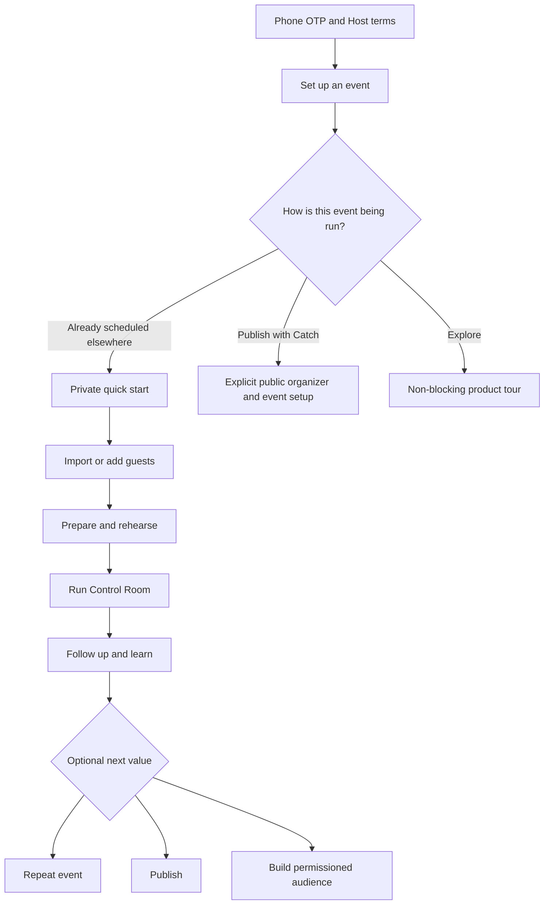

# Standalone Host Product And Implementation Specification

## Decision

Catch for Hosts is a first-class operations, reputation, audience, publishing,
and commerce product. Its minimum useful workflow must not depend on Catch
having sold the ticket or on an attendee having a Consumer dating profile.

The Host product and the Consumer network share organizers, events, operational
attendees, and explicit identity links. They do not share an onboarding
requirement. Hosts can adopt the system one capability at a time and may remain
on any rung indefinitely.

## Product Promise

The minimum Host promise is:

> Bring the event and guest list you already have. Catch gives your team one
> private run sheet, a clean roster, check-in, Event Success tools, feedback,
> review handling, and turnout analytics. Guests do not need the Catch dating
> app or a dating profile.

The progressive promise is:

> When you are ready, add audience follow-up, a public event page, OTP
> reservations, payments, a claimed organizer identity, and finally Catch's
> identity-rich network features. Each unlock is optional and explains its
> benefit, required setup, and data boundary before activation.

## Specification Purpose

This document is the reviewed product and implementation contract for turning
the existing standalone foundation into a comprehensible first-run Host
product. It owns the target customer, MVP boundary, journeys, progressive
disclosure rules, screen contracts, data and authorization deltas, rollout
order, measurement plan, failure policy, and acceptance gates.

It does not authorize production implementation by itself. Contract/schema
changes, screen and feature contracts, preview coverage, tests, provider work,
and deployment remain normal reviewed changes under their existing owner docs.

## Target Customer And First Wedge

The first target is a recurring facilitated social-event Host who:

- runs mixers, newcomer socials, community dinners, social games, networking,
  speed-meeting, or similarly interaction-led events;
- typically has 20-150 attendees;
- already receives bookings through spreadsheets, forms, direct messages, a
  ticketing product, or another community platform;
- has at least one person actively facilitating the room;
- has a phone or tablet available during preparation and runtime; and
- needs roster confidence, check-in, a run of show, and repeatable learning
  more urgently than a new public marketplace.

Lectures, concerts, passive performances, large festivals, classes with no
facilitated social outcome, and events above the validated operational ceiling
are not launch claims. They may use basic roster tooling, but their needs must
not dilute the first Event Success experience.

The MVP promise is deliberately narrower than the full product promise:

> Bring a social event you already scheduled and the guest list you already
> have. In a few minutes, Catch gives your team one reliable roster, check-in,
> and a simple live run of show. Guests need neither the Consumer app nor a
> dating profile.

### Actors and jobs

| Actor | Primary job | Minimum authority |
| --- | --- | --- |
| Private workspace owner | Set up the first event without asserting public business ownership | Authenticated owner of the private workspace |
| Organizer owner/manager | Publish, manage identity, configure payments, inspect permitted business data | Verified organizer authority appropriate to the action |
| Event lead | Prepare and control the live run sheet | Owner authority in the first single-operator pilot; later event-scoped runtime grant without payout or public-page authority |
| Check-in staff | Search the roster and set attendance state | Event-scoped, expiring attendance grant with least-privilege PII access; not part of the first single-operator pilot |
| Operational attendee | Exist on the roster and participate in Host-led activities | No account required for Host-only operations |
| Event-scoped verified attendee | Use private RSVP, feedback, assignment, or self-service actions | Phone-auth or purpose-scoped signed authorization linked server-side |
| Consumer member | Use profile-dependent network experiences | Completed relevant Consumer/profile/consent gates |

The MVP must not force the event lead or check-in staff to become an organizer
manager, and it must not expose payment, public-identity, or cross-event PII
authority to an event-scoped role.

## Product Evidence Gate

Before the first production implementation tranche is promoted beyond an
internal or founding-Host pilot:

1. Interview at least eight target Hosts across at least three event formats.
2. Observe at least three real event runtimes, including one weak-connectivity
   venue.
3. Test the quick-start and Control Room prototype with at least ten target
   Hosts.
4. Collect representative CSV/XLSX files and document booking source, row
   count, contact quality, duplicate patterns, staff count, device count, venue
   connectivity, and existing event-day failure modes.
5. Resolve the workspace-authority, offline, staff-role, review-provenance, and
   guest-access decisions listed below before their dependent slices start.

Proposed usability gates are:

- at least 8/10 target Hosts create an operations-only event without help;
- at least 90% map and confirm a representative roster in under five minutes;
- at least 9/10 identify the current and next live action within five seconds;
- zero lost check-ins or run-sheet progress in restart/reconnect simulations.

These thresholds are release gates to validate, not forecasts.

## MVP Non-Goals

The first standalone MVP excludes:

- paid OTP checkout, refunds, receipts, payouts, and payment onboarding;
- WhatsApp or SMS campaign sending;
- a cross-event CRM contact workspace;
- public listing claim or automated business-authority verification;
- global Host bottom-navigation redesign;
- profile-derived compatibility, ranking, approval, or cohort balancing;
- swiping, catches, Cross Paths, dating chat, or cross-event discovery;
- First Hello personalized missions, wingman requests, or individualized live
  reveals for operational-only attendees;
- organizer-wide reputation analytics;
- fully automated intelligent grouping; and
- third-party ticketing integrations beyond a future adapter boundary.

The schemas may preserve seams for these capabilities, but MVP UI, copy, and
success criteria must not depend on them.

## Product Principles

1. **First value before identity depth.** A phone-authenticated Host reaches a
   private event and roster before public-page, payments, or claim setup.
2. **Authentication is not business authority.** Host phone OTP proves the
   person controls a phone; it does not prove ownership of a business, public
   listing, sender identity, or payout destination.
3. **One operational truth.** Host UI reads one `EventAttendee` roster. Consumer
   participation remains a linked source contract, not a second Host board.
4. **One dominant live action.** The Control Room shows the current beat, the
   next beat, and recovery. Capability inventory stays off the live stage.
5. **Platform primitives stay platform primitives.** Roster, ordinary
   check-in, safety fallback, attendee feedback, and analytics are event
   platform capabilities. Event Success owns the optional facilitated ritual
   and run-of-show layer; First Hello remains its arrival ritual.
6. **Recommendation is not silent activation.** The basic run sheet may be
   recommended by default. Grouping, personalized, or attendee-private modules
   require explicit Host choice plus the required disclosure, authorization,
   consent, and opt-out.
7. **Offline is a product contract.** A runtime that loses check-ins or progress
   when a venue loses connectivity is not ready for standalone positioning.
8. **Progressive adoption is branching.** Operate, retain, publish, transact,
   establish identity, and use the network are capability branches with shared
   gates, not one mandatory setup wizard.
9. **Every import is reviewable and conditionally undoable.** Preview,
   correction, duplicate review, exact confirmation, receipt, and a bounded
   conflict-aware undo window precede cross-event identity assumptions.
10. **Private data is not growth consent.** Imports, OTP, attendance, service
    messaging, organizer messaging, and Catch marketing remain separate
    purposes.

## Capability Ladder

| Rung | Host outcome | Required adoption | Host-facing message |
| --- | --- | --- | --- |
| 0. Operate | Run an externally booked event | Host phone OTP, workspace, event, imported/manual roster | "Bring your guest list. Run the event here." |
| 1. Learn | Collect feedback, request reviews, respond publicly, improve the next event | Rung 0 plus attendee contact or event-scoped OTP where a private response is needed | "Close the loop after every event." |
| 2. Retain | Understand past and repeat attendance; message the audience that explicitly opted into each channel | Rung 1 plus a channel-specific permission ledger and delivery setup | "Turn attendees into a permissioned repeat audience." |
| 3. Publish | Acquire demand through a Catch public page and accept free/open reservations | Public organizer/event projection, publication eligibility, attendee phone OTP | "Publish once; registrations join the same roster." |
| 4. Transact | Sell tickets and manage refunds/payouts | Payment onboarding, supported policy, payout readiness | "Let Catch own checkout and payment operations." |
| 5. Establish identity | Own an existing public listing and reputation channel | Organizer claim and verification | "Claim your page and make your reputation portable." |
| 6. Use the network | Add profile review, compatibility, discovery, swiping, catches, and chat | Feature-specific Consumer profile and consent | "Unlock identity-rich participation for guests who choose it." |
| 7. Grow with Catch | Measure acquisition and use lawful first-party advertising activation | Separate Catch marketing consent, legal/policy approval, suppression and deletion controls | "Use only the audience that explicitly chose Catch marketing." |

Rung 2 is deliberately before Catch booking. A Host may build repeat business
from externally booked events, but an imported phone number is never treated as
WhatsApp, SMS, or Catch advertising permission.

The table is an adoption narrative, not an authorization dependency chain.
Implementation must use a capability graph:

```text
private Host workspace
  -> core event operations
       -> event learning and private feedback
       -> permissioned audience retention
       -> public acquisition
            -> commerce
            -> public reputation and claimed identity
                 -> profile-dependent network capabilities

Catch marketing activation is a separate governed branch. It is never implied
by any Host-product branch.
```

Business authority, sender identity, payment eligibility, review provenance,
and Consumer-profile readiness are shared gates that may appear in more than
one branch. The UI exposes only the next relevant outcome and its smallest
unmet gate.

## Identity And Consent Model

### Operational attendee

An imported or manually entered `eventAttendees/{attendeeId}` row can support
roster operations, check-in, source-aware counts, exports, and public aggregate
analytics. It does not create Firebase Auth, a Consumer account, or a public
profile.

### Event-scoped verified attendee

The public website uses phone OTP to create or reuse a Firebase Auth UID, then
links that UID to the operational attendee. The experience does not ask for a
password, account creation form, dating preferences, photos, or profile
approval. The UID supplies a stable, verified private boundary for reservation,
waitlist, self-service, feedback, and later account continuation.

This is "no profile setup," not literal anonymous booking. The product should
say "continue with phone" rather than claim that no identity exists.

### Consumer member

The Consumer account is created only when the person intentionally continues
into Consumer onboarding. The OTP attendee may reuse their verified UID and a
private onboarding draft seeded with their supplied name and phone. Host-entered
data must not silently populate public or dating-profile fields.

### Four separate permissions

| Permission | Purpose | Default |
| --- | --- | --- |
| Event service | Confirmation, changes, cancellation, check-in, safety and receipt messages for the requested reservation | Allowed only to the extent necessary for that event and channel policy |
| Organizer WhatsApp | Future organizer updates over WhatsApp | Off until explicit organizer-scoped opt-in |
| Organizer SMS | Future organizer updates over SMS | Off until explicit organizer-scoped opt-in |
| Catch marketing/ads | Catch campaigns, customer-list uploads, retargeting or lookalike activation | Off until a distinct Catch permission and policy/legal gate |

Checkboxes are separate, optional, unbundled, and unchecked by default.
Importing data, booking an event, or opting into one channel cannot infer any
other permission. STOP/unsubscribe and self-service withdrawal must update the
same server-owned ledger and suppress future sends immediately.

## Surface Responsibilities

| Surface | Owns | Does not own |
| --- | --- | --- |
| Host Flutter app/web | Workspace, events, roster import/manual entry, check-in, Event Success runtime, feedback/review inbox, CRM segments, campaign composer, analytics, publication/payment/claim readiness | Consumer dating profile or a separate React Host dashboard |
| Marketing React website | Crawlable organizer/event pages, phone-OTP reservation, confirmation/change/cancel entry, optional organizer channel permissions, account-continuation CTA | Private roster, campaign management, or Host runtime |
| Consumer Flutter app | Intentional profile completion, identity-rich booking, profile approval, compatibility, discovery, swiping, catches, chat | Basic prerequisite for Host operations or OTP reservation |
| Admin React app | Consent disputes, import/link support, publication and message-template moderation, provider/webhook failures, refunds and deletion support | Routine Host operations |

## Product Object Model

### Private Host workspace

The quick-start flow must not call the existing `createOrganizer` behavior
unchanged. That behavior creates a claimed, owner-verified organizer and
reserves public identity. Phone OTP alone cannot justify those effects.

The selected direction is a private lifecycle inside the canonical
`organizers/{organizerId}` model, not a second organization collection:

- add an authoritative private-workspace lifecycle, proposed as
  `workspaceLifecycle: privateOperations`, that is distinct from existing
  `ownership.state: userCreated`, `claimed`, or `transferred` business
  authority;
- add `operations_only` to the organizer supply-capability contract; its
  `bookable`, `paymentsEnabled`, `waitlistEnabled`, and `hostContactEnabled`
  fields are all false, `claimable` is false, `reviewPolicy` is `none`, and
  team-authorized private event operations are evaluated separately;
- app visibility is hidden;
- public page, public slug, claim state, follower acquisition, public
  provenance, and search projection are absent or fail closed;
- supply capabilities are operations-only;
- professional display name and event-operation location may be minimal and
  private; public description, media, contact, category, and SEO fields are not
  collected;
- `organizerTeamMemberships` remains the team authority, with a future
  event-staff role narrower than organizer manager; and
- conversion to a public/claimed organizer is an explicit server operation
  that first searches for an existing listing, resolves duplicate/claim policy,
  collects public fields, verifies authority, and only then reserves a route.

The capability schema enum and discriminated `oneOf` must add
`operations_only` plus `reviewPolicy: none`; neither existing public-review
policy may be inherited. The current `organizerSupplyCapabilitiesFor` function maps every `userCreated`
organizer to `claimed_managed`; therefore quick start must not reuse that state
or constructor until the contract, generated types, Dart reader, validator,
and server verifier all understand `privateOperations` plus
`operations_only`. Stored capabilities continue to be verified against
canonical authority and fail closed.

Promotion is a resumable, idempotent, receipt-backed workflow, not one Firestore
transaction. Its fenced stages are requested, authority verified, listing match
resolved, writes frozen, route reserved, authority cut over, references
migrated, projections rebuilt, and completed (or failed/compensated).

If no existing public listing matches, the private organizer id survives and is
promoted in place. If a canonical public listing already exists, that public
organizer id survives; the private id becomes a permanent server-resolved alias,
and stable event ids, attendee ids, receipts, analytics references, and audit
history are migrated in idempotent batches. Reads resolve the alias during the
cutover, new writes are fenced to the surviving id, and public capability stays
fail closed until authority, route, reference, and projection receipts are
complete. A failed stage can resume or compensate without exposing both records
as owned public organizers.

These invariants are mandatory:

1. quick start cannot create a public or discoverable organizer;
2. quick start cannot mark a business identity owner-verified;
3. quick start cannot reserve a public slug;
4. operations-only events cannot notify followers or enter discovery; and
5. the private record can be promoted or merged without forking event history.

### Event provenance and capability state

Do not add one coarse `integrationMode` enum. It would conflate where an event
came from with which products are currently enabled.

Each event needs:

- exactly one immutable origin such as `hostQuickStart`, `publishedCreation`,
  `adminIntake`, or `externalAdapter`, including source details where relevant;
- independent publication state;
- independent registration state;
- independent payment state;
- independent network/profile capability state;
- source-preserving attendee rows; and
- a capability projection used by UI, Functions, rules, website, and analytics.

Publishing is a capability transition, never provenance. Publication,
registration, payment, and network changes write idempotent transition receipts
with actor, prior revision, new revision, reason, and timestamp.

The capability projection is server-owned, derived, and fail closed. During
migration, existing `publicRegistrationEnabled`, event-policy admission state,
organizer visibility, and verified organizer supply capabilities remain the
authoritative inputs; the projection is not a second writable authority. An
empty Consumer participation list does not imply an operations-only event, and
a mixed-source roster does not silently elevate publication, payments, or
network access.

### Event-scoped staff authority

`organizerTeamMemberships` remains organizer-wide and continues to grant only
owner/manager authority. It must not be stretched for temporary event workers.
A later `eventStaffGrants/{eventId_uid}` authority contains event id, uid,
role (`runtimeLead` or `checkIn`), explicit permissions, grantor, issued and
expiry timestamps, revoked timestamp, and revision. Reads revalidate the grant;
cached access expires after the documented offline authorization window.

The first pilot is single-operator: the private workspace owner runs and checks
in the event. Multi-staff setup, device leadership transfer, and staff PII are
not readiness requirements until the event-scoped grant slice ships.

### Attendee identities

`eventAttendees/{attendeeId}` is the canonical Host-facing operational identity.
`eventParticipations/{eventId_uid}` remains the Consumer booking/membership
edge. The server projection links them through optional `linkedUid` without
synthesizing accounts.

An attendee id is never a bearer credential. Guest-facing actions require one
of:

- a Firebase phone-auth identity linked server-side to the attendee row; or
- a short-lived, event-scoped, purpose-scoped, revocable signed capability
  token.

Sensitive feedback, safety reports, identity merges, account continuation, and
cross-event access require phone-auth or stronger authorization. A signed link
may support low-risk event-scoped acknowledgement or survey entry only when its
scope, expiry, reuse policy, and revocation behavior are explicit.

### Feedback, safety, and public review boundaries

These are three separate trust domains:

| Path | Authorization and content | Host visibility | Public effect |
| --- | --- | --- | --- |
| Experience survey | Single-use, expiring event-service link or phone OTP; structured ratings and constrained text only; no safety/private free text in a signed-link flow | Aggregate results only after the minimum response threshold; recommendation is five responses | None |
| Safety report | Phone OTP or stronger identity, dedicated policy/triage path, encryption and restricted roles | Never included in ordinary Host aggregates or notes | None unless a separate moderated action is taken |
| Public review | One review per server-linked attendee/event identity, moderation and revocation support | Host may respond and dispute through existing authority | Host-invited external reviews are visibly labeled and excluded from the Catch-verified headline score until independent attendance proof exists |

An event-service message may deliver one transactional feedback invitation when
the event and channel policy permit it; it does not authorize later organizer
marketing. Host notes are organizer-private, role-gated, auditable, subject to a
documented retention period, and covered by export/deletion policy. Attendee ids
are never exposed as review or survey credentials.

## Information Architecture

The MVP keeps the existing global Host tabs. It does not rename Inbox to Guests
or Organizer to Business before those destinations contain the promised
products.

The event workspace becomes the primary standalone product:

| Section | Host question | Owns | Does not own |
| --- | --- | --- | --- |
| Prepare | "Are we ready to run this?" | event facts, staff, roster readiness, run-sheet choice, rehearsal, offline readiness | public listing, pricing, follower growth |
| Guests | "Who is expected and who is here?" | one operational roster, import/manual entry, correction, duplicate review, check-in, source/status filters | a second Consumer participation board |
| Run | "What should I do now?" | current beat, next beat, timer/cue, optional grouping, guest drawer, fallback, sync state | setup form, analytics dashboard, full capability inventory |
| Follow up | "What happened and what should I do next?" | attendance reconciliation, private feedback, review invitation, host notes, event report, duplicate event | raw safety notes, unauthorized contact campaigns |

`Event Success` remains the differentiating product family. Host-facing runtime
copy should prefer `Live Guide`, `Run sheet`, or `Control Room`, because these
describe the job. Marketing and owner documentation may continue to use Event
Success as the system name.

## First-Run Journey



### Entry and intent

After phone OTP and Host terms, a first-time Host sees one primary action:

> Set up an event

The next choice asks how the event is being run:

1. **Already scheduled elsewhere** - recommended and visually primary.
2. **Publish and register with Catch** - secondary, capability-gated path.
3. **Explore Host tools** - non-blocking product tour.

The choice persists in a resumable first-run draft. It changes disclosure, not
the underlying event model.

### Operations-only quick start

Collect only:

- explicit event title;
- date;
- start and end time;
- timezone;
- venue name and structured location;
- facilitated social-event format;
- optional expected attendee count; and
- minimal private workspace label when no private workspace exists.

Do not collect organizer media, public description, Instagram, public contact,
admission policy, age policy, ticket price, demand pricing, public page, payout,
or claim information.

On success, route directly to Prepare. The user can add guests, rehearse, or
leave and resume. Public publication remains absent.

Quick start cannot call the current `createEvent` payload unchanged. That
contract requires run-specific, commercial, capacity, and discovery values
that do not truthfully describe many social events. Add a dedicated
`createPrivateOperationalEvent` callable and evolve the canonical
`events/{eventId}` contract into explicit `privateOperations` and
`publishedBooking` variants rather than filling public fields with defaults.

| Quick-start input | Canonical private-event storage | Publication conversion |
| --- | --- | --- |
| Title | Required explicit `title`; add to Dart/TypeScript domain and formatters | Reuse after Host confirmation; regenerate public title/SEO projections |
| Date and local times | UTC timestamps plus required IANA `timezone` | Retain timezone as display/edit source of truth; never infer it later from offsets |
| Venue | Private meeting label and structured location; precise coordinates optional until an operation needs them | Apply public-address and map-disclosure policy before projection |
| Social format | General event-format discriminator and reviewed run-sheet eligibility | Map only to supported public discovery taxonomy with Host confirmation |
| Expected attendee count | Optional `expectedAttendance`; planning hint only | Never copy to admission `capacityLimit`; ask for capacity separately if registration is enabled |
| Workspace label | Private display label only | Does not become public organizer name without authority and confirmation |
| No distance/pace answer | Fields are absent/not applicable for non-run formats | Collect only if the chosen public activity format requires them |
| No description answer | Private operational notes remain optional and non-public | Require a public description before publication |
| No price answer | Payment state remains disabled; do not write `priceInPaise: 0` as a claim of free registration | Collect explicit free/paid admission and price during registration/payment enablement |
| No discovery answers | Discovery projection is absent and no index/projection write occurs | Derive only after public market, city, activity, geo and admission inputs pass validation |

Backward compatibility requires a read fallback for legacy events without
`title` or `timezone`, a deterministic formatter migration, versioned generated
types, and SEO/projection tests. Legacy fallbacks are never written back as
Host-confirmed values. The private variant retains common lifecycle and roster
fields but does not require booking counters or discovery projections until the
corresponding capability is enabled.

### Guest-list import

The import journey is:

1. Choose CSV, XLSX, or manual entry.
2. Detect headers and let the Host map name, phone, email, external reference,
   ticket type, and initial status.
3. Preview normalized values before upload.
4. Separate valid, warning, duplicate candidate, invalid, and unsupported rows.
5. Never silently merge shared-phone or ambiguous rows.
6. Let the Host correct a row, keep both people, exclude a row, or explicitly
   merge a duplicate candidate.
7. Show the exact create/update/skip counts before confirmation.
8. Request a server preview/version token; commit that exact reviewed version
   with an idempotency key and payload hash so a preview/commit race fails.
9. Return a durable receipt and offer `Undo this import` only while every
   affected change remains safely reversible.
10. Keep checked-in or linked identity state when a safe re-import updates a
    row.

The server retains a TTL-bound, server-only change set containing created ids
and permitted field preimages. Undo may delete still-unmodified created rows
and restore only fields whose revisions still match the receipt. Check-in, OTP
linking, correction, another import, or downstream guest action can make a row
conflicted. Receipt states are `undoAvailable`, `undoConflict`, `undone`,
`partiallyUndone`, and `undoExpired`; partial undo reports exact restored,
retained, and conflicted counts without leaking PII.

The existing 250-row request bound remains the first implementation ceiling;
the UX may chunk larger reviewed files only after server transaction,
idempotency, progress, cancellation, and rollback behavior are specified.

Import security and correctness fixtures must cover shared phone numbers,
country-code ambiguity rather than silently assuming `+91`, duplicate columns,
mixed encodings, CSV formula injection on export, malformed/oversized XLSX,
password-protected files, macro-bearing files, and concurrent import/check-in.

### Prepare

Prepare presents a short readiness list:

- event facts complete;
- guest list loaded or intentionally skipped;
- ordinary check-in fallback ready;
- recommended run sheet selected;
- Control Room rehearsed; and
- offline cache ready on the current device.

The recommended basic run sheet is a reviewed, roster-agnostic facilitation
template. MVP customization is limited to title, short Host instruction,
duration, ordering, skip, and optional manual team-placement beats. A general
run-sheet editor, random grouping, personalized, attendee-private, and
profile-dependent modules remain off until separately specified and gated.

### Rehearsal

Rehearsal uses synthetic attendee data and never writes production attendance
or guest actions. It teaches:

- current versus next beat;
- advance, undo, pause, and skip;
- how to find Guests;
- how to use Help & fallback;
- how offline/sync state appears; and
- how to recover after an accidental advance or application restart.

Completion returns to Prepare with a visible readiness result.

## Event Success MVP

### Included

- a Host-authored or recommended run sheet;
- stage progression with current and next beat;
- timers and facilitation cues;
- local rehearsal;
- ordinary roster/check-in integration;
- optional Host-directed manual team placement from a reviewed template,
  without algorithmic assignment or sensitive keep-apart storage;
- restart/reconnect recovery;
- completion; and
- basic private feedback invitation and aggregate learning.

### Deferred

- compatibility ranking or profile-derived reasoning;
- individualized Consumer-profile enrichment;
- wingman requests;
- personalized reveal;
- First Hello target missions for external attendees;
- private compatibility questionnaires;
- automated social recommendations that imply chemistry; and
- any guest-facing action whose authorization still depends only on an
  attendee id.

### Control Room interaction contract

The Run screen must fit the current decision in one phone viewport at text
scale 1.0 and remain usable at text scale 2.0:

- event identity and live/sync status;
- current step number and total;
- current step title;
- one short Host instruction;
- at most one readiness or exception summary;
- the next step label;
- one dominant primary action; and
- two supporting destinations: Guests and Help & fallback.

Settings, the complete run sheet, historical analytics, module toggles,
conversation-cue libraries, and full rosters stay behind secondary surfaces.
Advancing is serialized and reversible within the documented undo window.
Destructive or room-visible actions show their consequence before commit.

### Offline and concurrency contract

Standalone positioning requires:

- locally cached event facts and roster;
- absolute offline attendance operations carrying desired checked-in state,
  client operation id, expected attendee revision, and idempotent receipt;
- absolute undo operations that name the state to restore rather than replaying
  a toggle;
- local run-sheet progression with monotonic client operation ids;
- visible synced, pending, conflict, and failed states;
- deterministic replay after reconnect;
- one exclusive runtime session in MVP, with a second device visibly locked out
  rather than permitted to create a concurrent writer;
- recovery after process death/restart; and
- no silent loss or double application.

Recommended policy:

- replace the current replay-unsafe attendance toggle before offline support;
  check-in uses per-attendee desired state, expected revision, accepted server
  revision, and a durable idempotency receipt;
- run-sheet progression uses revisioned compare-and-set with an explicit
  conflict surface;
- the current device may continue locally while offline, but room-visible
  attendee companion synchronization is labeled unavailable until server ack;
- online-only generated assignments fail visibly and never block ordinary
  check-in or Host-guided progression; and
- MVP acquires an exclusive runtime session while online and rejects another
  device for live mutation. The original device may continue within the bounded
  offline authorization window; after session expiry, a second device may take
  over only through explicit recovery, and stale queued room-visible actions
  never auto-execute on reconnect.

The local queue owns encrypted, durable operations across backgrounding and
application upgrades. It records authorization expiry and event revision,
uses a monotonic clock for elapsed timers and server time for shared ordering,
and pauses replay after device-clock changes, event cancellation/deletion,
staff revocation, cache eviction, or an expired offline-authorization window.
Conflict choices are explicit: retain server, retain local when still lawful,
or reconcile manually. Shared-device logout clears cached PII and keys.

## Implemented Foundation

The current foundation provides these backend and contract seams; UI adoption
is not complete where noted:

- a unified private operational-roster contract for imported, manual,
  Catch-booked, and web-OTP sources, while the current Host composition still
  presents operational attendees and Consumer participation separately;
- CSV/XLSX/manual import, idempotent import receipts, check-in, and independent
  Host turnout/source analytics;
- public phone-OTP registration for explicitly published, future, free,
  open-admission events, including transactional capacity and waitlist state;
- an onboarding-draft seed containing the attendee-supplied name and verified
  phone for an intentional later Consumer onboarding continuation;
- optional organizer-scoped WhatsApp and SMS grants collected independently at
  registration;
- a server-only communication-preference ledger and privacy-bounded Host CRM
  summary for contacts, past/repeat attendees, linked accounts, imports, and
  channel-reachable audiences;
- current-event in-app broadcast delivery through Activity and eligible push;
- public organizer reviews and owner responses on the marketing website;
- account deletion of onboarding drafts and organizer communication grants.

The CRM summary is not a campaign sender. WhatsApp and SMS remain visibly
`provider setup required` until their delivery and compliance gates below are
complete.

## Feature-Complete CRM

### Audience workspace

- deduplicated contact timeline across events, with source provenance;
- past attendee, repeat attendee, lapsed attendee, event/source/status, tag and
  channel-permission segments;
- private notes and tags with organizer-team audit history;
- identity merge/unmerge support with a clear imported-versus-verified state;
- CSV export and deletion/suppression handling;
- counts available before PII is revealed; only authorized managers may open
  contact detail.

### Campaign composer

- choose service or marketing message class before composing;
- choose one organizer and one or more eligible segments;
- show reachable, excluded, opted-out, invalid, duplicate, and unsupported
  counts before send;
- preview each channel, approved template variables, sender identity, schedule,
  frequency cap, and estimated cost;
- require an idempotency key and freeze the resolved audience at approval/send;
- record per-recipient channel delivery, failure, retry, reply, opt-out, and
  suppression receipts without exposing them to unrelated clients;
- add test-send, draft, approval, schedule, cancel, and post-campaign report;
- prevent free-form Host copy from bypassing template or moderation policy.

### Channel adapters

**In-app:** extend the existing event broadcast from current-event Consumer
participations to organizer-scoped, permissioned linked attendees and followers.
Preserve notification preferences and Activity as the durable user-visible
receipt.

**WhatsApp:** use an organizer/platform-owned WhatsApp Business integration,
approved business-initiated templates, webhook status/replies, STOP handling,
quality/frequency protections, and a clear decision about whether Catch or each
Host owns the sender identity.

**SMS in India:** select a provider, register the Principal Entity and sender
headers, approve consent/content templates where required, map each message to
the correct template, ingest delivery/STOP signals, and maintain suppression.

The scheduled campaign dispatcher, leases, retries, and delivery receipts
should use the Operations platform once the provider contracts exist. The
current aggregate summary remains an ordinary callable because it is bounded,
synchronous, and side-effect free.

## Feature-Complete Booking Without A Consumer Profile

Profile-independent reservation logic includes:

- free registration, capacity, waitlist position/state, promotion, cancellation
  and duplicate prevention;
- attendee confirmation code and signed self-service link;
- add-to-calendar, reminders, location/change/cancellation service messages;
- ticket type, quantity and companion inventory where policy does not require
  identity-rich approval;
- paid checkout using the verified phone identity, with payment, refund,
  receipt and payout linkage independent of a dating profile;
- event-scoped questions, waivers and preference-light Event Success inputs;
- self check-in and private feedback/review invitation.

Profile-dependent gates remain separate:

- profile review/approval based on photos or dating identity;
- reciprocal compatibility or cohort balancing using private preferences;
- swiping, catches, match chat and cross-event discovery;
- safety or membership policies whose proof depends on a completed account.

Paid OTP booking is architecturally valid, but it is not yet implemented on the
public website. The first public policy remains free and open admission so paid,
approval, invite, membership and profile-balanced flows fail closed.

## Screen Contracts

These are product contracts for the implementation slices. Production routes,
component ids, actions, captures, previews, and tests must be added to the
machine-readable screen and feature contracts in the implementing PR.

### `host.first_run.intent`

| Contract | Requirement |
| --- | --- |
| Entry | Authenticated Host with no usable private workspace/event |
| Primary action | `Set up an event` |
| Secondary choices | `Already scheduled elsewhere`, `Publish and register with Catch`, `Explore Host tools` |
| Data | Host uid, first-run draft, existing workspace/listing matches |
| Progressive disclosure | No organizer media, public identity, pricing, or profile questions |
| Recovery | Resume draft; switch path without losing common event facts |
| Analytics | viewed, path selected, help opened, draft resumed, abandoned |
| Accessibility | Choices explain outcome in text; no icon-only distinction |

### `host.event.quick_start`

| Contract | Requirement |
| --- | --- |
| Fields | Title, date, start/end plus IANA timezone, venue, social format, optional planning-only expected count, private workspace label when needed |
| Primary action | `Create private event` |
| Mutation | Atomic private workspace/event creation or event creation in an existing private workspace |
| Pending behavior | Freeze submitted snapshot; prevent duplicate submit; survive route dismissal attempt |
| Success | Route to Prepare, never to a public event success/marketing screen |
| Failure | Field-safe backend errors; draft remains intact |
| Exclusions | Admission, price, public page, payout, claim, profile/network policy |

### `host.event.guests`

| Contract | Requirement |
| --- | --- |
| Primary object | One `EventAttendee` roster |
| Actions | Import, add guest, search/filter, correct, check in/out, inspect source, undo import |
| States | Empty, mapping, preview, duplicates, invalid rows, importing, receipt, mixed-source roster, offline pending, error |
| PII | Role-gated; masked in aggregate/readiness contexts |
| Exclusion | No second `EventParticipation` board |
| Recovery | Retry exact idempotent payload; download errors; conditionally undo a receipt or resolve conflicts |

### `host.event.prepare`

| Contract | Requirement |
| --- | --- |
| Primary object | Readiness list, not a settings inventory |
| Actions | Complete facts, add guests or deliberately skip roster, select reviewed run sheet, rehearse, cache offline data; assign staff only after event-scoped grants ship |
| Primary action | `Rehearse Control Room` until rehearsed, then `Open Control Room` |
| Disclosure | Advanced Event Success settings open only from the relevant readiness item |
| States | Not started, partially ready, ready, frozen, offline-cache stale, setup conflict |

### `host.event.run`

| Contract | Requirement |
| --- | --- |
| Primary object | Current run-sheet beat |
| Primary action | One advance/start/reveal/complete action derived by runtime state |
| Secondary destinations | Guests; Help & fallback |
| Status | Live/rehearsal, sync state, current/total step, next step |
| Recovery | Undo, pause, skip, single-session lock/recovery, conflict resolution, reconnect/restart; leadership transfer appears only after Slice 4C |
| Disclosure | No full setup form, report, or feature inventory on the live stage |
| Safety | Ordinary check-in and incident fallback never depend on an optional ritual |

### `host.event.follow_up`

| Contract | Requirement |
| --- | --- |
| Primary object | Attendance reconciliation and learning summary |
| Actions | Resolve pending check-ins, request private feedback, invite eligible reviews, add Host notes, duplicate event |
| Review provenance | Label external attendee invitations separately from Catch-attendance verified reviews |
| Privacy | Hosts receive aggregate coaching, never raw safety/private notes |
| Progressive unlock | Publishing/reputation/audience prompts appear only after core completion |

### Required lifecycle and edge-state matrix

| Area | States that require deterministic behavior and evidence |
| --- | --- |
| Entry | No workspace; one private workspace; several workspaces; public organizer only; manager-only access; draft created on another device; title/date collision |
| Time | Start early; run late; cross midnight; timezone change; background/foreground; device-clock change |
| Setup | Expected count absent; no roster by choice; solo Host skips staff; offline cache stale, unavailable, or evicted |
| Run sheet | Zero-step invalid; one step; many steps; pause; skip; absolute undo; complete; reopen policy; accidental primary-action tap; timer expiry and recovery |
| Sync | Synced; pending; failed; manual conflict; event cancelled/deleted offline; authorization expired/revoked; old leader fenced after transfer |
| Accessibility | Text scale 2.0, portrait/landscape, keyboard navigation, bright-venue contrast, one-handed use, reduced motion, and announcements for pending/conflict/recovery state |

Zero-step run sheets cannot start. Completion is explicit and reopening creates
a revisioned continuation receipt rather than silently decrementing state.
Room-visible actions provide a short undo window or confirmation proportional
to consequence. Timer display derives elapsed duration from a monotonic local
clock and reconciles shared timestamps from server authority.

## Implementation Surface Map

This is the expected change map, not permission to edit generated outputs by
hand:

| Concern | Current owner seams | Expected implementation delta |
| --- | --- | --- |
| Host first run and routing | `lib/routing/go_router.dart`, `lib/hosts/presentation/host_operations/host_events_scaffold.dart` | first-run intent route, resumable draft, private-event handoff |
| Public organizer creation | `contracts/callables/create_organizer_payload.schema.json`, `functions/src/organizers/createOrganizer.ts`, Host organizer create controller | retain for explicit public identity; add separate private-workspace operation/lifecycle |
| Organizer authority | `contracts/firestore/organizers.schema.json`, `contracts/firestore/organizer_team_memberships.schema.json` | private lifecycle, fail-closed public capability, event-staff authority |
| Event creation | `contracts/callables/create_event_payload.schema.json`, `contracts/firestore/events.schema.json`, `functions/src/events/mutateEvent.ts`, `lib/hosts/presentation/event_management/create/` | explicit title, provenance/capabilities, operations-only mutation branch with no public side effects |
| Operational roster | `contracts/firestore/event_attendees.schema.json`, `contracts/firestore/event_attendee_imports.schema.json`, `functions/src/events/eventAttendees.ts`, `functions/src/events/eventAttendeeProjection.ts`, `lib/events/data/event_attendee_repository.dart` | preview/version token, correction, conditional undo receipt, absolute offline attendance operations, one Host roster |
| Host event workspace | `lib/hosts/presentation/host_event_manage_route_screen.dart`, `lib/hosts/presentation/host_event_manage_screen.dart`, `lib/hosts/presentation/host_event_manage_controller.dart` | Prepare/Guests/Run/Follow up composition and lifecycle projection |
| Event Success Host runtime | `lib/event_success/presentation/event_success_host_screen.dart`, `lib/event_success/presentation/host_parts/`, `lib/event_success/domain/`, `functions/src/eventSuccess/` | current-step Control Room, roster-agnostic rehearsal/runtime, optional reviewed manual-placement beat, recovery states |
| Reviews and feedback | `lib/hosts/presentation/widgets/host_event_reviews_panel.dart`, `functions/src/reviews/mutateReview.ts`, Event Success feedback/scorecard contracts | guest authorization, private feedback, external-attendee review provenance |
| CRM expansion | `lib/hosts/presentation/inbox/`, `lib/hosts/data/host_crm_repository.dart`, `functions/src/organizers/organizerCrm.ts` | explicitly post-MVP audience workspace and provider-gated campaign delivery |
| Design contracts | `design/screens/catch.screens.json`, `design/features/*.feature.json`, `tool/ui_capture/`, `widgetbook/` | register new states/actions, fix roster/Event Success fixtures, add captures/previews/tests before promotion |

Every schema change regenerates compile-critical Dart/TypeScript/validator
outputs through the existing contract pipeline. Generated files are never
edited directly.

## Visual Direction Snapshots

The three generated snapshots are independent hierarchy studies for owner
selection, not a complete six-screen UI package or new design-system sources.
`docs/design_language.md`, shared Flutter primitives, screen contracts, and
Widgetbook/capture proof remain authoritative. Implementation must not trace
generated iconography, type metrics, or geometry blindly.

All three concepts happen to show team assignment. That content is not an MVP
requirement and must be replaced by a roster-agnostic facilitation beat in the
selected direction. The studies compare hierarchy only.

### Stage Director


Strength: the current beat and Host instruction dominate. Risk: event metadata
and readiness consume vertical space before the primary action on small or
large-text viewports. It is viable only with responsive simplification plus
visible sync, pause, and undo behavior.

### Live Run Sheet


Strength: current, completed, and upcoming context are explicit. Risk: it can
become a task-management list if later modules are appended instead of kept in
secondary surfaces. As drawn it contradicts the Control Room contract by
placing too much of the run sheet on stage; selecting it means revising it to
current plus next and adding a separate `View run sheet` action.

### Quiet Command Console


Strength: strongest live/wow distinction and one-handed scanning. Risk: the
dark stage must be proven at text scale 2.0 and in bright venues, and the hard
plane split must not turn supporting rows into a second dashboard. It is the
adversarial review's strongest direction, subject to explicit sync/pending,
pause/undo, non-grouping content, and measured contrast.

Owner selection among these directions is required before a production screen
contract or Widgetbook reference is frozen. The selected direction should be
adapted, not copied, using `CatchRouteScaffold`, `CatchBottomAction`, shared
section/status primitives, `CatchTokens`, semantic text roles, and the existing
Event Success controller boundary.

After selection, the implementation design package must add deterministic
snapshots for first-run intent, private quick start, import preview with
duplicate/error resolution, Prepare/rehearsal entry, non-grouping Run in
synced/offline-pending/conflict states, and Follow up with attendance
reconciliation and aggregate feedback. Those snapshots are acceptance evidence
for implementation, not extra alternatives before direction selection.

## Implementation Plan

### Gate 0: validate the wedge

Deliverables:

- target-Host interview and observation synthesis;
- prototype tasks and usability results;
- representative import corpus with sensitive data removed;
- venue connectivity and multi-device failure inventory;
- decision record for private workspace lifecycle, staff roles, guest access,
  review provenance, retention, and supported event-size ceiling.

Do not start provider messaging, payments, public claim, or profile-dependent
Event Success while this gate is open.

### Slice 1A: private authority and event contracts

Backend/contracts:

- add `privateOperations` workspace lifecycle and the fail-closed
  `operations_only` capability mode to canonical organizer contracts and
  derivation policy;
- add a server-owned private-workspace create operation that does not reserve a
  public route or write owner-verified public provenance;
- add a dedicated private-event callable plus the field-variant and migration
  behavior in the quick-start storage matrix;
- add explicit event title and IANA timezone to strict create/update/domain
  contracts;
- add stable event provenance and independent publication, registration,
  payment, and network capability state;
- keep operations-only events hidden from public/discovery/follower
  projections;
- define imported PII retention/deletion policy.

Required proof:

- capability-constructor tests proving private workspaces cannot book, charge,
  waitlist, expose Host contact, reserve routes, notify followers, or project
  to discovery;
- callable authorization and atomic promotion/no-public-side-effect tests;
- schema/generator/rules checks; and
- legacy title/timezone read, formatter, and SEO/projection migration tests.

### Slice 1B: first-run draft and quick-start UI

Flutter:

- add first-run draft/controller/repository seams;
- add intent and operations-only quick-start screens;
- leave current published-event creation available behind the publication path;
- route quick-start success directly to Prepare; and
- preserve current public organizer creation for explicit organizer setup only.

Required proof:

- route/controller tests for new, resume, cancel, duplicate-submit, and failure;
- feature/screen contracts plus light/dark/text-scale captures; and
- a negative test proving phone OTP cannot create claimed/owner-verified public
  identity through quick start.

### Slice 2A: server-authoritative import preview and commit

Backend/contracts:

- retain opaque attendee id plus optional linked UID;
- add preview/version tokens, row decisions, correction semantics, and
  conditional conflict-aware undo receipts with server-only TTL preimages;
- preserve source and checked-in/linked state on safe updates;
- make ambiguous phone/email matches warnings, not automatic merges; and
- document/chunk above the 250-row server bound only after idempotent rollback
  semantics exist.

Required proof includes shared-phone, country-code, duplicate-column,
encoding, formula-injection, hostile-XLSX, concurrent check-in, preview race,
retry, and partial/expired/conflicted undo cases.

### Slice 2B: one Host roster UI

Flutter:

- replace the dual operational/participation composition with one roster;
- build mapping, preview, duplicate-resolution, row-correction, receipt,
  conditional undo,
  mixed-source, and offline-pending states;
- keep participation-specific booking/waitlist details as optional linked
  attributes on the roster row; and
- update report/export paths to consume the same roster projection.

Migration:

- project existing Consumer participations into attendees;
- do not delete `eventParticipations`;
- preserve old Host report behavior until parity tests pass; and
- instrument unmatched, ambiguous, merged, unmerged, and corrected identities.

Do not build a general cross-source merge/unmerge/alias system in MVP. Keep
ambiguous records separate, allow explicit correction, and add general identity
reconciliation only after pilot evidence. Required proof includes realistic
fixture files, deterministic captures for every state, source-mix analytics,
and re-import/conditional-undo tests.

### Slice 3: quick-start Prepare and rehearsal

- build Prepare as a lifecycle/readiness projection rather than widget-owned
  checklist logic;
- add a basic supported-format run-sheet template independent of Consumer
  profiles;
- make the basic run sheet recommended while leaving grouping/personalized
  modules off;
- add synthetic rehearsal that cannot mutate live attendance or companion
  state;
- add local offline-cache readiness and stale-cache indicators; and
- capture first-run to rehearsal as one deterministic visual/integration path.

### Slice 4A: revisioned offline operations and recovery engine

Domain/data:

- introduce revisioned run-step operations with client operation ids;
- acquire one exclusive MVP runtime session and reject concurrent live writers;
- add local event/roster/run-sheet cache;
- replace check-in toggle with absolute, revisioned attendance/undo operations;
- queue attendance and run-step operations with idempotent receipts;
- reconcile idempotently after reconnect;
- surface conflicts instead of last-write-wins silence; and
- restore pending/synced state after restart.

Required proof includes offline/restart simulations, cancellation/deletion and
authorization-expiry handling, no-lost-operation tests, cache eviction/logout,
clock-change/background/application-upgrade cases, and conflict-choice tests.

### Slice 4B: Control Room and rehearsal UI

Presentation:

- select one generated visual direction and express it through the existing
  Catch design system;
- expose the full current-step runtime on the canonical Host Run route;
- keep current action, Guests, and Help & fallback visible without scrolling;
- put supporting Event Success tools behind current-step or secondary drawers;
- add rehearsal/live/sync/conflict/offline/recovery states; and
- preserve normal check-in and Host-led facilitation when generated tools are
  unavailable.

The first production release supports roster-agnostic Host-run cues and an
optional reviewed manual-placement beat. It does not include random grouping or
require the full UID-to-attendee migration across First Hello,
wingman, personalized reveal, preferences, compatibility responses, feedback,
and every companion collection.

Required proof includes the post-selection snapshot matrix, text-scale 2.0,
keyboard/orientation and status-announcement captures, bright/dark visual
review, performance checks for the roster size ceiling, and physical-venue
rehearsal.

### Slice 4C: event staff and multi-device leadership

After the single-operator pilot, add event-scoped expiring grants, least-PII
check-in access, a runtime leadership lease with epoch/fencing token, explicit
transfer, and stale-leader rejection. Required proof includes two-device
split-brain, old-device-offline, revoked-access, lease-expiry, and transfer
tests. Until this slice ships, Prepare does not promise staff assignment.

### Optional expansion: grouping and preferences

Random grouping is a separate product/trust slice. It must specify how
contactless attendees opt out, whether Hosts may record a verbal preference,
who can create/view keep-apart constraints, sensitive-data retention, offline
eligibility changes, too-few-eligible fallbacks, and what explanation guests
receive. It is not an MVP acceptance criterion.

### Slice 5A: low-risk experience survey and Follow up

- define OTP and signed-capability authorization separately;
- add event-scoped invitation, expiry, revocation, single-use, and completion
  receipts;
- expose aggregate experience coaching only above the response threshold;
- build Follow up on attendance reconciliation, experience invitation, Host
  notes, and event duplication.

### Slice 5B: authenticated safety reporting

- require OTP or stronger identity and route safety reports to the dedicated
  restricted triage path;
- keep safety details server-separated from surveys, Host notes, analytics,
  crash reports, and ordinary Host roles; and
- define correction, deletion, escalation, retention, and audit policy.

### Slice 5C: public review invitation and provenance

- enforce one review per server-linked attendee/event identity without bearer
  attendee ids;
- show only aggregate coaching to ordinary Host roles;
- create a review provenance label for Host-invited external attendees that is
  distinct from Catch-attendance verified and unverified public reviews;
- exclude that provenance from the verified headline score until independent
  attendance proof exists;
- add moderation, revocation, organizer dispute, correction, deletion, and
  identity-notice paths; and
- add review invitation to Follow up only after these gates ship.

### Expansion 6: reputation and permissioned retention

Only after activation and repeat-use thresholds are met:

1. Build the organizer-level review/feedback inbox and response analytics.
2. Build contact timeline, tags, notes, saved segments, suppression, and
   campaign draft/report schemas.
3. Extend in-app messaging to exact eligible repeat-audience segments.
4. Choose WhatsApp sender ownership and India SMS provider/DLT assets.
5. Implement approved templates, webhook/STOP handling, delivery receipts,
   message limits, cost guards, role permissions, and Admin support.

### Expansion 7: public reservation, commerce, identity, and network

1. Complete reservation self-service, notifications, calendar, waitlist offers,
   ticket types, and policy-aware admission.
2. Add paid OTP checkout, refunds, receipts, payouts, and payment support.
3. Finish public organizer claim/merge, editing, verified response state, and
   reputation analytics.
4. Migrate profile-independent attendee-private Event Success contracts from
   UID-only keys to attendee ids through versioned schemas, dual reads,
   authorization changes, generators, rules, and rollback.
5. Unlock profile-dependent capabilities only after their exact profile,
   consent, event, and safety gates pass.

### Expansion 8: lawful Catch growth activation

1. Define a separate Catch marketing permission, purpose, retention period,
   withdrawal path, and deletion propagation.
2. Complete legal and platform-policy review for dating-category customer lists,
   retargeting, and lookalikes.
3. Build hashed export/server-side activation only after consent and suppression
   checks; never give Hosts raw cross-organizer audiences.
4. Audit every outbound audience by purpose, platform, terms version, source,
   count, and operator.

## Adversarial Review Disposition

An independent adversarial product-management review challenged the original
direction against the current organizer, event, attendee, Event Success,
review, CRM, and authorization contracts. The specification accepted these
material corrections:

- narrowed the first wedge to recurring facilitated social events instead of
  claiming broad Host usefulness;
- replaced a linear prerequisite ladder with a branching capability graph;
- prohibited quick start from reusing public/claimed organizer creation;
- selected a private lifecycle inside the canonical organizer model rather
  than a second workspace collection;
- replaced a coarse event integration-mode enum with provenance plus
  independent capability state;
- narrowed the Event Success MVP to dependable roster-agnostic Host-run
  progression and an optional reviewed manual-placement beat rather than
  random grouping or migration of every UID-backed attendee feature at once;
- changed "Event Success on by default" to a recommended basic run sheet with
  explicit opt-in for grouping, personalized, or attendee-private modules;
- made offline/restart recovery plus safe rejection of a second runtime writer
  a launch contract;
- made import preview, ambiguous-duplicate handling, correction, receipt, and
  undo part of the MVP;
- separated attendee id from guest authorization;
- introduced distinct review provenance for Host-invited external attendees;
- deferred CRM providers, payments, public claim, profile-dependent modules,
  and global navigation changes until core activation is proven; and
- added falsifiable hypotheses, guardrails, and do-not-ship conditions.

The second adversarial pass then caught source-level contradictions and the
specification accepted these additional corrections:

- introduced a new fail-closed private-workspace authority because current
  `userCreated` organizers derive `claimed_managed` booking/payment powers;
- added the quick-start storage matrix instead of fabricating required run,
  capacity, price, and discovery values;
- made origin immutable and capability changes receipt-backed transitions;
- replaced replay-unsafe attendance toggles with absolute revisioned
  operations;
- made import undo conditional, versioned, TTL-bound, and conflict-aware;
- separated single-operator MVP from event-scoped staff and multi-device
  leadership;
- removed random grouping from MVP and separated survey, safety, and public
  review trust domains;
- marked the current roster as a unified contract whose sole Host UI adoption
  is incomplete; and
- scoped the three generated images as direction studies with a required
  post-selection journey/state capture matrix.

The review did not change the core decisions that Consumer profiles are
optional for Host operations, `EventAttendee` is the Host roster authority,
Host mobile/web share one product, and Event Success remains the differentiator.

## Host UX Rules

- Start with `Already scheduled elsewhere` as the recommended path and
  `Publish and register with Catch` as the explicit secondary path. After the
  minimal private event exists, make import and manual entry equal guest paths.
  Do not make public listing, ticketing, or claim setup precede operations.
- Every locked capability names the outcome first, then the smallest required
  setup: "Collect payments - finish payout setup," not "Account incomplete."
- Show each event's provenance, independently enabled capabilities, and
  attendee-source mix; never collapse them into one integration-mode label.
- Never use one ambiguous "marketing consent" badge. Show In-app, WhatsApp,
  SMS, and Catch marketing separately.
- A campaign composer shows reachable audience before copy entry and explains
  exclusions without revealing people the Host is not authorized to inspect.
- OTP attendees see what was saved, why, how to edit/delete it, and that a
  dating profile has not been created.
- Consumer-app benefits are an optional upgrade, never a warning that makes the
  standalone product feel incomplete.

## Measurement Plan

### Primary success metric

**Live qualified Host events completed through the Control Room per qualified
pilot Host.**

A qualified pilot Host matches the launch ICP, has a facilitated event for
20-150 attendees scheduled within 30 days, can make an explicit roster/no-roster
decision, has a supported Host device, and has authority to operate the event.

Measure three different milestones:

- **prepared activation:** private event created, roster imported/entered or
  deliberately skipped, a run sheet selected, and the supported device ready;
- **rehearsal completion:** the synthetic run reaches completion without live
  writes; and
- **live event completion:** at least one live beat starts and the event is
  explicitly completed.

Neither screen view nor rehearsal counts as a live completion.

### Funnel metrics

- Host OTP completion;
- first-run path selection;
- OTP-to-private-event duration;
- event draft completion and abandonment by field;
- import start, mapping completion, correction count, duplicate decisions,
  confirmation, failure, retry, undo, and time to usable roster;
- Prepare readiness item completion;
- rehearsal start/completion and confidence delta;
- event runtime start/completion;
- current-step identification usability result;
- check-in pending/reconciled/conflicted/failed counts;
- Host event completion and Host-reported confidence;
- private feedback invitation/completion;
- event duplication; and
- second prepared/completed event within 45 days.

### Proposed outcome thresholds

- at least 60% of qualified pilot Hosts reach prepared activation and at least
  40% complete a rehearsal within 14 days;
- at least 25% complete one live event within 30 days during the pilot; the
  target is re-estimated after scheduling-opportunity adjustment;
- at least 25% of Hosts who complete one event prepare a second event within 45
  days;
- at least 80% of representative files reach confirmed import without support,
  with unresolved-warning rate below 10% and every warning explicitly decided;
- median rehearsal increases Host confidence by at least two points on a
  seven-point scale; and
- Event Success impact testing targets at least a ten-percentage-point lift in
  attendees reporting two new meaningful conversations versus the selected
  comparison design.

These remain pilot hypotheses until observed data replaces them.

### Guardrails

- false attendee merges and unresolved duplicates;
- import undo conflicts, partial undo, and expiry;
- lost, duplicated, or conflicting offline mutations;
- expired offline authorization and leadership/lease conflicts;
- live runtime crash/restart recovery failures;
- P95 latency for check-in and step advance;
- Host support contacts per event;
- guest opt-out and grouping objection rate;
- safety complaints;
- unauthorized PII access;
- communications without exact channel permission;
- privacy export/delete SLA failures;
- public review abuse or provenance confusion; and
- event abandonment after import.

Pilot and launch require zero confirmed unauthorized communications, zero
confirmed cross-organizer PII exposure, zero known lost check-ins, and zero
automated personalized assignments without the required disclosure and opt-out.

### Event naming

Analytics events should describe outcomes rather than widget taps. Proposed
families are:

- `host_first_run_*`;
- `host_private_event_*`;
- `host_roster_import_*`;
- `host_prepare_*`;
- `host_rehearsal_*`;
- `host_control_room_*`;
- `host_offline_operation_*`;
- `host_feedback_*`;
- `host_review_invitation_*`; and
- `host_capability_unlock_*`.

Payloads may include event/organizer opaque ids, source/capability enums,
counts, durations, error categories, and experiment ids. They must not include
names, raw contact data, free-text feedback, safety detail, import rows, or
profile-derived private attributes.

## Accessibility And Non-Functional Requirements

- Support text scales 1.0, 1.5, and 2.0 without hiding the current or recovery
  action.
- Meet platform semantics, focus order, keyboard navigation on Host web, and
  visible focus requirements.
- Do not rely on color, icons, animation, or haptics alone for status.
- Respect reduce-motion while retaining state clarity.
- Keep live actions at least the platform-recommended target size and usable
  one-handed.
- Test light mode, intentional dark live stage, high ambient light, and dark
  mode separately.
- Cache only the minimum event/roster fields required for offline operation;
  encrypt sensitive local storage using the platform-approved seam and clear it
  on logout, access removal, retention expiry, or event deletion policy.
- Avoid per-row live listeners and unbounded roster reads; validate the target
  roster ceiling and larger-file behavior.
- Report sync age, pending operation count, and recovery state without exposing
  attendee PII in logs or crash reports.
- Keep setup-shaping fields revisioned/frozen after runtime begins, with an
  explicit late-change/attendee-notice policy when later introduced.

## Open Product Decisions

The owner must resolve these before their dependent implementation slice:

1. Exact launch ICP and excluded event types.
2. Organizer authority proof required for publication, sender identity,
   reviews, and payments.
3. Host web offline delivery: installable PWA, browser cache limits, and device
   support.
4. Maximum offline-authorization age, local key-storage owner, and supported
   cache/recovery behavior by platform.
5. Supported roster ceiling and chunking policy above 250 rows.
6. Event-staff role details, lease duration, and PII field access for the
   post-pilot slice.
7. Whether operations-only guests may omit all contact fields.
8. Access for contactless guests: shared display, signed QR capability, or
   Host-only.
9. Whether optional manual team placement belongs in the first template;
   random grouping is deferred.
10. Review provenance wording for Host-invited external attendees.
11. Imported-data/preimage/Host-note retention defaults and Host/guest
    correction/deletion flow.
12. Minor/age-restricted event eligibility.
13. Pricing and usage limits for the operations-only product.
14. External booking integrations to prioritize after file import.
15. Experiment design for Event Success impact.
16. Exact notice when phone OTP creates or reuses a persistent Firebase identity.
17. Visual direction selection for the Control Room.

## Do Not Ship If

- quick start marks a workspace claimed or owner-verified from phone OTP;
- a private workspace derives current `claimed_managed` supply capabilities or
  any public booking/payment/waitlist/contact permission;
- an operations-only event can notify followers, enter discovery, or reserve a
  public route;
- expected attendance becomes admission capacity, `priceInPaise: 0` implies
  free registration, or non-run events receive fabricated distance/pace values;
- imported people can be falsely merged without correction and undo;
- attendee ids are treated as bearer credentials;
- event staff need full organizer-manager PII authority;
- external guests are grouped without disclosure, opt-out, and keep-apart
  protections;
- raw private or safety feedback becomes visible to ordinary Host users;
- external-event reviews are labeled Catch-verified without independent proof;
- check-in or run-sheet progress can be lost or silently double-applied after
  network loss, restart, or replay;
- MVP permits two concurrent runtime writers instead of locking/rejecting the
  second session, or post-MVP leadership permits a stale writer after transfer;
- an offline attendance request still expresses a toggle rather than an
  absolute desired state and expected revision;
- the Host cannot identify the current and next live action within the
  usability threshold;
- the flagship states lack deterministic route/Widgetbook captures and
  integration/failure tests; or
- the product claims usefulness beyond facilitated social events without
  evidence.

## MVP Acceptance Criteria

The standalone MVP is complete only when:

- a phone-authenticated Host with no Consumer profile can create a private
  workspace and operations-only event without creating public identity;
- the Host can supply an explicit title, time/timezone, venue, format, and
  optional expected count through a resumable quick start;
- a representative CSV/XLSX can be mapped, previewed, corrected, deduplicated,
  confirmed, retried idempotently, and undone through a durable receipt;
- imported, manual, web-OTP, and Catch-booked people appear in one Host roster
  without synthetic accounts or a second participation board;
- Prepare exposes readiness and rehearsal without forcing advanced Event
  Success configuration;
- the Control Room shows one current action, the next action, Guests, recovery,
  and sync state within the tested viewport;
- ordinary check-in and run-sheet progression survive offline use, reconnect,
  and application restart without silent loss or double application, while a
  second runtime writer is safely locked out;
- any optional manual team-placement beat remains Host-directed and never
  implies compatibility; random grouping is not part of MVP;
- Follow up reconciles attendance and supports authorized private feedback
  without exposing raw safety/private notes to the Host;
- operations-only events remain private and produce no follower, discovery,
  public-route, claim, payment, or Consumer-profile side effects;
- deterministic light, dark, text-scale, offline, mixed-source, error,
  conflict, recovery, and success evidence exists for the flagship journey; and
- the pilot evidence and do-not-ship conditions pass.

## Full Product Acceptance Criteria

The standalone Host strategy is feature-complete when:

- an organizer can operate, measure, collect feedback and respond to reviews
  for an event whose entire booking history originated elsewhere;
- an imported attendee can complete every profile-independent event action via
  signed link or phone OTP without installing the Consumer app;
- free and paid eligible reservations support confirmation, waitlist,
  cancellation, change, reminders, receipts and support without dating-profile
  setup;
- a Host can build a cross-event audience, but send only to recipients with the
  exact channel permission and required regulatory/provider eligibility;
- every outbound send is idempotent, moderated, rate-limited, auditable,
  suppressible and reflected in delivery analytics;
- OTP-supplied private data can prefill an intentional account flow, but is not
  published, treated as a dating profile, or uploaded to advertising systems
  without a separate lawful Catch marketing gate;
- each surface keeps its authority boundary and no parallel Host dashboard or
  event model is introduced.
