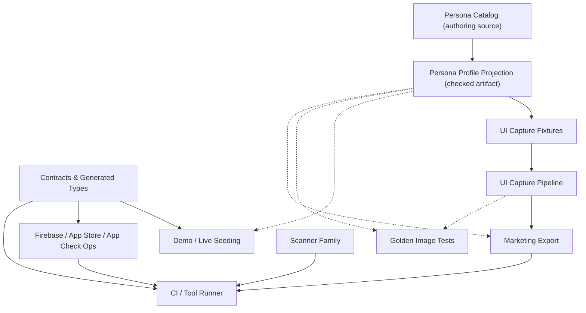

# Tooling Platform Consolidation Tracker

## Goal

Raise `tool/` from a collection of useful scripts into a coherent tooling
platform. The platform should expose stable, ergonomic entrypoints while keeping
implementation code grouped by real ownership boundaries: contracts, synthetic
data, UI capture, marketing export, scanners, remote data operations, Firebase
deployment, and platform setup.

The end state is not "more scripts." It is:

1. **One discovery surface.** `node tool/run.mjs` is the only thing anyone has to
   remember; every script is registered and a script that is not registered fails
   CI.
2. **One synthetic-data source with explicit projection layers.** The persona
   catalog is authored once and projected — deterministically and drift-gated —
   into the shapes that seeding, UI capture, marketing, and golden tests consume.
   No consumer reads the raw catalog directly.
3. **Verification gates that never mutate the tree.** Every generator exposes a
   non-mutating `--check` mode and CI uses it.
4. **Remote operations that not only *advertise* blast radius but *enforce*
   it.** Indexing is step one; apply-time guardrails are the goal.

## How to read this doc

This tracker deliberately distinguishes what *is true today* from what *will be
true*. Earlier revisions blurred the two, which made the work look more finished
and more enforced than it was. Every capability and checklist item below carries
one of these markers:

- ✅ **In place** — committed and enforced by CI (a gate fails if it regresses).
- 🟡 **Asserted-only** — the code/index exists, but nothing enforces it yet, or it
  is still uncommitted / unlanded. Do not rely on it as a guarantee.
- ⬜ **Planned** — scoped for this sprint, not started or in progress.

If a narrative section claims a capability, it must name the gate that enforces
it. If there is no gate, the capability is 🟡 or ⬜, not ✅.

## Scope and non-goals

**In scope (this sprint):** landing the already-built platform pieces safely as
isolated PRs; wiring the remaining persona-projection consumers (seed-world,
golden, marketing JSON); upgrading the remote-ops index from description to
enforcement; converging scanner internals; and closing the documentation/reality
gaps below.

**Non-goals:** rewriting individual tool logic (seeding algorithms, contract
schemas, scanner matching rules) beyond what consolidation requires; introducing
a new language/runtime for tooling; building golden infrastructure from scratch
(the harness already exists under `test/goldens/` — we are connecting it to the
shared projection, not creating it).

## Architecture principles

Each principle is annotated with its current enforcement state so the gap between
intent and reality stays visible.

- **Shared data has one high-quality source.** Synthetic personas, photos, host
  workflows, UI-capture fixtures, marketing screenshots, and golden image tests
  should draw from the same catalog with explicit projection layers.
  - ✅ The persona catalog → `personaProfileProjection(...)` → checked artifact →
    UI-capture fixture path is live and drift-gated.
  - ⬜ Seed-world, golden, and direct marketing-JSON consumers still read their own
    sources; wiring them to the shared projection is this sprint's main payload.
- **Capture and marketing pipelines are connected but not collapsed.** UI capture
  owns deterministic route/screen coverage; marketing owns framed, website-ready
  assets derived from approved capture slots.
  - ✅ `tool/ui_capture/` (route inventory + coverage) and `tool/marketing/`
    (capture manifest, screenshot export, device framing, website sync) exist and
    are manifest-registered.
  - 🟡 The marketing `--design-json` export derives from capture metadata but is
    not yet consumed by a downstream design tool, so it has no golden/schema gate.
- **Scanners are a discoverable family.** Root wrappers stay stable for CI and
  muscle memory; internals should converge on shared helpers.
  - ✅ All six scanners are registered and share shell *boilerplate*
    (`tool/lib/scanner_shell.sh`: repo-root setup, mode parsing, dependency check).
  - ⬜ The actual matching engines (the per-scanner `perl` logic) are **not** yet
    shared. "Convergence" today means boilerplate extraction only; the engine
    consolidation decision is still open (see workstream D).
- **Contract generation is safe to run in CI.** Any check-mode gate must detect
  drift without mutating generated files.
  - ✅ Schema and business-rule generators expose `--check`; `contracts-ci.yml`
    and `tool/check_data_contract.sh` use the non-mutating path.
- **Remote tools advertise — and will enforce — blast radius.** Anything that can
  read, write, deploy, or delete remote Firebase / App Store / App Check state
  needs an explicit safety label, dry-run defaults, and grouped runbook coverage.
  - ✅ `tool/remote_ops_manifest.json` indexes every remote surface by purpose,
    blast radius, entrypoint, and required checks; references are validated
    (tool-ids resolve, file paths exist).
  - ⬜ The labels are **descriptive strings, not runtime guardrails.** No code
    prevents an `--apply` against prod from a missing dry-run. Apply-time
    guardrails for operations that today live only as manual console steps are
    planned (workstream E).

## Tool taxonomy

`tool/tools_manifest.json` currently registers **67 tools across 14 categories**.
Registration is enforced: `discoverManagedScripts` in `tool/run.mjs` walks `tool/`
and fails validation on any `.mjs/.js/.dart/.py/.rb/.sh` not in the manifest
(excluding `lib/`, `contracts/generated/`, and `*.test.mjs`).

| Category | Count | Ownership |
|---|---:|---|
| `data` | 18 | Firestore validators, repairs, backfills, deletions |
| `contracts` | 9 | Schema / Firestore / Storage / boundary / path / business-rule gates |
| `demo` | 6 | Demo seeding, persona catalog, persona projection, image-gen |
| `scanners` | 6 | UI/design debt scanners (stable root wrappers) |
| `firebase` | 5 | Project/config/deploy helpers |
| `audit` | 4 | Audit registry, error candidates, widget cleanup, catalog |
| `env` | 4 | Dart-define + Firebase env wrappers |
| `marketing` | 3 | Capture manifest, screenshot export, website sync |
| `ui-capture` | 3 | Route inventory, coverage check, capture runner |
| `design` | 3 | Visual review / design preview entrypoints |
| `platform` | 2 | Apple flavor + iOS Maps key config |
| `migrations` | 2 | Retained one-time migrations (auditability) |
| `meta` | 1 | The runner itself |
| `remote-ops` | 1 | Remote-ops manifest validator |

> **Terminology note (avoid a real collision).** "Projection" is overloaded.
> `data:profile-projection-parity` concerns the **public-profile Firestore mirror**
> (a production data-integrity check) and is unrelated to the **persona profile
> projection** (synthetic demo data). This doc always uses the full phrase
> "persona profile projection" for the synthetic one. Workstream C includes
> renaming the persona artifacts/commands to keep them unambiguous.

## Dependency map

Edges reflect *current* reality. Solid = wired and CI-enforced today; dashed =
planned this sprint. This is the single most-misread diagram in the old revision,
so the legend is load-bearing.

Legend: a dashed edge means the consumer does **not** yet read the shared
projection (it reads its own source, or does not exist as an integration yet).
Closing every dashed edge is the definition of done for the data-source goal.

## Findings

### Resolved (kept for traceability)

- ✅ **Unmanaged scanner wrappers.** Six root scanners were outside the manifest;
  they are now registered under `scanners` with `bash -n` syntax and `--count`
  debt checks. Enforced by `discoverManagedScripts` in `tools-ci.yml`.
- ✅ **Undocumented surfaces.** `tool/README.md` now documents `ui_capture/` and the
  scanner family. *(But see the open finding on its "already depend on them"
  wording.)*
- ✅ **Persona photo status mismatch (now superseded).** The original bug — the
  persona validator treated `uploaded` as live-ready while the UI-capture fixture
  filtered for `published`, dropping valid photos — was first fixed by aligning
  the fixture to `uploaded`. That fix was then **superseded the same day** when the
  fixture was repointed at the checked persona-projection artifact
  (`assetStatuses: ["planned"]`). The `published` path is no longer the live code
  path; do not reintroduce a raw-catalog read to "fix" it.
- ✅ **Mutating contract gate.** The business-rules generator lacked a non-mutating
  mode, so the check gate could rewrite generated files. `--check` was added to
  `tool/contracts/generate_business_rules.mjs` and wired into
  `tool/check_data_contract.sh`.

### Open (surfaced during the 2026-05-31 review)

- ⬜ **README overstates current dependence.** `tool/README.md` says the stable root
  wrappers are kept because "CI, release runbooks, or muscle memory **already**
  depend on them." For the six scanners this is not yet true: they have never been
  committed, and their `flutter-ci.yml` hooks are uncommitted additions on this
  branch. The statement is accurate for the genuinely pre-existing entrypoints
  (`check_data_contract.sh`, `flutter_with_env.sh`, etc.) but not the scanners.
  Fix the wording to split "pre-existing" from "introduced this sprint."
  *(Tracked in workstream A.)*
- ⬜ **Persona projection has a silent-empty default.** `personaProfileProjection`
  defaults to `assetStatuses: ["uploaded"]`, but the catalog reports
  `Uploaded photos: 0`, so the default produces an **empty** projection. A future
  seed/marketing consumer that forgets `--asset-statuses` gets nothing and may not
  notice. Make the status explicit/required, or fail loudly on an empty projection
  unless `--allow-empty` is passed. *(Tracked in workstream C.)*
- ⬜ **Marketing `--design-json` has no contract.** It emits capture metadata, route
  ids, copy, asset paths, and device-frame geometry, but nothing validates its
  shape. The moment a design tool consumes it, an unguarded schema change breaks
  that tool silently. Add a schema/golden gate before first external consumption.
  *(Tracked in workstream C.)*

## Landing plan

**This is the part the previous revision lacked, and the highest near-term risk.**
The entire consolidation currently sits *uncommitted* in a working tree of ~397
dirty files, on a branch (`codex/club-card-fidelity`) whose commits are about
Explore cards and media. Tooling changes that can fail CI — manifest enforcement,
new build-failing scanner gates, a rewired contract gate — must not ride inside a
large unrelated UI branch, because:

- When `node tool/run.mjs check` or a scanner goes red, it should bisect to a
  small tooling diff, not a 1,100-file UI diff.
- The new scanner gates will otherwise fire against the entire UI diff at once,
  conflating UI debt with tooling debt.
- Reviewers cannot meaningfully review platform changes buried in card-fidelity
  work.

### Required: split into isolated, independently-green PRs

`tool/run.mjs` + `tools_manifest.json` infrastructure is already committed on
`main`'s history (present at HEAD). The *uncommitted* work below should land as
this sequence, each PR green on its own and each leaving `main` releasable:

| PR | Contents | New CI surface | Notes |
|---|---|---|---|
| **A — Scanner family** | Register 6 scanners + `tool/lib/scanner_shell.sh`, manifest entries, `flutter-ci.yml` scanner hooks, README scanner + "stable entrypoints" wording fix | `tools-ci` covers scanner `--count` (non-failing); `flutter-ci` gains **bare** scanner gates (build-failing) | Safe now: all six scanners report **0** debt against `lib/`. Flip the gates on in the same PR. |
| **B — Contract gate** | `generate_business_rules.mjs --check`, `check_data_contract.sh` rewire, manifest entry | `contracts-ci` / `tools-ci` | Pure hardening; no behavior change in generated output. |
| **C — Persona projection** | `personaProfileProjection`, `demo_ops persona-profile-projection`, checked artifact, repoint UI-capture fixture, tests, manifest `--check` | `tools-ci` (`demo:ops`, `demo:persona-catalog`), `flutter-ci` (fixture test) | Includes the silent-empty-default fix. |
| **D — Remote-ops index** | `remote_ops_manifest.json`, `check_remote_ops_manifest.mjs`, manifest entry, README | `tools-ci` (`remote-ops:manifest`) | Index only; enforcement is workstream E (later). |
| **E — Marketing JSON + ui_capture** | `export_app_screenshots.mjs --design-json`, `frame_device_capture.dart`, `ui_capture/*`, manifest entries | `tools-ci` (`marketing`, `ui-capture`) | Some files already untracked here; bundle them. |

### CI impact to communicate before merge

- `tools-ci.yml` runs `node tool/run.mjs check --manifest-only` **and** the full
  `node tool/run.mjs check` (every registered check). The full run includes
  `data:profile-projection-parity`, which does `npm --prefix functions run build`
  — the heaviest single check; budget for it.
- The scanner checks in the **manifest** use `--count` and always exit 0 (signal,
  not gate). The **build-failing** scanner gates live in `flutter-ci.yml`, which
  runs the wrappers bare. They are clean today; keep them clean per-PR.

### Rollback

Because the platform lands as isolated PRs, rollback is a single revert of the
offending PR with no UI entanglement. Manifest enforcement is intentionally
strict (an unregistered script fails `tools-ci`); the "Adding or moving a tool"
flow in `tool/README.md` is the escape valve, not a revert.

## Workstreams and phased checklist

Each item carries a state marker, an owner (assign at sprint planning), and an
acceptance criterion. "Done" means the acceptance criterion is enforced, not
merely coded.

### Phase 0 — Land safely (de-risk first)

- [ ] ⬜ **A.** Split the uncommitted platform work into PRs A–E above; land in
  order. **Owner:** TBD. **Accept:** each PR merges green independently; `main`
  releasable after each.
- [ ] ⬜ **A.** Correct `tool/README.md` "stable entrypoints" wording to separate
  pre-existing entrypoints from those introduced this sprint. **Owner:** TBD.
  **Accept:** no sentence claims pre-existing dependence on a net-new file.

### Phase 1 — Foundations (built; pending safe landing)

- [x] ✅ Read `tool/` and identify categories and abstraction boundaries.
- [x] ✅ Create this tracker (now restructured to a sprint plan).
- [x] ✅ Register the six scanner wrappers in `tool/tools_manifest.json`.
- [x] ✅ Document `ui_capture/` and the scanner family in `tool/README.md`.
- [x] ✅ Extract shared scanner shell mechanics into `tool/lib/scanner_shell.sh`.
- [x] ✅ Add non-mutating `--check` to `generate_business_rules.mjs`; wire the
  contract gate to it.
- [x] ✅ Add `personaProfileProjection` + `demo_ops persona-profile-projection`
  with explicit `assetStatuses` filtering.
- [x] ✅ Generate the checked planned-asset projection artifact and repoint the
  UI-capture fixture at it (replacing the raw-catalog read).
- [x] ✅ Add the read-only marketing `--design-json` export.
- [x] ✅ Add `remote_ops_manifest.json` + validator; register and document it.
- [x] ✅ Targeted verification (manifest, scanners, capture coverage, marketing
  export, persona catalog, contract `--check`, fixture analysis) passing.

### Phase 2 — Close the projection consumers (the data-source goal)

These are confirmed imminent for this sprint. Closing all of them turns every
dashed edge in the dependency map solid.

- [ ] ⬜ **C.** Fix the silent-empty default in `personaProfileProjection`
  (require `--asset-statuses`, or fail on empty unless `--allow-empty`).
  **Owner:** TBD. **Accept:** an empty projection cannot be produced or written
  silently; a test covers it.
- [ ] ⬜ **C.** Rename persona projection artifacts/commands to disambiguate from
  `data:profile-projection-parity` (e.g. "persona profile projection" everywhere).
  **Owner:** TBD. **Accept:** no command/file name collides with the public-profile
  parity tool.
- [ ] ⬜ **C.** Wire **seed-world** tooling (`tool/demo/seed_demo_data.mjs`) to
  consume the shared persona projection instead of sourcing personas itself.
  **Owner:** TBD. **Accept:** seeding reads the checked projection; a drift gate
  fails CI if the artifact is stale.
- [ ] ⬜ **C.** Wire **golden image tests** (`test/goldens/`, starting with
  `profile_view_test.dart`) to render from the shared projection. **Owner:** TBD.
  **Accept:** at least one golden renders from the projection; the golden updates
  deterministically from `--update`.
- [ ] ⬜ **C.** Add a **schema/golden gate for the marketing `--design-json`**
  output and have the first design consumer read it. **Owner:** TBD. **Accept:** a
  shape change to the JSON fails a CI check.
- [ ] ⬜ **C.** Promote/upload planned persona photos so `uploadedPhotoCount` is
  non-zero before any live seed write depends on uploaded assets. **Owner:** TBD.
  **Accept:** `uploaded` projection is non-empty; live seed path validated.

### Phase 3 — Enforcement upgrades (description → guardrail)

- [ ] ⬜ **E.** Add apply-time guardrails / command wrappers for every remote
  operation that today exists only as a manual console step (App Check enforcement,
  App Store/TestFlight steps). **Owner:** TBD. **Accept:** each `manual` entry in
  `remote_ops_manifest.json` either has a wrapper that enforces dry-run-before-apply
  or an explicit, owned ticket; no remote write defaults to apply.
- [ ] ⬜ **D.** Decide where scanner **matching engines** converge (shared shell
  library vs. Dart vs. Node) once more scanner rules accumulate, then migrate the
  six wrappers' internals. **Owner:** TBD. **Accept:** matching logic lives in one
  place; wrappers are thin; root wrapper names unchanged.

## Definition of done

The initiative is complete when **all** of the following hold:

1. ✅-equivalent: `node tool/run.mjs check` (full) is green on `main` and enforced
   by `tools-ci.yml`; every script under `tool/` (excl. `lib/`, generated, tests)
   is registered.
2. Every dashed edge in the dependency map is solid: seed-world, golden, and
   marketing-JSON all read the shared persona projection; none reads the raw
   catalog; each is drift-gated by `--check` in CI.
3. The persona projection cannot silently produce/write an empty artifact.
4. Every remote operation has a manifest entry with a safety label, and every
   `manual` entry has either an apply-time guardrail or an explicit owned ticket.
5. The marketing `--design-json` has a shape gate before any external consumer.
6. No narrative section in this doc asserts a capability that is not CI-enforced
   (the ✅/🟡/⬜ discipline holds at close-out).
7. `tool/README.md` accurately distinguishes pre-existing from introduced
   entrypoints.
8. No stranded dead path remains from the projection wiring, and every adjacent
   retirement candidate below has been triaged (deleted, archived, or explicitly
   kept with a reason).

## Cleanup and retirement on completion

This consolidation is **mostly additive** (manifests, a projection layer, indexes,
guardrails), so genuine deletions are modest. They fall into two buckets, plus a
guard list against over-pruning. A useful side effect of the platform: because
`tools_manifest.json` and `remote_ops_manifest.json` are the single sources of
truth and their references are CI-validated, deleting a tool now has a known blast
radius — orphan a reference and `tools-ci` fails loudly. Cleanup got safer.

### Stranded by completion — delete when the wiring lands

- [ ] ⬜ **Inline persona synthesis in `tool/demo/seed_demo_data.mjs`.** Once
  workstream C wires seed-world to the shared persona projection, the file's
  bespoke identity generation — the `firstNames` roster, `profilePromptsForIndex` /
  `photoPromptsForIndex`, and the persona-identity portions of `buildRoster` —
  becomes duplicate of the projection and should be removed. **Keep** the
  event/club/payment/participation/roster-aggregate logic; only the persona
  *identity* synthesis is superseded. This is the largest single dedup the tracker
  enables (~part of a 3.2k-line file). **Owner:** TBD. **Accept:** seed personas
  come only from the projection; no `firstNames`-style local roster remains.
- [ ] ⬜ **Persona projection artifact lifecycle.** Once planned photos are
  promoted to `uploaded` (Phase 2), decide whether the `*.planned.json` artifact is
  retired for live/seed consumers (kept only for deterministic capture/golden) or
  superseded by an `*.uploaded.json` sibling. Avoid keeping both for the same
  consumer. **Owner:** TBD. **Accept:** each consumer reads exactly one artifact;
  no orphaned projection file.

### Adjacent retirement candidates — surfaced by the "register every tool" lens

These are not *caused* by this tracker, but the audit exposes them and the cleanup
is cheap to do in the same sprint. Each needs owner sign-off, not silent deletion.

- [ ] ⬜ **`tool/design/` personality previews.**
  `design_personality_preview_app.dart` and `render_design_personality_previews.dart`
  still reference the **retired `ELECTRIC SUNSET`** exploration themes
  (`electricSunset`, `nitron`, `editorialSport`), predating the locked
  Newsreader/Inter/IBM Plex Mono identity. Likely dead exploration tooling. **Owner:**
  design. **Accept:** confirmed stale → deleted, or confirmed still-used → updated to
  the locked identity. (`visual_review_app.dart` is a separate, possibly still-live
  entrypoint — triage independently.)
- [ ] ⬜ **`tool/migrations/` one-time migrations.**
  `firestore_relationship_migration.mjs` and `migrate_run_data_to_events.mjs` are
  retained for auditability and referenced only by the manifest. Once their target
  data is confirmed fully migrated across dev/staging/prod, either delete or move to
  an explicit `tool/migrations/archived/` with a "do not run" header. **Owner:** TBD.
  **Accept:** no runnable one-time migration sits in the active surface without a
  completion note.
- [ ] ⬜ **Completed one-shot `data/` retirements.** `data:retire-legacy-profile-decisions`,
  `data:retire-legacy-profile-fields`, `data:strip-profile-coordinates`, and the
  `data:validate-profile-decision-migration` validator (plus their `.test.mjs`) are
  dead once the legacy fields are gone in every environment. **Owner:** data.
  **Accept:** removed (with manifest + `remote_ops_manifest.json` entries) after prod
  confirmation, or explicitly held with a reason.

### Do NOT delete (guard against over-pruning)

- **Stable root wrappers / the six scanners.** Workstream D moves their *internals*
  into a shared engine; the wrapper files and names stay — CI and muscle memory
  depend on them.
- **`demo_ops.mjs` + `demo_ops_core.mjs`.** Intentional CLI-vs-implementation split,
  not duplication.
- **The superseded `uploaded`/`published` fixture branch** is **already removed** from
  `sales_demo_synthetic_fixtures.dart`; there is nothing left to clean there.
- **Migrations kept purely for auditability**, if policy requires retaining them
  in-tree — relabel status, don't delete.

## Risks and mitigations

- **Bundling with the club-card branch.** *Mitigation:* the PR A–E split; do not
  merge platform changes inside the UI branch.
- **New bare scanner gates break builds.** *Mitigation:* counts are 0 today; flip
  on with PR A; document the `// <scanner>:allow: <reason>` escape hatch.
- **Silent-empty projection.** *Mitigation:* workstream C makes status explicit /
  fails loud.
- **"Projection" naming collision** with public-profile parity. *Mitigation:*
  workstream C rename + glossary note above.
- **Manifest strictness blocks unrelated PRs** that add a tool without registering
  it. *Intended;* mitigated by the documented 5-step "Adding or moving a tool"
  flow in `tool/README.md`.

## Open questions

The product/eng calls below were taken as "imminent / yes" for planning, but are
recorded so they are explicitly confirmed at sprint planning, not assumed:

- Confirm DRIs per workstream (A–E).
- Confirm seed-world, golden, and direct marketing-JSON consumption are all in
  *this* sprint (assumed yes). If any slips, move its workstream-C item to a
  follow-up and update the dependency map legend accordingly.
- Confirm the golden migration order (assumed `profile_view_test.dart` first).

## Status log

- 2026-05-31: Created tracker after initial `tool/` audit. First scoped pass was
  limited to manifest/README hygiene and the synthetic photo status mismatch.
- 2026-05-31: Registered six scanner wrappers in the manifest under `scanners`
  with cheap syntax/count checks.
- 2026-05-31: Updated `tool/README.md` so `ui_capture/` and the scanner-family
  root wrappers are documented as intentional tooling surfaces.
- 2026-05-31: Updated the sales-demo UI-capture fixture to consume catalog photos
  with `assetStatus: uploaded` (later superseded — see below).
- 2026-05-31: Fixed the fixture's non-constant default parameter so targeted Dart
  analysis runs cleanly.
- 2026-05-31: Verification passed for manifest validation, scanner checks, UI
  capture route inventory/coverage, marketing export/sync, persona catalog
  validation, targeted Dart analysis, and whitespace. Persona catalog reports
  `Uploaded photos: 0`, so asset promotion is tracked separately.
- 2026-05-31: Added `--check` mode to `generate_business_rules.mjs`, wired
  `check_data_contract.sh` to it, and added the check to the manifest.
- 2026-05-31: Extracted shared scanner shell mechanics into
  `tool/lib/scanner_shell.sh`; updated all six wrappers to source it.
- 2026-05-31: Added `personaProfileProjection` and the
  `demo_ops persona-profile-projection` command (defaults to `uploaded`; can emit
  `planned`/`generated`/`all`). Uploaded projection: 24 personas, 0 photos.
  Planned projection: all 96 draft photos.
- 2026-05-31: Added `--output`/`--update`/`--check` to the projection command,
  generated the checked planned artifact, and repointed the UI-capture fixture at
  it — superseding the earlier `uploaded` fixture fix.
- 2026-05-31: Added `tool/marketing/export_app_screenshots.mjs --design-json` as a
  read-only metadata export for marketing captures.
- 2026-05-31: Added `remote_ops_manifest.json` + `check_remote_ops_manifest.mjs`
  grouping Firebase env/deploy, remote data ops, App Check/security, CI/CD, and
  iOS/TestFlight operations by purpose, blast radius, entrypoint, and checks.
- 2026-05-31: **Restructured this tracker from a flat changelog into a sprint
  plan.** Added the ✅/🟡/⬜ is-vs-will-be discipline; a landing plan with PR
  decomposition and CI-impact analysis; phased workstreams with owners and
  acceptance criteria; a definition of done; and a risks section. Corrected the
  stale findings (superseded photo fix, resolved contract gate) and recorded three
  newly surfaced open findings (README overstatement, silent-empty projection
  default, ungated marketing JSON). Relabeled the dependency map to mark live vs.
  planned edges. Confirmed all six scanner gates currently report 0 debt against
  `lib/`, so the build-failing flutter-ci hooks are safe to land in PR A.
